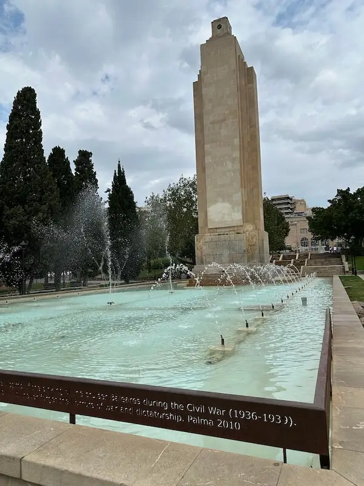
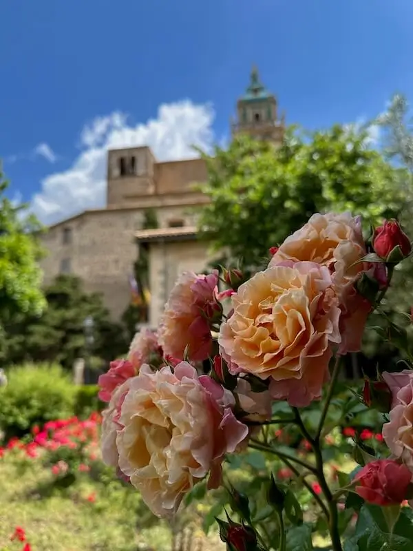
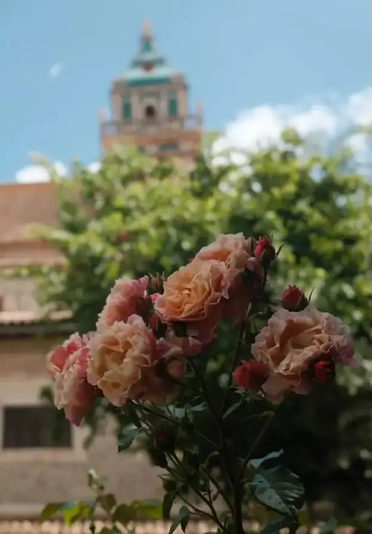
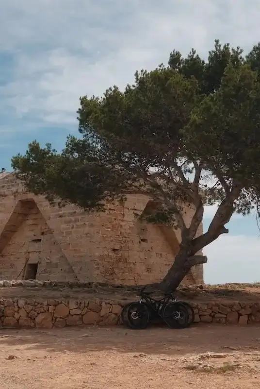

Die Fuji X100VI kam im März 2024 auf den Markt und noch immer ist es schwierig, ein neues Model zu kaufen. Bereits das vorige Model, die X100V, ~~wurde Opfer eines~~ erlang einen riesigen (TikTok-)Hype. Ich konnte kurz vor Ostern dieses Jahres tatsächlich eine X100VI kaufen. Denn mittlerweile bin ich der Smartphone Fotografie etwas müde geworden: Überschärfte Fotos; ein HDR-Look, der jede Wolke wie das größte Unwetter wirken lässt; wenige bis keine Möglichkeit für schnelle Kreativität. In diesem Beitrag möchte ich klären, ob sich der Kauf gelohnt hat und ob die Kamera dem Hype gerecht wird und tatsächlich die beste Alltagskamera oder dank Smartphones überflüssig ist.

## Mein Wunsch nach einer kleinen Kamera

Mein bisheriges Fotografie-Setup bestand aus meiner Sony A7 III mit verschiedenen Objektiven, sowie meinem iPhone. Ich war also bereits mit einer Kamera "für die guten Fotos" ausgestattet und natürlich kam die A7 III auch mit in unsere Urlaube oder zu Familienausflügen. Und die Kamera macht wirklich sehr gute Fotos. Gerade mit dem Sigma 24-70mm f/2.8, welches ich besaß, waren die Fotos qualitativ super. Aber die Kombination aus Kamera und Objektiv wog ca. 1,5kg.

Gerade in Urlauben machen wir - meine Frau, meine Tochter und ich - viele Ausflüge. Allerdings ist meine Tochter noch sehr jung und ich trage deshalb auch eine Kraxe (ein Rucksack mit Sitz für das Kind), in der sie sitzen kann. Wenn ich also 17 - 20kg auf dem Rücken trage, sind 1,5kg um den Hals bei stundenlanger Wanderung einfach nicht schön. Die Kamera wirkte wie eine Last.

Den Höhepunkt hatte ich 2023, als wir im Urlaub in Thailand waren und den Khao Ra, den höchsten Berg Koh Phangans, hoch wanderten. Ich verstaute die Kamera bei dieser Wanderung sogar in der Kraxe, da ich sie nicht mehr um den Hals haben wollte und meine Fotos machte ich mit meinem iPhone. Für extra Gewicht auf dem Rücken sollte man keine Kamera mitnehmen. Hier ein Bild von mir auf dem Khao Ra:



Das Sony Setup nahm ich in Urlaube immer nur auf Ausflüge mit, wenn der Ausflug "gute Fotos wert war". Bei abendlichen Spaziergängen oder der Erkundung der Straßen um die Ecke nahm ich sie gar nicht erst mit. Meine Fotos machte ich dann mit dem iPhone und die Kamera blieb immer wieder im Hotelzimmer liegen, einfach, um mit "leichtem Gepäck" unterwegs zu sein.

Mein erster Impuls für ein schlankeres Setup war, das Objektiv zu verkleinern. Ich stieg um auf das Sony 20-70mm f/4, mit welchem ich zwar etwas Lichtstärke einbußte, aber dafür auch Gewicht einsparte. Allerdings machten die ~350g nicht wirklich etwas aus und im nächsten großen Urlaub, Kroatien 2024, hatte ich eine ähnliche Erfahrung.



Bei der Wanderung um die Plitvicer Seen in Kroatien hatte ich erneut das Gefühl, dass die Kamera "im Weg" war. Die Bilder sind schön geworden, aber die Kamera und die Kraxe zusammen waren einfach unliebsam. Und wie in den bisherigen Urlauben blieb die Kamera im Hotel, wenn es kein Ausflug war, für den ich das Gewicht rechtfertigen konnte. Ich wollte das Setup **deutlich** reduzieren und selbst mit der recht kleinen Sony 35mm f/1.8 Festbrennweite blieb das Gesamtgewicht der Kombination bei gut einem Kilogramm. 

Ich bin also überzeugt, dass mein Wunsch nach einer kleineren Kamera begründet war und ich mir den Kauf nicht leicht machte.

## Die Kandidaten

Aber mit diesem Wunsch war meine Entscheidung noch lange nicht auf die X100VI von Fuji gefallen. Es gab einige Kandidaten, manche davon eigentlich die offensichtlichere Wahl. Wie ein anständiger Tech-Nerd tauchte ich also ins Rabbit Hole der Kameras ein und suchte verschiedene Optionen für leichte, aber gute Setups heraus. Ich wog die Vor- und Nachteile ab, verglich, schaute mehr YouTube-Videos zu dem Thema, als es hätten sein müssen und entschied mich schlussendlich. Aber ich will nicht vom roten Faden abweichen. Lass mich kurz die Optionen beleuchten, die mir in den Sinn kamen und zu jeder Option ein paar Gedanken niederschreiben.

**Sony A7C II / A7C R:** Die vermutlich offensichtlichsten Kandidaten. Sony ist technisch in vielen Bereichen führend, speziell im Auto- und Augenfokus. Ich besitze eine Sony-Kamera und kenne das System. Ich habe Objektive für das System und Sony hat eine Kamera mit Vollformatsensor in die Form einer APS-C Kamera gedrückt. Irre! Gepaart mit dem Sony 40mm f/2.5 G Objektiv ein recht handliches Setup. Nicht ganz 700 Gramm, relativ handlich mit ca. 9 cm Länge und super Technik. Außerdem wäre dies eine Kamera, die auch bei Urlauben z.B. mit Safaris geeignet wäre, denn dann schraubt man einfach das dicke Tele auf die Kamera und für abendliche Ausflüge dann wieder das kleine 40mm (oder 24mm, das gibt es auch im selben Formfaktor).

**Ricoh GR III (X):** Der nächste Kandidat war die Ricoh GR III, ggf. auch als X-Variante. Das kleinste Gesamtpaket. Passt wirklich in Jacken- oder manche Hosentaschen und die Bilder, die man so sieht, sind super. APS-C Sensor mit 28mm oder 40mm in der X-Variante (jeweils Vollformat-Äquivalent) und Lichtstärke f/2.8. Nur 255 Gramm schwer, wirklich handlich und damit eine super Wahl! Was ich zum Zeitpunkt meiner Entscheidung noch nicht wusste, mittlerweile ist die [Ricoh GR IV für den Herbst 2025 angekündigt](https://ricohgr.eu/de/blogs/news/22-05-2025-entwicklung-ankundigung-von-ricoh-gr-iv). Wenn du die Kamera also in Betracht ziehst, erwäge vielleicht, ein wenig zu warten.

**Leica D-Lux 8:** Eine Leica! Leica-Farben, top Verarbeitung. Nicht ganz so klein, wie die Ricoh, aber trotzdem noch ziemlich handlich und dann ein Zoom-Bereich von 24-75mm (Vollformat-Äquivalent). Eine Lichtstärke von f/1.7 im Weitwinkel bis f/2.8 im Tele-Bereich. Allerdings „nur“ ein Micro-Four-Thirds Sensor. Also kleiner, als bei der Ricoh und vor allem den Sonys. Trotzdem noch deutlich größer (und besser), als im Smartphone. Jedoch würden Makler schreiben, „eine Kamera, um das Fotografieren zu genießen“. Sie ist langsam. Startet langsam, zoomt langsam, fokussiert recht langsam. Aber die Bilder, die Farben… Leica halt!

**Fujifilm X100VI:** Der bekannteste Kandidat, die X100VI. Ich muss sagen, der Hype der Vorversion ist an mir vorbeigegangen und diesen habe ich erst mitbekommen, als die neue Version veröffentlicht wurde und die Fotografie-Kanäle diese testeten. APS-C Sensor, wie die Ricoh, und 35mm Festbrennweite (wieder Vollformat-Äquivalent). 40 Megapixel und Fuji-Farben. Die Farbprofile, die vermutlich für den Hype des Vorgängers sorgten. Das Versprechen, kaum bis gar nicht nachbearbeiten zu müssen. Deutlich verbesserter Autofokus (allerdings komme ich von einer Sony, also die Messlatte liegt wohl unerreichbar hoch). Mit 520 Gramm etwas schwerer, als die Ricoh und die Leica. Dafür mit f/2 lichtstärker, als die Ricoh und mit dem APS-C Sensor mit einem größeren Sensor ausgestattet, als die Leica. Vielleicht der optimale Mittelweg zwischen Sony und Ricoh/Leica? Zwischen bestmöglicher Technik (aber schwer) und leichtem Gewicht (dafür nachteilige Technik)?

**Fujifilm X-T5(0):** Zu guter Letzt war mein Interesse für Fuji geweckt, wieso also nicht mal deren Kameras mit Wechselobjektiven ansehen. Die X-T5 oder X-T50. Die X-T50 ist kaum größer, als die die X100VI und der Kamerabody selbst ist sogar leichter. Klar, da muss ein Objektiv dran, aber das 27mm (ca. 40mm auf Vollformat) f/2.8 ist ebenfalls super schmal und lässt die X-T50 in derselben Größen- und Gewichtsklasse spielen, wie die X100VI. Hat aber die Option, für Urlaube andere Objektive dran zu hängen. Äquivalente zu den 24-70ern oder auch „dicke Tele“ für geplante Safari-Trips. Aber dann wäre die X-T50 meine einzige Kamera. Nur 8 Bilder pro Sekunde im Burst-Mode, aber ich fotografiere auch Sport, wie Springreiten. Meine A7 III macht 10 Bilder pro Sekunde und mit einer neuen Hauptkamera würde ich mich hier eher noch verbessern wollen. Nun, die X-T5 macht 15 Bilder pro Sekunde 😀 Aber die ist wieder deutlich schwerer und größer. Würde ich diese als Alltagskamera mitnehmen?

Jede dieser Varianten hat ihre Stärken und jede Option ist valide. Am Ende sind es persönliche Präferenzen. Wenn ich jetzt schreiben würde, wieso ich alle anderen nicht gewählt habe, wirkt es, als sei die X100VI der Sieger nach Ausschlusskriterium geworden. Aber das ist nicht wahr. Mein Bauchgefühl (und auch mein Kopf) haben die Leica und die Ricoh recht schnell ausgeschlossen. Beide haben keinen guten Autofokus. Gerade bei der Ricoh wird oft empfohlen, den Fokus im vornherein auf eine spezifische Distanz einzustellen und bei der Leica kam der kleine Sensor hinzu. Somit blieben Fuji und Sony.

Ich hätte gern die Sony genommen. Wirklich! Aber ich hatte zwei Bedenken: Zum Einen das Tilt-Display. Ich will hauptsächlich fotografieren und nicht Vloggen und dabei präferiere ich neigbare Displays. Wie bei der X100VI und meiner A7 III. Ich würde es natürlich auch gern hochkant neigen wollen, aber ein Tilt-Display ist einfach nicht meins. Zum Anderen die Größe, gerade unter dem Gesichtspunkt einer Alltagskamera. Ich hatte Sorge, dass die Sony nicht „klein genug“ wird und am Ende nicht die Erleichterung bringt, die ich gern hätte. Dass ich dann die nächste Kamera habe, die ich nicht einfach umhänge, wenn es zum Grillen in den Garten oder zu einem Ausflug an die Elbe geht. Die Fuji hingegen überzeugte mich mit dem 40MP-Sensor (und den Crop-Möglichkeiten), dem nicht mehr so schlechten Autofokus (wenn auch nicht auf Sonys Niveau), dem Gewicht und der Größe und dem Versprechen, dass fertige Bilder produziert werden. Die Kamera dann gepaart mit einer guten App, um die Fotos überall aufs Handy übertragen zu können. Eine Vorstellung, die mich begeisterte. Und so war die Entscheidung gefallen: Fuji X100VI. Und sollte sie mir doch nicht gefallen, würde ich bei einem Verkauf nur wenig Verlust machen.

Allerdings würde die Fuji meine A7 III nicht ersetzen, sondern ergänzen. Und da wir von ergänzen sprechen, ich ergänzte meine Fuji noch mit einem 1/8 Black Promist Filter von K&F Concept, sowie einem Shutter Button, weiteren Batterien, einer Gegenlichtblende und dann konnte es losgehen.

## Erfahrungen mit der Fuji X100VI als Alltagskamera

Für mich sollte die Kamera in zwei Szenarien glänzen: Dem Alltag und Urlauben. Beim Urlaub rede ich nicht von Safaritrips im Krüger Nationalpark oder Whale Watching Touren, sondern von Sightseeing Trips. Beide Szenarien konnte ich in den letzten knapp 3 Monaten ausgiebig testen. Ostern, Geburtstage, Ausflüge, einfach zu Hause im Garten und Urlaube - alles war dabei.

### Die Fuji X100VI im Alltag

Zwei Dinge sind mir sofort aufgefallen. Erstens hat mich die Kamera animiert, sie viel häufiger mitzunehmen. Zu kleinen Touren, Spaziergängen oder eben auch zu Ausflügen, wie in den Hansa Park. Mein dickes Sony Setup hätte ich dazu nie mitgenommen. Aber das konnte natürlich auch sein, da es ein "neues Spielzeug" war, das ich noch ausprobieren wollte.

Der zweite Punkt kam überraschender, obwohl ich davon ich vielen Reviews gehört bzw. gelesen habe. Die Kamera ist ein Eisbrecher. _„Hast du dir jetzt eine Filmkamera zugelegt?“_ und _„Cool, die ist ja Retro!“_ sind nur zwei Beispiele an Reaktionen, die ich erhielt, als ich die Kamera umgehängt hatte. Die Kamera stieß auch Interesse, auf Gegenliebe. Mein Sony-Setup rief eher Reaktionen, wie „Ohje, jetzt werden wieder Fotos gemacht“ hervor. Bei der Fuji hingegen störte es nach der kurzen Aufmerksamkeit nicht mehr, dass die Kamera ebenfalls dabei war. Es fiel teilweise gar nicht auf, wenn ich abdrückte und so kamen wunderbare Momentaufnahmen zustande.

Und die Fotos selbst nehme ich meist in der eher subtilen, aber schönen Filmsimulation [Reggie’s Portra](https://reggiebphotography.com/blog/the-most-versatile-fujifilm-x-trans-iv-film-simulation-recipe-reggies-portra "Reggie's Portra") oder dem neuen Farbprofil Reala Ace auf, ich fotografiere in HEIF und lade die Fotos direkt per iPhone- oder iPad-App in die Fotomediathek. Ebenfalls ein Workflow, den ich mit der Sony nie leben konnte, da die App einfach sch****... schlecht ist.

Aber hätte ich all das nicht auch mit dem iPhone machen können? Nein. Nein, aus zwei Gründen. Der erste ist rein subjektiv, denn wenn ich nur das iPhone dabei habe, fotografiere ich sehr viel weniger. Das iPhone inspiriert mich nicht wirklich zum Fotografieren. Das mag bei Anderen anders sein, aber für mich ist das ein Punkt. Und Zweitens hätte ich nicht alle Bilder so einfach mit einem iPhone schießen können. Action-Fotos auf Karussells, auf denen der Hintergrung verschwimmt, sind mit dem iPhone nur über Umwege möglich. Entweder ohne Kontrolle, wie sehr der Hintergrund verschwimmen soll, wenn man Live Photos nutzt oder mit Kamera Apps von Drittherstellern. Aber für mich ist das sehr viel mehr Aufwand, als einfach die Belichtungszeit per Einstellrad an der Kamera zu justieren. Ähnliches gilt für Wasser, bei einem iPhone Foto sieht man meist jeden einzelnen Wassertropfen eingefroren, während man mit der Kamera das Wasser "fließend" aussehen lassen kann. Da ich das erste Bild mit meiner Tochter auf dem Karussell nicht zeigen möchte, hier zwei Bilder, die es anhand von Wasser verdeutlichen. Eins aufgenommen mit dem iPhone 14 Pro meiner Frau, eins mit meiner Fuji X100VI (Klicken zum Vergrößern):

Mit dem iPhone 14 Pro aufgenommen                                      |  Mit der X100VI aufgenommen
:---------------------------------------------------------------------:|:----------------------------------------------------------:
 | 

Natürlich ist die Komposition eine etwas Andere, aber für mich sind die Wolken und das Wasser ausschlaggebend. Die Wolken wirken für mich auf dem Bild der Fuji "weicher". Nicht, wie ein bedrohliches Unwetter. Das Wasser wirkt fließend, die einzelnen Tropfen sind nicht eingefroren. Und das Allerbeste?! Gefällt einem die Farbstimmung des Bildes der Fuji nicht, könnte man dies via Filmsimulation einfach verändern 😎. Beim iPhone hat man die iPhone-Farben, das war's.

### Die Fuji X100VI im Urlaub

Diese Bilder lassen mich direkt zum nächsten Punkt kommen, Urlaub. Ich hatte die Kamera als einzige Kamera mit auf Mallorca (wo die beiden obigen Bilder entstanden sind) und auf Rhodos. In beiden Urlauben hatte ich nicht mehr das Gefühl, die Kamera im Hotel liegen lassen zu wollen. Selbst bei einem kleinen Spaziergang entlang der Promenade hing ich sie mir um den Hals. Zum ersten Mal war die Kamera eigentlich immer dabei und die Bilder begeisterten mich immer wieder so sehr, dass ich meine Frau dutzende Male darauf hinwies (Upsi). Aber ich glaube, sie merkte, wie glücklich ich mit der Kamera war. Es gab ganz wenige Situationen, in denen ich mir etwas weitwinkligeres gewünscht hätte. Doch dann habe ich ja noch immer mein iPhone oder kann Fotos für ein Panorama machen, das ich dann auf dem iPad per Affinity Photo zusammensetzen lasse. Ein Kompromiss, den ich gern eingehe, um das neue „Kameragefühl“ zu haben.

Aber lohnt es sich, eine solche Kamera mit in den Urlaub zu nehmen? Das ist natürlich jedem selbst überlassen. Zum Einen muss man prüfen, ob man Fotos machen möchte und ob das eigene Smartphone einen motiviert, dies zu tun. Daran scheiterte es bei mir schon. Der zweite Punkt ist, dass viele im Urlaub "bessere" oder zumindest "andere" Fotos machen wollen, als die Schnappschüsse, die sie privat aufnehmen. Hier dazu nochmal zwei Bildpaare, an denen sich die Unterschiede gut erkennen lassen (Klicken zum Vergrößern):

Mit dem iPhone 14 Pro aufgenommen                                   |  Mit der X100VI aufgenommen
:------------------------------------------------------------------:|:----------------------------------------------------------:
      | 
 | 

Das Bokeh im oberen Bild der Fuji X100VI wurde it f/2.8 aufgenommen und die Blende hätte bis f/2 geöffnet werden können. Das ist also nicht das Limit. Aber auch das ist ein Punkt, der bei mir für eine Kamera spricht: Ich hatte die Wahl, die Blende zu schließen und den Hintergrund etwas erkennbarer zu machen. Beim iPhone (hier ohne Porträtmodus) hat man genau diese eine Art der Unschärfe, wenn man nah an den Vordergrund heran geht.

Die Farben bei der Fuji (beim Blau des Himmels und den warmen Tönen im zweiten Bild gut zu erkennen) sind wieder Geschmackssachen. Es gibt aber Dutzende Farbprofile, die man nutzen könnte. [Fuji X Weekly](https://fujixweekly.com/fujifilm-x-trans-v-recipes/ "Fuji X Weekly") hat diverse Filmsimulationen, die man testen kann. Wärmere, kühlere, Farbe, Schwarz-Weiß. Es gibt sicher für jeden etwas.

Habe ich meine Sony A7 III vermisst? Nein! Im Gegenteil, die X100VI hat mir total viel Spaß gemacht und mich zum Fotografieren motiviert. Außerdem ist sie gegenüber meinem iPhone 15 Pro Max ein Upgrade, was die Fotos angeht. Ich finde, die Fotos wirken einfach anders. Hier nochmal ein paar Beispiele für Farben, Bokeh (f/2) bei der Katze und einer längeren Belichtungszeit (1/60 Sek.) beim Bild mit der Schildkröte.






## Fazit: Ist es die beste Alltagskamera oder dank Smartphones überflüssig?

Natürlich sind solche Kameras, wie die von mir genannten Kandidaten, nicht durch Smartphones überflüssig gemacht worden. Sie bieten einen Mehrwert. Ob sie nun einfach mehr zum Fotografieren motivieren, kreative Möglichkeiten (Langzeitbelichtung, Spielen mit Blendenöffnung) eröffnen oder man die Bilder einfach ästhetischer findet. Die eigentliche Frage ist, ob für einen selbst eine solche Kamera Sinn ergäbe oder ob das eigene Smartphone ausreicht. Ich hoffe, meine Bilder konnten hier ein wenig helfen.

Für mich ist die Fuji X100VI die optimale Alltagskamera. Sie hat eine tolle Größe und ein super Gewicht. Sie ist handlich - dabei aber auch nicht zu klein - und stört mich überhaupt nicht, wenn ich sie mitnehme. Ob bei Spaziergängen, Ausflügen oder Wanderungen mit Kraxe, die X100VI darf immer dabei sein. Mehr noch, ich nehme sie gern mit und nutze sie gern! Sie motiviert mich, Bilder zu machen und ich finde diese dann auch einfach schöner, als hätte ich sie mit dem iPhone gemacht. Sogar den Workflow, um an die Fotos zu kommen, finde ich toll. App öffnen, Kamera verbinden, Fotos herunterladen - Fertig!

Also ja, für mich ist es aktuell die perfekte Alltagskamera. Das heißt aber nicht, dass sie die perfekte Kamera für jede Situation ist. Für Shootings beim Springreiten oder Pferde-Shootings im Allgemeinen, nutze ich noch immer gern meine Sony A7 III, aber dann nehme ich die "große Kamera" auch speziell dafür mit. Dann ist sie _das richtige Werkzeug für den Job_ und diesen Rang kann ihr eine Alltagskamera auch nicht ablaufen. Also bitte kaufe nicht einfach die X100VI, weil ich positiv über sie schreibe. Frage dich, ob du Verwendung für eine solche Kamera hättest und wieso du interessiert bist (außer aufgrund des Gear Acquisition Syndrome 😉). Wenn du aber eine solche Alltagskamera haben willst und nutzen würdest, dann ist die X100VI eine super Wahl!