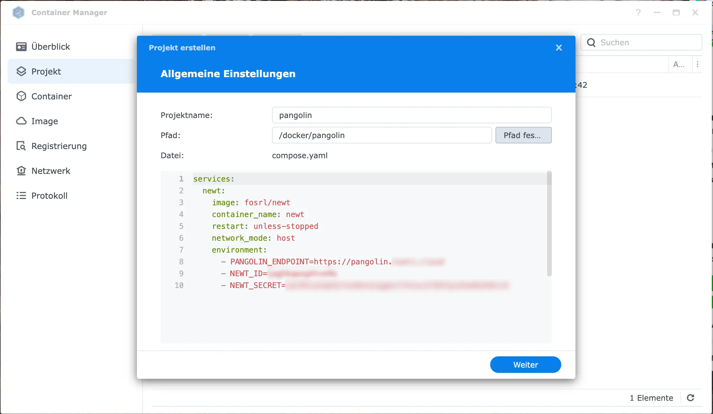
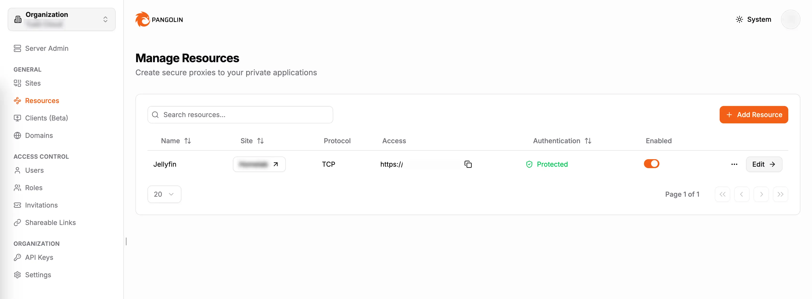

## Wieso denn noch eine Lösung?

Es fühlt sich langsam an, als spränge ich von Lösung zu Lösung, um das _perfekte_ Setup zu finden, um mein heimisches Netzwerk von außen zu erreichen. Ich habe [Cloudflare Tunnel](/synology-nas-als-private-cloud-via-cloudflare-tunnel-ohne-portweiterleitung/) und Tailscale probiert und auch ein [eigenes Setup](/nas-als-private-cloud-1-eigener-tunnel-mit-virtuellem-privaten-server-reverse-proxy-und-wireguard/) gebaut. Alle Varianten hatten ihre Vor- und Nachteile. Cloudflare war super einfach zu konfigurieren und die Endpunkte konnten sicher genug ins Internet geöffnet werden, was ich begrüße, da ich einige Services tatsächlich öffentlich erreichen möchte. Allerdings hat Cloudflare Limitierungen, was beispielweise Streaming angeht. Außerdem geht mein Traffic durch Cloudflare.

Gleiches galt für Tailscale. Tailscale war bei Weitem das einfachste Setup und ich würde die Lösung jedem empfehlen, der es wirklich simpel halten will und der kein Problem damit hat, seinen eigenen Traffic über den Service laufen zu lassen. Ich selbst wollte eine Lösung in der eigenen Hand haben und habe so ein eigenes Setup aufgebaut. Details zu meinem Setup findest du [auf meinem Blog](/nas-als-private-cloud-1-eigener-tunnel-mit-virtuellem-privaten-server-reverse-proxy-und-wireguard/).

Während ich aber in das Rabbit Hole eintauchte, stieß ich auf [Pangolin](https://github.com/fosrl/pangolin) und es schien _die_ Lösung zu sein! Ein selbst gehosteter Reverse Proxy, der das eigene Netzwerk über WireGuard anbinden kann - auch, wenn dieses hinter einem CGNat hängt. Es bietet sicheren Zugriff dank [CrowdSec](https://www.crowdsec.net/) und eigener Zugriffskontrolle. Etwas, das ich in meine DIY-Lösung noch hätte einbauen müssen. Und das beste ist, die Installation sind 2 (bzw. 3, wenn man die Verbindung des Heimnetzes dazu rechnet) Kommandos. Die Konfiguration selnst geht dann über eine schöne UI.

## Okay, was ist Pangolin?

_Pangolin_ ist ein Set an Tools (sowohl Industriestandards, wie auch selbst entwickelte), die es uns ermöglichen, einen getunnelten Reverse Proxy möglichst einfach aufzusetzen. Die Übersicht der Komponenten findest du in deren [offzieller Dokumentation](https://docs.fossorial.io/Getting%20Started/overview#components-overview). Dort findest du auch ein Diagramm, welches die Kommunikation der einzelnen Komponenten darstellt.

Zusammengefasst ist _Pangolin_ selbst das Managementpaket für dsa gesamte Setup. Es beinhaltet auch das Authentifizierungssystem und das Frontend, über welches wir die Konfiguration durchführen. Dann wird _WireGuard_ genutzt (mit dem eigenen Management Interface _Gerbil_) genutzt, um einen Tunnel zum eigenen Heimnetz aufzubauen. _Gerbil_ ist dabei ein Aufsatz, welches die Tunnelkonfiguration abstrahiert, du kannst aber auch natives WireGuard wählen, wenn dir das lieber ist. Ich werde es hier aber einfach halten. _Traefik_ ist ein sehr guter und leichtgewichtiger Reverse Proxy. In meinem DIY-Setup wählte ich _Caddy_, aber _Traefik_ war auch dort in der engeren Auswahl. _Badger_ ist ein selbst gebautes Plugin für _Traefik_, welches nicht authentifizierte Anfragen an _Pangolin_ zur Authentifizierung weiterleitet. Zu guter Letzt haben wir _Newt_. _Newt_ ist ein leichtgewichtiger Server, der im Neimnetzwerk installiert werden muss. Das geht auch via Docker und _Newt_ verbindet sich dann via WebSocket und _Gerbil/WireGuard_ zum Pangolin Server. So kann das Heimnetz dann von außen erreicht werden.

Vielleicht wurde es beim Lesen schon deutlich, aber das Setup bietet eigentlich alles, das wir auch mit Cloudflare bauen konnten. Nur ist es self-hosted 😎 und dank dem containerisierten _Newt_ brauchen wir auch bei einem Synology NAS keine hackige Lösung, wie die selbst kompilierte WireGuard App. Der Endpunkt läuft einfach als Container.

Fangen wir also an!

## Voraussetzungen

Die [Installationsanleitung](https://docs.fossorial.io/Getting%20Started/quick-install) ist wirklich super! Der erste Punkt sind die Voraussetzungen, die ich nochmal etwas ausschmücken will:
- Ein Linuxsystem mit root Zugriff und öffentlicher IP
- Eine Domain, die auf diesen Server zeigt
- Die TCP Ports 80 und 443 müssen offen sein, sowie der UDP Port 51820 und 21820
    - Vermutlich willst du auch TCP Port 22 für SSH offen haben (oder den angepassten, den du konfiguriert hast)
- Eine valide Email-Adresse für Let's Encrypt
- Optional einen SMTP Server zum Versenden von Emails mit One-Time-Passwords
    - Dies kann auch dein Gmail Account mit einem [_App Password_](https://support.google.com/a/answer/176600?hl=de) sein
    - Proton bietet diesen Service leider nur für Business Accounts
    - iCloud bietet auch [App-spezifische Passwörter](https://support.apple.com/de-de/102525) an
    - [Resend](https://resend.com/home) sollte auch klappen
    - Für alle anderen Anbieter müsstest du das selbst prüfen

## Installation von Pangolin

Laut Anleitung gibt es erstmal 2 Steps (natürlich nachdem du dich per `ssh` auf deinem Server eingeloggt hast). Prüfe [auf der offiziellen Installationsanleitung](https://docs.fossorial.io/Getting%20Started/quick-install#installation-steps) bitte, ob sich die Schritte geändert haben. Ansonsten ist es:
```
ssh USER@DEINEDOMAIN.TLD
```
Danach laden wir automatisiert das Installerskript für unsere Architektur und machen dieses ausführbar.
```
wget -O installer "https://github.com/fosrl/pangolin/releases/download/1.8.0/installer_linux_$(uname -m | sed 's/x86_64/amd64/;s/aarch64/arm64/')" && chmod +x ./installer
```
Danach kann es direkt installiert werden:
```
sudo ./installer
```

Der Installer führt uns durch die Installation. Ich werde hier den Wizard einmal durchgehen.

- Es beginnt mit der Frage, ob Pangolin als Docker Container laufen soll - default "ja": **ja**
- _Basic Domain_ ist deine Domaine ohne Subdomain: `deinedomain.tld`
- _Pangolin_ Domain ist die Subdomain, unter welcher das Pangolin Dashboard erreichbar sein soll: `pangolin.deinedomain.tld`
- _Email_ für Let's Encrypt: Nunja... deine Email-Adresse
- _Gerbil_ für getunnelte Verbindungen: **ja**
- _SMTP-Server_ für Email-Funktionalität (für One-Time-Passwords): Bleibt dir überlassen, ich habe **nein** gewählt.
- _Docker installieren_: **ja** (da ich es auf einem frischen System installiere, darf gern die Installation übernommen werden)
- Docker _Container starten_: **ja**

Und das war's! Wie im Wizard beschrieben, geht's danach unter `https://pangolin.deinedomain.tld/auth/initial-setup` weiter - bereits eine HTTPS-Verbindung!

## Die Ersteinrichtung und Verbindung des Heimnetzes

Als erstes legst du den Admin User (mit einem anständigen Passwort) und loggst dich mit diesem ein. Danach wird deine Organisation erstellt. Den Namen kannst du frei wählen, die ID wird bestehen bleiben. Letztendlich ist das für unser Heimnetz so etwas, wie "Private Cloud" oder so.

Die dann einzurichtende _Site_ ist das angebundene Heimnetz. Du kannst auch mehrere entfernte Netze anbinden. Das ist der Teil, der am Ende als _Newt_ auf deinem NAS, Raspi oder in Proxmox verbunden wird. Kannst du als Beispiel "Homelab", "Zuhause", "Nas" oder wie auch immer nennen. Hauptsache der Name identifiziert für dich das dahinter liegende Netz. Speichere dann die für dich erstellten Credentials ab. Für spätere Installationen desselben Newt brauchst du diese. Danach wählst du unter _Install Newt_ **Docker**.

Wenn du den Inhalt für `docker-compose` kopiert hast, öffne dein DSM und darin den _Container Manager_. Navigiere zu _Projekte_, erstelle ein neues Projekt und gib diesem einen Namen ("newt_for_pangolin" oder so). Wähle einen Pfad, in welchem das compose am Ende liegen soll (ich nutze `/volume1/docker/pangolin`) und wähle `docker-compose.yml erstellen`.

Kopiere deinen Inhalt hinein und füge den `network_mode: host` (Zeile 6) hinzu. Ansonsten müssen wir mit Netzwerk Bridges arbeiten, den Traffic routen und von Haus aus verbindet sich dein Newt nicht mit der Pangolin Instanz. Dein `docker-compose.yml` sollte also so aussehen:

```{hl_lines=[6]}
services:
  newt:
    image: fosrl/newt
    container_name: newt
    restart: unless-stopped
    network_mode: host
    environment:
      - PANGOLIN_ENDPOINT=https://pangolin.{deinedomain.tld}
      - NEWT_ID={DEINE_ID}
      - NEWT_SECRET={DEIN_SECRET}
```



Danach kannst du _weiter_, aktivierst _nicht_ den WebSocket und startest den Container. Dieser fährt kurz hoch und du solltest wenig später sehen, dass eine Verbindung hergestellt ist. Dein Heimserver ist verbunden! 🥳

## Routen einrichten

Nun kannst du Endpunkte oder deine Services hinzufügen. Dies nennt sich hier _Resources_, navigiere also zu den _Resources_ und lege via "+ Add Resource" deine erste Route an. Als Beispiel nutze ich Jellyfin, adaptiere für deine Bedürfnisse

> Name: Jellyfin  
> Site: Homelab (oder "NAS" oder was auch immer du der Site für einen Namen gegeben hast)  
> Resource Type: HTTPS  
> HTTPS Settings => Domain: jellyfin.deinedomain.tld  (markiere die dann erscheinende Domain)

Weiter mit "_Create Resource_", nun müssen wir das Ziel in unserem Heimnetz angeben. Hierbei handelt es sich wirklich um das **lokale** Ziel im Heimnetzwerk, im _Homelab_ oder wie auch immer du deine _Site_ genannt hast. Also das Socket (IP:Port) unter welchem beispielsweise dein NAS (wenn du dem Tutorial gefolgt bist) dein Jellyfin erreichen kann.

Wenn du die Route nun speicherst, wirst du die Route in deiner Übersicht sehen und unter `jellyfin.deinedomain.tld` dein lokales Jellyfin erreichen. Cool!



## Nun zur Sicherheit

Ich sprach anfangs vom Aspekt der Sicherheit und wir haben extra einen SMTP-Server für den Versand von Einmalpasswörtern eingerichtet. Lass uns also die Jellyfin-Route etwas absichern.

Öffne via "Edit ->" Button rechts bei der Ressource erneut die Einstellungen und wechsel zum Tab "**Authentication**". Hier kannst du nun festlegen, welche _Rollen_ oder _User_ Zugriff auf die Seite haben dürfen. Du kannst auch ein allgemeingültiges Passwort oder einen allgemeingültigen PIN festlegen. Allerdings sind die dann für alle Nutzer gleich. Kommt das Passwort oder der PIN in Umlauf, kann jeder sich einloggen. Wenn du SMTP eingerichtet hast, kannst du auch One-time Passwords einrichten. Dann bekommt der anfragende Nutzer einen Verifizierungscode per Email.

_Rollen_ kannst du in der linken Navigationsleiste unter _Access Control_ hinzufügen. Das ergibt allerdings auch nur Sinn, wenn du mehrere _User_ hast. Denn _User_ kannst du eine Rolle zuweisen. Beispielsweise die Rolle _Familie_ mit den Usern _Ehepartner_, _Kind_ (natürlich dann mit entpsrechender Email). Die Ressource "photos.meinedomain.tld" könntest du dann beschränken, sodass ausschließlich Mitglieder der Rolle "Familie" Zugriff haben.

Aufgepasst! Wenn du das Feature testen willst und deinen eigenen User für Jellyfin berechtigst (sodass niemand anderes darauf zugreifen darf) und dann die Jellyfin-URL öffnest, landest du _direkt_ bei Jellyfin. Du hast schon einen Session-Token bei Pangolin, bist deshalb authentifiziert. Teste den Zugriff also über einen anderen Browser oder über ein privates Fenster.

Unter **Rules** kannst du darüber hinaus weitere Regeln festlegen, wie IP Ranges, die erlaubt oder nicht erlaubt sein sollen.

## Fazit

Und das war es schon. Die Installation ging mühelos, die erste Ressource ist angelegt und du weißt nun auch, wie du erweiterte Sicherheit einbauen kannst.