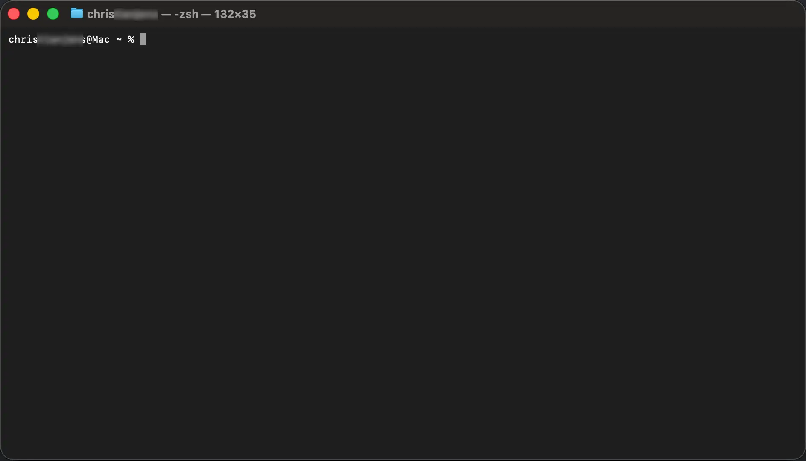
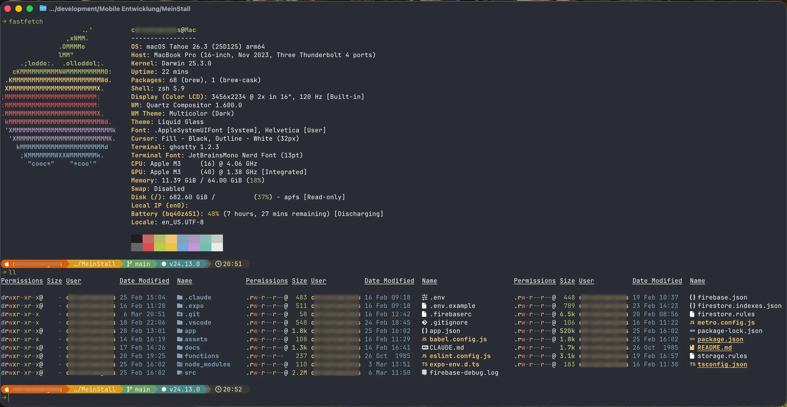

Ich arbeite mittlerweile viel im Terminal. Nicht unbedingt, weil es sein muss – sondern weil es mir Spaß macht. Gerade für textbasierte Themen, wie das Blogging oder auch das Coden. Ich habe das Gefühl, mit dem Terminal mittlerweile schneller zu sein - produktiver. Und wenn ich etwas täglich benutze, dann soll es auch gut aussehen und sich gut anfühlen.

macOS Standard-Terminal                                      | Ghostty als Alternative 
:-----------------------------------------------------------:|:-------------------------------------------------------------------:
       | 

Als ich anfing, mich immer mehr im Terminal zu bewegen, fand ich mich also irgendwann - natürlich - im Rabbit Hole der Terminal-Konfiguration wieder. Doch viele Tools blähen sich über die Zeit immer weiter auf. Es soll (und muss?!) immer mehr abgedeckt werden. Das war auch das Problem mit dem Editor meiner Wahl, VS Code. Auch dieser entwickelt sich immer mehr vom schlaken Editor, der er mal war, zu einem aufgeblähten Code Processor. Mit meinem Terminal sah ich also die Chance, wieder zu entschlacken. Mein Ziel war ein schnelles, schlankes und trotzdem schönes, sowie produktives Terminal!

Ich habe festgestellt, die beiden Anforderungen schließen sich auch nicht aus. In diesem Beitrag will ich dir also zeigen, wie ich von einem Standard Terminal zu einer schönen Arbeitsumgebung gekommen bin. Die Grundvoraussetzung für alles, was folgt, ist [Homebrew](https://brew.sh "Homebrew – The Missing Package Manager for macOS"). Falls du Homebrew noch nicht installiert hast, findest du auf der verlinkten Seite einen einzeiligen Installationsbefehl. Das dauert nur einen Moment und danach können wir loslegen.

## Was wir installieren

1. [Ghostty – Ein moderner Terminal-Emulator](#ghostty)
2. [Starship – Der hübsche Prompt](#starship)
3. [Fastfetch – Systeminfos beim Start](#fastfetch)
4. [eza – ls mit Farbe und Icons](#eza)
5. [ZSH Syntax Highlighting & Autocomplete](#zsh-plugins)
6. [NeoVim – Das Herzstück](#neovim)
7. [Bonus: Das Installations-Skript](#bonus)

---

## 1) Ghostty – Ein moderner Terminal-Emulator {#ghostty}

Vor allem anderen brauchen wir erstmal ein Terminal, das unseren Anforderungen entspricht. Das Standard-Terminal von macOS ist in Ordnung, aber [Ghostty](https://ghostty.org "Ghostty Terminal") ist mehr als das.

Ghostty ist GPU-beschleunigt und nutzt plattformspezifische Technologien: Unter macOS läuft es auf Swift und AppKit, also nativ und ohne Electron-Overhead. Entwickelt wurde es von [Mitchell Hashimoto](https://mitchellh.com "Mitchell Hashimoto"), dem Gründer von HashiCorp. Wenn jemand weiß, wie man gute Tools baut, dann er. Ziel für Ghostty war es, ein Terminal (bzw. ein Terminal-Emulator) zu bauen, welches neben der Geschwindigkeit auch möglichst wenig Bedarf für Konfiguration hat. Und sollte man etwas konfigurieren wollen, geschieht dies ganz einfach textbasiert über die Datei `~/.config/ghostty/config`. Kein GUI, keine Maus – einfach eine Datei editieren und fertig.

Die Installation läuft über Homebrew:

```
brew install --cask ghostty
```

Danach einfach Ghostty öffnen und mit dem Rest weitermachen.

---

## 2) Starship – Der hübsche Prompt {#starship}

Das Erste, was du im Terminal siehst, ist der Prompt. Am besten sieht dieser also gut aus, zeigt dir aber auch relevante Infos an. [Starship](https://starship.rs "Starship – The minimal, blazing-fast, and infinitely customizable prompt") ist dabei meine klare Empfehlung: leichtgewichtig, schnell und mit einer Menge [Presets](https://starship.rs/presets/), die du sofort übernehmen kannst.

Installation:

```
brew install starship
```

Ich nutze das _Gruvbox Rainbow_ Preset, das ich mit einem einzigen Befehl anwende:

```
starship preset gruvbox-rainbow -o ~/.config/starship.toml
```

Damit wird die Preset-Konfiguration direkt als `starship.toml` gespeichert. Danach muss Starship noch in der `~/.zshrc` aktiviert werden:

```zsh
# >>> Starship Config >>>
eval "$(starship init zsh)"
# <<< Starship Config <<<
```

Beim nächsten Öffnen des Terminals begrüßt dich ein deutlich ansprechenderer Prompt.

---

## 3) Fastfetch – Systeminfos beim Start {#fastfetch}

Kennst du diese Terminal-Screenshots, bei denen beim Start ein hübsches System-Info-Panel erscheint? Das macht [Fastfetch](https://github.com/fastfetch-cli/fastfetch "Fastfetch auf GitHub"). Es zeigt beim Starten des Terminals Infos wie Betriebssystem, CPU, RAM und mehr an.

Alternativen wären `neofetch` (der Klassiker, aber nicht mehr aktiv gepflegt) oder `fetch`. Wenn du dir unsicher bist, welches Tool für dich passt: Auf Reddit gibt es einen [Vergleich der drei](https://www.reddit.com/r/linux/comments/1g9ezkg/heres_the_difference_between_neofetch_fastfetch/ "Reddit: Unterschied zwischen neofetch, fastfetch und fetch"), der dir die Entscheidung abnehmen kann. Ich habe mich für Fastfetch entschieden, weil es schlank wirkt und aktiv weiterentwickelt wird.

```
brew install fastfetch
```

In der `~/.zshrc` reicht eine einzige Zeile, damit Fastfetch bei jedem neuen Terminal-Fenster ausgeführt wird:

```zsh
fastfetch
```

---

## 4) eza – ls mit Farbe und Icons {#eza}

Das gute alte `ls` ist seit Jahrzehnten dabei, aber schön ist es nicht. [eza](https://github.com/eza-community/eza "eza auf GitHub") ist ein moderner Ersatz: farbig, mit Datei-Icons, mit Git-Status-Anzeige und jeder Menge nützlicher Parameter.

```
brew install eza
```

Damit ich `eza` nicht immer von Hand mit den richtigen Parametern aufrufen muss, habe ich ein paar Aliases gesetzt. Die gehören in die `~/.zshrc`:

```zsh
# >>> ALIASES >>>
alias ls="eza -lah --icons=always"
alias ll="eza -lah --icons=always --grid --group-directories-first"
alias lt="eza --tree --level=2 --icons=always"
# <<< ALIASES <<<
```

Was die einzelnen Aliases machen:

- **`ls`** – Überschreibt das Standard-`ls` mit einer ausführlichen, farbigen Liste inklusive Icons und Header. Auch versteckte Dateien werden angezeigt.
- **`ll`** – Wie `ls`, aber als Grid-Ansicht und mit der Konfiguration, Ordner vor Dateien aufzulisten.
- **`lt`** – Zeigt eine Baumansicht, zwei Ebenen tief, ebenfalls mit Icons. So siehst du direkt die Ordner und Dateien innerhalb der Ordner auf der aktuellen Ebene.

---

## 5) ZSH Syntax Highlighting & Autocomplete {#zsh-plugins}

Ein No-Brainer.

`zsh-autosuggestions` zeigt dir während des Tippens Vorschläge aus deiner Befehlshistorie an, die du mit der Pfeiltaste rechts übernehmen kannst. `zsh-syntax-highlighting` färbt deine Eingaben ein: Grün, wenn der Befehl bekannt ist – Rot, wenn er es nicht ist. Beide zusammen sparen täglich ein paar unnötige Enter-Drücke.

```
brew install zsh-autosuggestions zsh-syntax-highlighting
```

Wichtig: Dieser Block **muss ans Ende der `~/.zshrc`**. Die Plugins müssen als letztes geladen werden, damit sie korrekt funktionieren.

```zsh
# --------------------------------------------
# THIS MUST BE THE LAST PART OF THE FILE
# --------------------------------------------

# >>> ZSH Syntax Highlighting/Autocomplete >>>
source $(brew --prefix)/share/zsh-autosuggestions/zsh-autosuggestions.zsh
source $(brew --prefix)/share/zsh-syntax-highlighting/zsh-syntax-highlighting.zsh
# <<< ZSH Syntax Highlighting/Autocomplete <<<
```

---

## 6) NeoVim – Das Herzstück {#neovim}

Jetzt kommen wir zum eigentlichen Kern des Setups. [NeoVim](https://neovim.io "NeoVim") ist ein moderner Fork von Vim, der sich durch eine aktive Community und ein robustes Plugin-Ökosystem auszeichnet. Wer Vim kennt, findet sich sofort zurecht. Wer Vim nicht kennt: Wenn du anfängliche Schmerzen gern durchstehst, um dann mit starker Produktivität belohnt zu werden, lohnt sich das Ausprobieren.

Der Unterschied zu einem normalen Texteditor liegt bei NeoVim in den Plugins. Damit wird aus dem Terminal-Editor ein vollständig konfigurierbares Werkzeug.

```
brew install neovim
```

### init.lua – Die Grundkonfiguration

Die Konfiguration von NeoVim liegt in `~/.config/nvim/init.lua`. Diese Datei ist der Einstiegspunkt für alles. Bei mir sieht sie so aus:

```lua
require("config.lazy")

vim.cmd("set expandtab")
vim.cmd("set tabstop=2")
vim.cmd("set softtabstop=2")
vim.cmd("set shiftwidth=2")
```

Die vier `vim.cmd`-Zeilen setzen Tabs auf 2 Spaces – meine Präferenz. Das `require("config.lazy")` lädt den Plugin-Manager, um den es im nächsten Schritt geht.

### lazy.nvim – Der Package Manager

Plugins in NeoVim brauchen einen Package Manager. Ich nutze [lazy.nvim](https://lazy.folke.io/ "lazy.nvim Dokumentation"), weil er Plugins erst lädt, wenn sie wirklich gebraucht werden (_lazy loading_), was den Start beschleunigt. Er scheint auch der aktuell "Standard" der Community zu sein.

Installiert wird der Package Manager laut [empfohlener Anleitung](https://lazy.folke.io/installation "Installationsanleitung für lazy.nvim") in zwei Schritten. Den ersten haben wir eben bereits erledigt, dies war `require("config.lazy")` in der `init.lua`.

Als zweites brauchen wir die Konfigurationsdatei selbst: `~/.config/nvim/lua/config/lazy.lua` (der Pfad entspricht dem `require("config.lazy")` in der `init.lua`). Diese braucht folgenden Inhalt (Kopie aus dem Installationsskript der Anleitung, gern prüfen oder von dort beziehen):

```lua
-- Bootstrap lazy.nvim
local lazypath = vim.fn.stdpath("data") .. "/lazy/lazy.nvim"
if not (vim.uv or vim.loop).fs_stat(lazypath) then
  local lazyrepo = "https://github.com/folke/lazy.nvim.git"
  local out = vim.fn.system({ "git", "clone", "--filter=blob:none", "--branch=stable", lazyrepo, lazypath })
  if vim.v.shell_error ~= 0 then
    vim.api.nvim_echo({
      { "Failed to clone lazy.nvim:\n", "ErrorMsg" },
      { out, "WarningMsg" },
      { "\nPress any key to exit..." },
    }, true, {})
    vim.fn.getchar()
    os.exit(1)
  end
end
vim.opt.rtp:prepend(lazypath)

-- mapleader auf Space legen, bevor Plugins geladen werden
vim.g.mapleader = " "
vim.g.maplocalleader = "\\"

-- lazy.nvim einrichten
require("lazy").setup({
  spec = {
    { import = "plugins" },
  },
  install = { colorscheme = { "habamax" } },
  checker = { enabled = true }, -- prüft automatisch auf Plugin-Updates
})
```

Beim ersten Start von NeoVim klont sich lazy.nvim selbst aus GitHub, falls es noch nicht vorhanden ist. Dann importiert es alle Plugin-Definitionen aus dem `plugins`-Ordner – den wir gleich anlegen. Solange dieser Ordner noch nicht existiert, kann es beim ersten Start zu einem unkritischen Fehler kommen. Keine Sorge, das beheben wir gleich.

Außerdem legen wir mit diesem Skript den `<leader>` auf die Leertaste. Diese Info wird gleich noch wichtig. Plugins können über Tastaturkürzel geöffnet werden. Diese Kürzel benötigen jedoch eine Art "Trigger", eine Taste, die sagt _"hey, nun kommt ein Plugin-Kürzel"_ - und genau das ist die Leertaste nun.

### Gruvbox Material – Das Colorscheme

Farben machen einen Unterschied. Ich habe mich für [Gruvbox Material](https://github.com/sainnhe/gruvbox-material "Gruvbox Material auf GitHub") entschieden – warme Erdtöne, angenehm für lange Sessions. Die Plugin-Definition kommt in eine neue Datei: `~/.config/nvim/lua/plugins/gruvbox-material.lua`

```lua
return {
  {
    "sainnhe/gruvbox-material",
    lazy = false,   -- Themes müssen sofort geladen werden
    priority = 1000,
    config = function()
      -- Kontrast: 'hard', 'medium' oder 'soft'
      vim.g.gruvbox_material_background = "medium"
      -- Kursive Kommentare aktivieren
      vim.g.gruvbox_material_enable_italic = 1

      vim.cmd.colorscheme("gruvbox-material")
    end,
  },
}
```

`lazy = false` und `priority = 1000` sorgen dafür, dass das Theme als erstes geladen wird – vor allen anderen Plugins. Sonst kann es zu einem kurzen Aufflackern des Standard-Themes beim Start kommen.

### Telescope – Fuzzy Finder

Das letzte Plugin und für mich das produktivste: [Telescope](https://github.com/nvim-telescope/telescope.nvim "Telescope auf GitHub"). Ein _Fuzzy Finder_ erlaubt es, Dateien und Text zu suchen, ohne den genauen Namen zu kennen. Man tippt ein paar Buchstaben, und Telescope zeigt alle Treffer im aktuellen Projekt in Echtzeit an.

Damit Telescope auch im Datei-Inhalt suchen kann, braucht es zwei externe Tools:

```
brew install ripgrep fd
```

Die Plugin-Konfiguration kommt in `~/.config/nvim/lua/plugins/telescope.lua`:

```lua
return {
  {
    'nvim-telescope/telescope.nvim',
    version = 'v0.2.1',
    dependencies = {
      'nvim-lua/plenary.nvim',
      { 'nvim-telescope/telescope-fzf-native.nvim', build = 'make' },
    },
    config = function()
      local builtin = require('telescope.builtin')

      vim.keymap.set('n', '<leader>ff', builtin.find_files, { desc = 'Telescope find files' })
      vim.keymap.set('n', '<leader>fg', builtin.live_grep,  { desc = 'Telescope live grep' })
      vim.keymap.set('n', '<leader>fb', builtin.buffers,    { desc = 'Telescope buffers' })
      vim.keymap.set('n', '<leader>fh', builtin.help_tags,  { desc = 'Telescope help tags' })
    end,
  },
}
```

Beachte bitte, dass wir - so ist es von den Entwicklern empfohlen - eine exakte Version gesetzt haben. Willst du das Tool aktualisieren, muss die Version manuell angepasst werden. Danach setzen wir die vier Hotkeys und hier siehst du den `<leader>` wieder (bei uns die **Leerstaste** (**Space**):

| Shortcut | Funktion |
|---|---|
| `Space + ff` | Dateien suchen |
| `Space + fg` | Volltextsuche im Projekt (Live Grep) |
| `Space + fb` | Zwischen offenen Buffern wechseln |
| `Space + fh` | NeoVim-Hilfe durchsuchen |

Beim nächsten Start von NeoVim lädt lazy.nvim alle Plugins automatisch herunter und installiert sie. Das passiert nur einmal, danach sind sie gecacht.

---

## Bonus: Das Installations-Skript {#bonus}

Wer das Setup auf einem neuen Rechner nicht Schritt für Schritt wiederholen möchte, kann es mit diesem Skript automatisieren. Es prüft zunächst, ob Homebrew installiert ist, installiert dann alle Abhängigkeiten, konfiguriert die `~/.zshrc` und legt alle NeoVim-Konfigurationsdateien an.

**Wichtiger Hinweis:** Das Skript hängt die `.zshrc`-Blöcke einfach ans Ende der Datei an. Wenn du die Einträge bereits manuell hinzugefügt hast, entstehen Duplikate. Das Skript legt vorher automatisch ein Backup an – schau dort nach, falls etwas schiefläuft.

```bash
#!/bin/bash

# Farben für die Ausgabe
GREEN='\033[0;32m'
YELLOW='\033[1;33m'
NC='\033[0m'

echo -e "${YELLOW}Terminal Setup – Chrischi's Konfiguration${NC}"
echo "Starte die Installation..."
echo ""

# --------------------------------------------
# 1) Homebrew prüfen und ggf. installieren
# --------------------------------------------
if ! command -v brew &> /dev/null; then
  echo "Homebrew nicht gefunden. Installiere Homebrew..."
  /bin/bash -c "$(curl -fsSL https://raw.githubusercontent.com/Homebrew/install/HEAD/install.sh)"
  # brew in aktuelle Session laden (nötig auf Apple Silicon nach Frischinstallation)
  if [[ -f /opt/homebrew/bin/brew ]]; then
    eval "$(/opt/homebrew/bin/brew shellenv)"
  elif [[ -f /usr/local/bin/brew ]]; then
    eval "$(/usr/local/bin/brew shellenv)"
  fi
else
  echo -e "${GREEN}✓ Homebrew ist bereits installiert.${NC}"
fi

# --------------------------------------------
# 2) Abhängigkeiten installieren
# --------------------------------------------
echo ""
echo "Installiere alle Abhängigkeiten via Homebrew..."

brew install --cask ghostty
brew install starship
brew install fastfetch
brew install eza
brew install zsh-autosuggestions
brew install zsh-syntax-highlighting
brew install neovim
brew install ripgrep
brew install fd

echo ""
echo -e "${GREEN}✓ Alle Abhängigkeiten installiert.${NC}"

# --------------------------------------------
# 3) .zshrc konfigurieren
# --------------------------------------------
echo ""
echo "Konfiguriere ~/.zshrc..."

# Backup anlegen
if [ -f ~/.zshrc ]; then
  BACKUP=~/.zshrc.backup.$(date +%Y%m%d_%H%M%S)
  cp ~/.zshrc "$BACKUP"
  echo "Backup erstellt: $BACKUP"
fi

# fastfetch + Starship + Aliases hinzufügen
cat >> ~/.zshrc << 'EOF'

# >>> Starship Config >>>
eval "$(starship init zsh)"
# <<< Starship Config <<<

# >>> ALIASES >>>
alias ls="eza -lah --icons=always"
alias ll="eza -lah --icons=always --grid --group-directories-first"
alias lt="eza --tree --level=2 --icons=always"
# <<< ALIASES <<<

# >>> RUN FASTFETCH >>>
fastfetch
# <<< RUN FASTFETCH <<<

# --------------------------------------------
# THIS MUST BE THE LAST PART OF THE FILE
# --------------------------------------------

# >>> ZSH Syntax Highlighting/Autocomplete >>>
source $(brew --prefix)/share/zsh-autosuggestions/zsh-autosuggestions.zsh
source $(brew --prefix)/share/zsh-syntax-highlighting/zsh-syntax-highlighting.zsh
# <<< ZSH Syntax Highlighting/Autocomplete <<<
EOF

echo -e "${GREEN}✓ ~/.zshrc konfiguriert.${NC}"

# --------------------------------------------
# 4) Starship Preset installieren
# --------------------------------------------
echo ""
echo "Starship Preset (Gruvbox Rainbow) installieren..."
starship preset gruvbox-rainbow -o ~/.config/starship.toml
echo -e "${GREEN}✓ Starship Preset installiert.${NC}"

# --------------------------------------------
# 5) NeoVim konfigurieren
# --------------------------------------------
echo ""
echo "NeoVim konfigurieren..."

mkdir -p ~/.config/nvim/lua/config
mkdir -p ~/.config/nvim/lua/plugins

# init.lua
cat > ~/.config/nvim/init.lua << 'EOF'
require("config.lazy")

vim.cmd("set expandtab")
vim.cmd("set tabstop=2")
vim.cmd("set softtabstop=2")
vim.cmd("set shiftwidth=2")
EOF

# lazy.lua (Package Manager)
cat > ~/.config/nvim/lua/config/lazy.lua << 'EOF'
-- Bootstrap lazy.nvim
local lazypath = vim.fn.stdpath("data") .. "/lazy/lazy.nvim"
if not (vim.uv or vim.loop).fs_stat(lazypath) then
  local lazyrepo = "https://github.com/folke/lazy.nvim.git"
  local out = vim.fn.system({ "git", "clone", "--filter=blob:none", "--branch=stable", lazyrepo, lazypath })
  if vim.v.shell_error ~= 0 then
    vim.api.nvim_echo({
      { "Failed to clone lazy.nvim:\n", "ErrorMsg" },
      { out, "WarningMsg" },
      { "\nPress any key to exit..." },
    }, true, {})
    vim.fn.getchar()
    os.exit(1)
  end
end
vim.opt.rtp:prepend(lazypath)

vim.g.mapleader = " "
vim.g.maplocalleader = "\\"

require("lazy").setup({
  spec = {
    { import = "plugins" },
  },
  install = { colorscheme = { "habamax" } },
  checker = { enabled = true },
})
EOF

# gruvbox-material.lua (Colorscheme)
cat > ~/.config/nvim/lua/plugins/gruvbox-material.lua << 'EOF'
return {
  {
    "sainnhe/gruvbox-material",
    lazy = false,
    priority = 1000,
    config = function()
      vim.g.gruvbox_material_background = "medium"
      vim.g.gruvbox_material_enable_italic = 1
      vim.cmd.colorscheme("gruvbox-material")
    end,
  },
}
EOF

# telescope.lua (Fuzzy Finder)
cat > ~/.config/nvim/lua/plugins/telescope.lua << 'EOF'
return {
  {
    'nvim-telescope/telescope.nvim',
    version = 'v0.2.1',
    dependencies = {
      'nvim-lua/plenary.nvim',
      { 'nvim-telescope/telescope-fzf-native.nvim', build = 'make' },
    },
    config = function()
      local builtin = require('telescope.builtin')

      vim.keymap.set('n', '<leader>ff', builtin.find_files, { desc = 'Telescope find files' })
      vim.keymap.set('n', '<leader>fg', builtin.live_grep,  { desc = 'Telescope live grep' })
      vim.keymap.set('n', '<leader>fb', builtin.buffers,    { desc = 'Telescope buffers' })
      vim.keymap.set('n', '<leader>fh', builtin.help_tags,  { desc = 'Telescope help tags' })
    end,
  },
}
EOF

echo -e "${GREEN}✓ NeoVim konfiguriert.${NC}"

# --------------------------------------------
# Fertig!
# --------------------------------------------
echo ""
echo -e "${GREEN}✓ Setup abgeschlossen! 🥳${NC}"
echo "Starte dein Terminal neu (oder führe 'source ~/.zshrc' aus), um alle Änderungen zu sehen."
echo "Beim ersten Start von NeoVim installiert lazy.nvim automatisch alle Plugins."
```

Das Skript speichern (z.B. als `terminal-setup.sh`), ausführbar machen und starten:

```
chmod +x terminal-setup.sh
./terminal-setup.sh
```

---

## Fazit

Damit ist mein kleines "Produktivitäts-und-Kosmetik-Setup" für das Terminal abgeschlossen. Ghostty startet flott, Starship macht den Prompt angenehm lesbar, Fastfetch begrüßt mich mit einem kleinen Systemüberblick und eza macht `ls` endlich schön. Die ZSH-Plugins ersparen mir täglich ein paar unnötige Tipp-Fehler.

NeoVim kann die Produktivität echt fördern, wenn man bereits ist, anfangs deutlich ineffizienter zu arbeiten. Die Shortcuts müssen sich einprägen und _Muscle Memory_ muss sich aufbauen. Vim und auch NeoVim können anfangs echt frustrierend sein. Aber mit Telescope hat sich das in kurzer Zeit mehr als ausgezahlt. Die Volltextsuche über ein ganzes Projekt aus dem Terminal heraus ist schlicht praktisch.

Das Installations-Skript macht das alles auf einem neuen Rechner zu einem Fünf-Minuten-Job. Und wer mag, kann es als Ausgangspunkt für sein eigenes Terminal-Setup nehmen und es von dort aus nach eigenem Geschmack erweitern. ☕️
