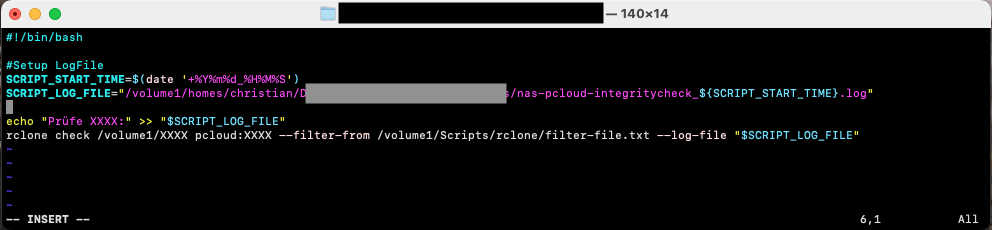
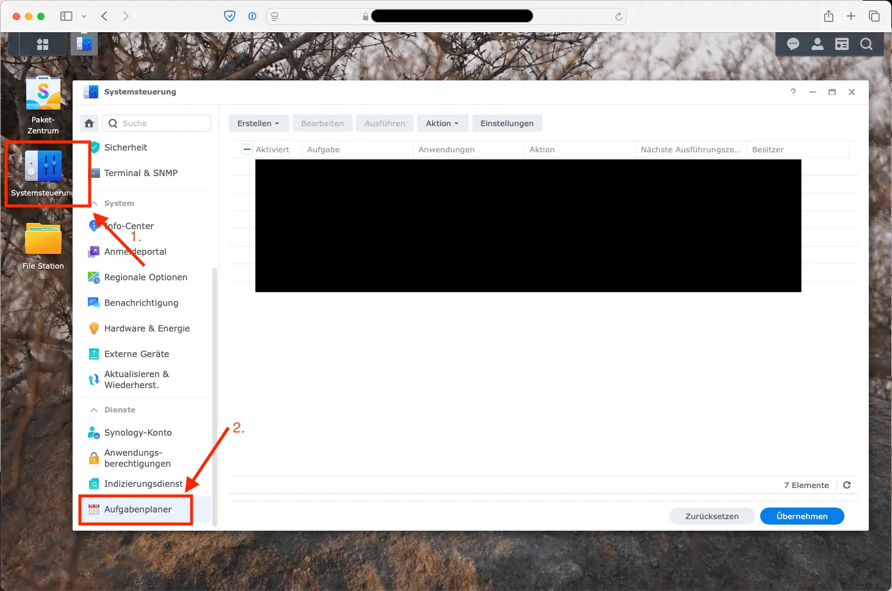

**Update 02.07.2025:** Dieser Beitrag ist dauerhaft von meiner alten Domain "chrischisblog.de" umgezogen. Den Grund für den Umzug habe ich in [diesem Post](/ipad-blog-workflow-vom-schreiben-bis-zur-veroeffentlichung) erklärt.

---

Der bei Weitem beliebteste Beitrag auf diesem Blog ist das Tutorial _[rclone auf dem Synology NAS installieren](/rclone-auf-dem-synology-nas-installieren)_. Obwohl ich ein wirklich kleines Blog habe, bekam ich sehr viel Feedback, einige Fragen und auch einen sehr sinnvollen Wunsch für ein Folgethema: Wie kann geprüft werden, ob die Synchronisierung auch die Datenintegrität hält. Ist alles korrekt synchronisiert worden? Muss man alle Dateien manuell prüfen oder gibt es einen eleganteren Weg? In diesem Beitrag möchte ich die Antwort geben: Natürlich gibt es einen eleganteren Weg und diesen möchte ich hier aufzeigen.

Um diesem Tutorial folgen zu können, musst du allerdings rclone bereits auf dem NAS installiert haben. Hierzu folge gern der Verlinkung am Anfang des Beitrags. Und auch hier der Disclaimer, ich werde in diesem Beitrag pCloud als Beispiel nutzen, da ich meine Daten mit pCloud synchronisiere. Es sollte aber ähnlich auch mit anderen Cloud-Diensten funktionieren.

In diesem Beitrag geht es also darum, *Prüfsummen für unsere synchronisierten Dateien zu erstellen und diese mit lokalen Prüfsummen zu vergleichen*. rclone bietet ein solches Feature von Haus aus an, [*rclone check*](https://rclone.org/commands/rclone_check/).

## Bevor es losgeht…

… möchte ich noch einmal auf die verschiedenen rclone hash Varianten hinweisen. Mir ist bewusst, dass rclone spezifische Arten implementiert hat, um Hash-Werte zu prüfen: md5, sha1, sha256 und andere. Über rclones Befehl [*hashsum*](https://rclone.org/commands/rclone_hashsum/) könnte man bestimmen, mit welchem Hash-Algorithmus man die Dateien prüfen will. Dann könnten wir die Hashes der Dateien erstellen (lokal und in der Cloud) und diese Hash-Listen vergleichen. Das gibt sehr viel Freiheit und ist ein legitimer Weg.

Es gibt jedoch auch den Befehl [*check*](https://rclone.org/commands/rclone_check/), welcher spezifisch für den Vergleich von Quelle und Ziel geschaffen wurde und ausgibt, wenn Dateien nicht identisch sind. Diesen Befehl werde ich in diesem Tutorial nutzen, da es der einfachste ist – meiner Ansicht nach.

Der Vollständigkeit halber sei noch erwähnt, das rclone auch die Befehle [*md5sum*](https://rclone.org/commands/rclone_md5sum/) und [*sha1sum*](https://rclone.org/commands/rclone_sha1sum/) hat, diese sind jedoch nur [einfachere Wege, um via hashsum den md5- oder sha1-Wert zu prüfen](https://forum.rclone.org/t/3-different-ways-to-hash/27279/3). Sogenannte Aliases für diesen Befehl.

Im Kern hat rclone drei Wege, um mit Hashes zu arbeiten:

* *hashsum*: Um Hashwerte zu generieren und anzuzeigen
* *checksum*: Um einen Pfad gegen eine vordefinierte Liste am Hashwerte zu prüfen
* *check*: Um Hashwerte zwischen zwei Pfaden zu prüfen – deshalb nutzen wir diesen Weg

## Und nun geht’s los!

Hier möchte ich nochmal erwähnen, dieses Tutorial ist so etwas, wie ein “Teil 2” meines Installations- und Konfigurations-Tutorial. Daher kommen auch die Ordner, die ich hier nun nutzen werde. Wenn du diese Ordner nicht auf deinem NAS hast, ist dies nicht schlimm. Wo du die kommenden Skripte erstellst, ist nicht wichtig. Wenn du aber ein Setup hast, das auf meinem ersten Tutorial basiert, kannst du auch hier weiter folgen.

### Das Skript vorbereiten

Wir arbeiten wieder im Terminal, da ich meine Prüf-Skripte auch im Skripte-Ordner haben möchte. Also mit ssh auf unser Synology

```
ssh DEIN_NAS_NUTZERNAME@DEINE_NAS_IP
```

Ich möchte die Skripte wieder in meinem “Scripts”-Ordner haben. Du solltest diesen auch haben, wenn du dem ersten Teil gefolgt bist. Also erst sudo-Rechte holen und dann in den Ordner navigieren

```
sudo -i
cd /volume1/Scripts/rclone
```

Hier lege ich meine Datei an, die ich regelmäßig ausführen möchte. Für mich ist das eine logische Trennung: Ein Skript synchronisiert meine Dateien, ein anderes Skript prüft die Integrität.

Dir steht natürlich frei, andere logische Trennungen zu machen oder gar alles in eine Datei zu schreiben. Es sollte aber auch in sechs Monaten noch Sinn ergeben, wenn man mal etwas nachsehen oder anpassen möchte.

```
touch check-sync-integrity.sh
chmod a+x check-sync-integrity.sh
```

In der ersten Zeile legen wir eine Datei mit dem Namen “check-sync-integrity.sh“ an und in der zweiten Zeile machen wir diese ausführbar, sodass wir sie später über den Aufgabenplaner im NAS regelmäßig laufen lassen können.

Weiter geht’s ans Eingemachte.

## Der Inhalt des Skripts

Die Datei existiert, was soll da nun also rein? Öffne die Datei in Vim, um sie mit Leben zu füllen:

```
vi check-sync-integrity.sh
```

Ich werde hier nur einen beispielhaften Ordner prüfen. Mit dem Gerüst wirst du aber danach das Skript hoffentlich selbst erweitern können, um all deine Ordner zu prüfen. Also mit *i* ab, in den *insert* mode, damit wir skripten können.

```
i
```

Erstmal der Inhalt meines Skripts, ich gehe gleich nochmal näher darauf ein:

```
#!/bin/bash

# Setup Log File
SCRIPT_START_TIME=$(date '+%Y%m%d_%H%M%S')
SCRIPT_LOG_FILE="/volume1/homes/christian/.../.../nas-pcloud-integritycheck_${SCRIPT_START_TIME}.log"

# Check directories
echo "Prüfe XXXX:" >> "$SCRIPT_LOG_FILE"
rclone check /volume1/XXXX pcloud:XXXX --filter-from /volume1/Scripts/rclone/filter-file.txt --log-file "$SCRIPT_LOG_FILE"
```

Die erste Zeile ist das typische [Hash-Bang](https://de.wikipedia.org/wiki/Shebang), um zu definieren, dass dieses Skript als Bash-Skript zu interpretieren ist. Womit wir es später auch ausführen werden.

Zeile 3 ist ein Kommentar, der keine Ausführung auf die Ausführung hat, jedoch für die Strukturierung des Skriptes gut ist. Hier definiere ich den Namen der Log-Datei, in die ich jeweils das Ergebnis schreiben möchte. Ich will eine Datei mit dem Namen “nas-pcloud-integritycheck\_20250315\_020000.log”. Hierbei ist der erste Teil statisch und bleibt immer gleich. Der zweite Teil spiegelt das Datum und die Uhrzeit wieder, wann das Skript gelaufen ist (bei mir dann ca. 02:00 Uhr).

Schlussendlich kommt das Herzstück. Meine beiden Ordner, die ich prüfen will. Hier gehe ich etwas näher auf alle Zeilen ein:

> #Check Directories

Eine Kommentar für meine Strukturierung. Wird ignoriert, gibt nur an, dass nun die zu prüfenden Ordner folgen

> echo „Prüfe XXXX:“ >> „$SCRIPT\_LOG\_FILE“

Schreibt *Prüfe XXXX:* in die Log-Datei. Dies ist 100% optional. Die Ausgabe des rclone-Befehls wird den Namen deines geprüften Ordners enthalten. Aber ich gruppiere meine Einträge gern mit manuell gesetzten Überschriften. Macht das Log für mich einfach etwas übersichtlicher. Das bleibt aber dir überlasen. Du müsstest natürlich statt “XXXX” den tatsächlichen Namen deines Ordners schreiben.

> rclone check /volume1/XXXX pcloud:XXXX –filter-from /volume1/Scripts/rclone/filter-file-shared.txt –log-file „$SCRIPT\_LOG\_FILE“

*rclone check* ist der Befehl, den wir nutzen wollen. Es folgen die beiden Ordner, die miteinander verglichen werden sollen. Meine Ordner habe ich als Beispiel XXXX genannt. Bitte gib den Pfad und den Namen deiner Ordner an. Danach gebe ich eine Filter-Datei an. Dies ist die identische Filterdatei, die ich auch bei der Synchronisation nutze. Hier schließe ich bestimmte Systemdateien vom NAS aus (z.B. den #recycle-Ordner oder bestimmte Mac- oder Windows-Dateien, die entstehen können, wenn man mit den Geräten auf die Ordner zugreift). Ich möchte diese Dateien auch beim Vergleich ausschließen. Sonst würde ich eine Anzahl an Unterschieden angezeigt bekommen, die irrelevant sind. Schlussendlich gebe ich den Pfad für meine zuvor definierte Log-Datei mit. Das Ergebnis soll hier hineingeschrieben werden.

Nun kannst du diese beiden Zeilen (Überschrift und Sync-Befehl) als Vorlage nutzen, um all deine synchronisierten Ordner prüfen. Bitte beachte dabei, dass du die Pfade zu deinen Ordnern korrekt sind. Wenn du diese aber bereits synchronisierst, gehe ich davon aus, dass du deine Pfade kennst 😎

Meine Datei sind nun so aus:



Danach mit

```
Escape
:wq
```

die Datei speichern und schließen.

## Das Skript automatisiert ausführen

Jetzt sollten wir noch sicherstellen, dass wir regelmäßig die Integrität prüfen. Ich werde meine Prüfung auf den 15. eines Monats legen, da Anfang des Monats schon mehr läuft. Hierfür auf der Web-Oberfläche des NAS einloggen, die Systemsteuerung öffnen und in den Aufgabenplaner navigieren:



Dort via “Erstellen” – “Geplante Aufgabe” – “Benutzerdefiniertes Skript” eine neue Aufgabe erstellen:

```
Allgemein:
Aufgabe: Der Name deiner Aufgabe, meiner ist “Monatlicher Check Sync-Integritaet”
Benutzer: root
Aktiviert: Haken ist gesetzt

Zeitplan:
An folgenden Datum ausführen: 2025-03-15 (oder der nächste 15. bzw. jeder andere Tag, an dem du es das erste Mal ausführen willst)
Wiederholen: Monatlich wiederholen
Start: 02:00 Uhr

Aufgabeneinstellungen:
Ausführungsdetails per Email senden: Habe ich keinen Haken, da ich die Log-Dateien manuell prüfen würde. Bleibt dir überlassen.
Benutzerdefiniertes Skript: bash /volume1/Scripts/rclone/check-sync-integrity.sh
```

Du kannst diese Aufgabe nun gern einmal laufen lassen. Je nach Anzahl deiner zu prüfenden Dateien, kann die Prüfung ein paar Minuten dauern. Danach solltest du aber in deiner Log-Datei eine Ausgabe haben, die ungefähr so aussieht. Auch hier habe ich meinen tatsächlichen Ordner mit XXXX verschleiert. Hier sollte der tatsächliche Ordnername stehen:


Dieser Check sollte nun – sofern du einen Aufgabenplan erstellt hast – monatlich laufen und dich wissen lassen, ob alle Dateien sauber an beiden Orten liegen. Sollten Dateien nicht identisch sein, wird dir dies ebenfalls aufgezeigt.

Viel Spaß damit und hoffentlich ruhige Nächte, da du nun weißt, dass deine Daten gut synchronisiert werden.

Zum Schluss in eigener Sache: Solltest du pCloud-Speicher erwerben und mich damit unterstützen wollen, würde ich mich total freuen, wenn du meinen Affiliate Link verwendest. So bekomme ich eine kleine Provision, es gibt aber keine Mehrkosten für dich. Einfach auf das folgende Bild oder [hier](https://partner.pcloud.com/r/130163) klicken. Danke!

[](https://partner.pcloud.com/r/130163 "pCloud Lifetime")