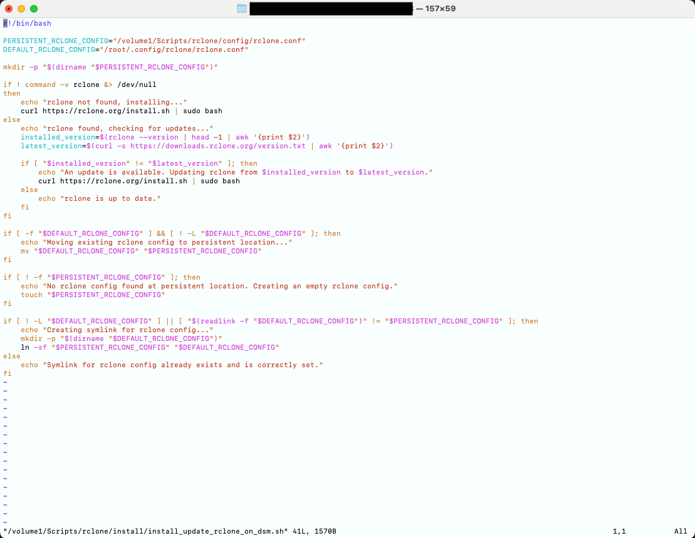
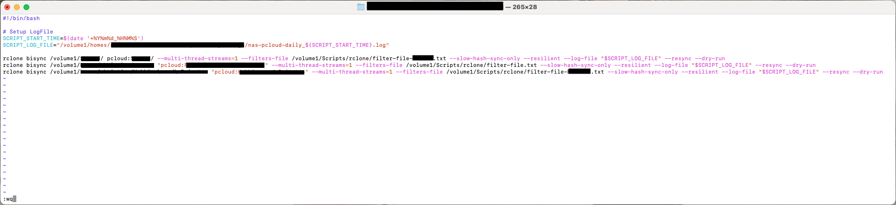
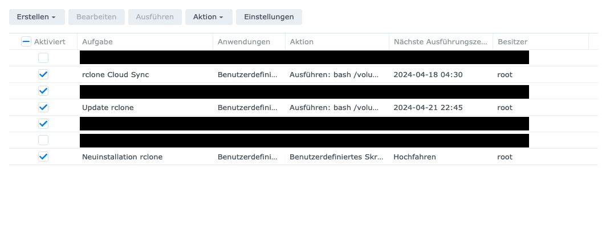

**Update 02.07.2025:** Dieser Beitrag ist dauerhaft von meiner alten Domain "chrischisblog.de" umgezogen. Den Grund für den Umzug habe ich in [diesem Post](/ipad-blog-workflow-vom-schreiben-bis-zur-veroeffentlichung) erklärt.

**Update 15.12.2024:** Am Ende des Tutorials wurden die Sync-Befehle für rclone aktualisiert. Beim Transfer großer Dateien kam es ab einer bestimmten Version zu Übertragungsfehlern. Dazu gab es auch im [rclone-Forum einen längeren Beitrag](https://forum.rclone.org/t/copy-sync-of-large-files-to-pcloud-always-failing/48334/24?page=2) und am Ende wurde ein (für mich) funktionierender Workaround gefunden. Das Update befindet sich erst am Ende, wenn die Datei *rclone\_bisync.sh* erstellt wird und ich weise an der entsprechenden Stelle noch einmal darauf hin.

---

In diesem Tutorial zeige ich dir, wie du rclone auf dem Synology NAS installieren kannst. Wieso ich rclone dem hauseigenem Paket Synology Cloud Sync bevorzuge, habe ich bereits [in diesem Post](https://chrysalis-krill-6zag.squarespace.com/blog/synology-nas-mit-pcloud-synchronisieren-mit-rclone) beschrieben. Ließ diesen gern erst durch, wenn du sicher sein möchtest, dass rclone die richtige Wahl ist (was es vermutlich ist, wenn du dein NAS mit einem Cloud-Storage synchronisieren oder sichern möchtest).

Kurz vorweg: Meine Beispiel-Installation nutzt pCloud als Cloud-Storage und ich arbeite an einem Mac. Da wir einen SSH-Tunnel zum NAS aufbauen und rclone auch auf unserer lokalen Maschine installieren müssen, kann die Arbeitsweise unter Windows etwas variieren. Eventuell benötigst du Tools, wie [PuTTY](https://www.putty.org/), um einen SSH-Tunnel aufzubauen. Die entsprechenden rclone-Installer für verschiedene Systeme findest du auf der [Download-Seite von rclone](https://rclone.org/downloads/) und mit diesen Infos sollten die Grundlagen geschaffen sein, um diesem Tutorial zu folgen.

## Was müssen wir tun (Inhalt des Tutorials)

1. [rclone auf unserem lokalen Rechner herunterladen und konfigurieren](#step1)
2. [Das NAS für rclone-Persistenz vorbereiten](#step2)
3. [rclone auf dem NAS installieren](#step3)
4. [rclone mit dem Synology Aufgabenplaner verbinden](#step4)

## 1) rclone auf unserem lokalen Rechner herunterladen und konfigurieren

Die Installation von rclone ist denkbar einfach und auf der [Installationsseite von rclone](https://rclone.org/install/) beschrieben. Öffne das Terminal und gib folgenden Befehl ein:

```
sudo -v ; curl https://rclone.org/install.sh | sudo bash
```

Du wirst um ein Passwort gebeten, auf dem Mac ist dein sudo-Passwort standardmäßig das Passwort deines Benutzeraccounts, sofern du Admin-Rechte hast. rclone wird nun auf deiner Maschine installiert. Für Windows gibt es ein Installationspaket, welches von der oben verlinkten Download-Seite heruntergeladen werden kann.

Als nächsten Schritt muss rclone konfiguriert werden. Die rclone [Doku hierzu befindet sich ebenfalls auf deren Website](https://rclone.org/commands/rclone_config/). Weiter im Terminal (oder unter Windows im Command Prompt) nun folgenden Befehl eingeben:

```
rclone config
```

rclone führt uns nun durch einen Konfigurationswizard.

```
2024/04/16 14:51:41 NOTICE: Config file "/Users/DEIN_NUTZERNAME/.config/rclone/rclone.conf" not found - using defaults
No remotes found, make a new one?
n) New remote
s) Set configuration password
q) Quit config
n/s/q> n
```

Als erstes wählen wir, dass wir eine neue Konfiguration anlegen wollen. Hierzu *n* für *New Remote* eingeben und Enter drücken.

```
Enter name for new remote.
name> pcloud
```

Als nächstes muss der Remote benannt werden. Da ich mich zu pcloud verbinden werde, nenne ich die Verbindung *pcloud*, gib hier ein, was für dich und deine Verbindung sprechend ist.

```
Option Storage.
Type of storage to configure.
Choose a number from below, or type in your own value.
 1 / 1Fichier
   \ (fichier)
 2 / Akamai NetStorage
   \ (netstorage)
...
Storage> 37
```

Als nächstes soll der Cloud-Storage gewählt werden, zu dem die Verbindung aufgebaut werden soll. Es gibt hier dutzende Optionen (bei mir waren es 55) und du musst deine finden. pCloud war Nummer 37, weshalb ich *37* eingegeben habe. Du musst die Option eingeben, zu der du dich verbinden möchtest.

```
Option client_id.
OAuth Client Id.
Leave blank normally.
Enter a value. Press Enter to leave empty.
client_id>
Option client_secret.
OAuth Client Secret.
Leave blank normally.
Enter a value. Press Enter to leave empty.
client_secret>
Edit advanced config?
y) Yes
n) No (default)
y/n> n
Use web browser to automatically authenticate rclone with remote?
 * Say Y if the machine running rclone has a web browser you can use
 * Say N if running rclone on a (remote) machine without web browser access
If not sure try Y. If Y failed, try N.
y) Yes (default)
n) No
y/n> y
```

Die nächsten zwei Fragen nach *client\_id* und *client\_secret* lässt du leer, die *Advanced Config* möchtest du nicht (*n* oder *leer lassen*) und dann kommt die Frage nach der *auto config*, welche du bejahst. Dies ist der Grund, wieso wir die Konfiguration an unserem Rechner durchführen, denn nun öffnet sich ein Browser-Fenster und du musst dich bei deinem Cloud-Anbieter anmelden, damit rclone einen Authentifizierungstoken erhalten kann (keine Angst, rclone erfährt nicht dein Passwort).

```
2024/04/16 14:53:43 NOTICE: If your browser doesn't open automatically go to the following link: http://127.0.0.1:53682/auth?state=WIRRE_ZEICHENKETTE
2024/04/16 14:53:43 NOTICE: Log in and authorize rclone for access
2024/04/16 14:53:43 NOTICE: Waiting for code...
2024/04/16 14:55:45 NOTICE: Got code
Configuration complete.
Options:
- type: pcloud
- hostname: eapi.pcloud.com
- token: {"access_token":"DEIN_PRIVATER_ZUGRIFFS_TOKEN","token_type":"bearer","expiry":"0001-01-01T00:00:00Z"}
Keep this "pCloud" remote?
y) Yes this is OK (default)
e) Edit this remote
d) Delete this remote
y/e/d> y
```

Sobald deine Authentifizierung abgeschlossen ist, erhältst du deinen Token. Bestätige mit *y*, dass die Konfiguration okay ist.

```
Current remotes:

Name                 Type
====                 ====
pcloud               pcloud

e) Edit existing remote
n) New remote
d) Delete remote
r) Rename remote
c) Copy remote
s) Set configuration password
q) Quit config
e/n/d/r/c/s/q> q
```

Damit ist deine Konfiguration abgeschlossen. Beendet den Wizard mit *q*. Nun gibst du im Terminal folgendes ein:

```
rclone config file
```

Dies gibt dir den Pfad zur rclone Konfigurationsdatei. Dort kannst du im Finder (Explorer unter Windows) hin navigieren, denn diese müssen wir nun auf das NAS kopieren.

## 2) Das NAS für rclone-Persistenz vorbereiten

Das Problem, das auftreten könnte, ist, dass DSM-Updates auf dem NAS dazu führen können, dass rclone und auch die Konfigurationsdatei wieder gelöscht werden. Dann müssten wir den ganzen Kram erneut durchführen, wenn wir die *rclone.conf* nicht irgendwo anders persistieren. Auch eine regelmäßige Kopie vom Mac aufs NAS ist für mich keine Option. Deshalb legen wir auf dem NAS einen Ordner an, der alle rclone-Skripte (und ggf. auch Skripte für andere Tools) enthalten kann und vom NAS selbst nicht angerührt wird. Via Skript können wir dann rclone immer installieren und konfigurieren. So schaffen wir die Persistenz, die wir wollen.

Die Idee hierzu kam vom englischsprachigen Blog [muffn.io](https://blog.muffn.io/posts/scheduled-backups-using-rclone-on-synology-dsm/). Ich nutze allerdings nicht die komplette Lösung, sondern habe diese adaptiert. Sein [Installations- und Update-Skript](https://github.com/monstermuffin/scripts/blob/main/Synology%20rclone/rclone_install/rclone_dsm_install.sh) habe ich allerdings fast übernommen, nur um Kommentare ergänzt und die Konfi-Datei-Ordner ganz oben angepasst. Das wird aber Teil dieses Tutorials. Ich wollte hiermit nur die Transparenz schaffen. Was sein Skript genau macht, kannst du in meinem anderen [Post zum Thema NAS & pCloud](https://chrischisblog.de/synology-nas-pcloud-vollautomatisiert-mit-rclone-synchronisieren/) lesen.

Los geht’s! Erstmal via SSH aufs NAS verbinden. Eventuell muss dies auf deinem NAS erst unter *Systemsteuerung > Terminal &SNMP* aktiviert werden.

```
ssh DEIN_NAS_NUTZERNAME@DEINE_NAS_IP
```

Nachdem du dein Passwort eingegeben hast, solltest du eine SSH-Session auf deinem NAS haben, der Prompt sollte “*NAS\_NUTZERNAME@NAS\_NAME*:” sein. Ich habe mich dafür entschieden, die Skripte in einen Ordner direkt unter “/Volume1” zu legen, der *Scripts* heißt. Dort landen alle Skripte, die über den Aufgabenplaner regelmäßig ausgeführt werden können. Um auf dieser Ebene Ordner anzulegen, benötige ich root-Rechte

```
sudo -i
```

Nachdem du das Passwort eingegeben hast, können wir die Ordner anlegen.

```
mkdir /volume1/Scripts/rclone/config -p
```

Hiermit werden rekursiv alle Ordner angelegt. Nicht wundern, wenn du dich in die Weboberfläche mit deinem User einloggst, dein Nutzer hat keinen Zugriff auf diesen Ordner und sieht diesen nicht. Diese Berechtigung müsstest du, bei Bedarf, vergeben. Ist aber nicht notwendig für diese Einrichtung. Dieser Ordner soll die *rclone.conf* enthalten, da sie hier nicht gelöscht wird. Im Skript können wir dann die hier liegende Datei immer nutzen, um nach einer Neuinstallation rclone voll automatisiert erneut zu konfigurieren.

Es gibt verschiedene Möglichkeiten, dies zu erreichen. Entweder im Terminal direkt per scp (wenn ihr root auf dem NAS aktiviert und ein Passwort vergeben habt) oder ihr ladet die Datei per Browser in eurem Home-Ordner und verschiebt sie dann in den eben angelegten Ordner. Diesen Weg bin ich gegangen. Also das NAS im Browser geöffnet und die *rclone.conf* in meinen Home-Ordner geladen. Danach weiter im Terminal:

```
mv /volume1/homes/DEIN_NUTZERNAME/rclone.conf /volume1/Scripts/rclone/config
```

Die Datei verschwindet aus deinem Home-Verzeichnis und liegt nun im Konfig-Ordner von rclone. Perfekt!

Als nächstes benötigen wir das [Installationsskript](https://github.com/monstermuffin/scripts/blob/main/Synology%20rclone/rclone_install/rclone_dsm_install.sh) von [Monstermuffin](https://github.com/monstermuffin). Dafür erstelle ich einen weiteren Ordner unterhalb von Skripte/rclone, namens *install*

```
mkdir /volume1/Scripts/rclone/install
```

In diesen Ordner laden wir das angesprochene Installationsskript:

```
wget -O /volume1/Scripts/rclone/install/install_update_rclone_on_dsm.sh https://raw.githubusercontent.com/MonsterMuffin/scripts/main/Synology%20rclone/rclone_install/rclone_dsm_install.sh
```

Damit speichern wir die Github-Datei von Monstermuffin als *install\_update\_rclone\_on\_dsm.sh* im Install-Ordner. Nun muss die Datei ausführbar gemacht werden, denn nur dann können wir es über den Synology Aufgabenplaner ausführen.

```
chmod a+x /volume1/Scripts/rclone/install/install_update_rclone_on_dsm.sh
```

Eine Anpassung im Skript brauchen wir. Denn wir müssen in dem Skript unseren Speicherort für die persistierte Konfigdatei hinterlegen. Leider müssen wir dafür Vim als Editor benutzen…

```
vi /volume1/Scripts/rclone/install/install_update_rclone_on_dsm.sh
```

In Vim bist du standardmäßig im Command Mode, wirst also den Text *nicht* editieren können. Navigiere also mit deinen Pfeiltasten auf der Tastatur zum Pfad von:

```
PERSISTENT_RCLONE_CONFIG=””
```

Dort steht in den Anführungszeichen aktuell der Pfad, den Monstermuffin für seine Konfig gewählt hat, trage dort den Pfad ein, in den du deine rclone.conf gelegt hast. Für mich muss die Zeile also lauten:

```
PERSISTENT_RCLONE_CONFIG=”/volume1/config/rclone.conf”
```

Um das zu erreichen, drücke erst *i* für *Insert Mode*, dann kannst du den Text editieren. Den Rest können wir so lassen, mit *Escape* beendet du den *Insert Mode*, danach kannst du mit *:wq* deine Änderungen schreiben (speichern) und Vim (glücklicherweise) wieder beenden.



Die Datei sieht bei mir so aus (in Zeile 3 steht nun mein Pfad).

Das war einiges. Jetzt erstmal durchatmen und einen neuen Kaffee holen, dann geht’s weiter ☕️

Denn ein Skript müssen wir noch anlegen, das Herzstück. Das Skript, welches bestimmt, wie unser NAS mit pCloud synchronisiert werden soll.

**Update 16.12.2024:** Doch bevor es mit den Skripten weitergeht möchte ich hier nochmal kurz etwas Hintergrundwissen einstreuen. Denn ich habe diesen Teil des Tutorials noch einmal überarbeitet. So möchte ich einerseits ein [unschönes Verhalten beim bidirektionalen Synchronisieren](https://forum.rclone.org/t/copy-sync-of-large-files-to-pcloud-always-failing/48334/1) mit rclone direkt umgehen, aber zum Anderen nochmal deutlich machen, dass du hier nicht meinem Skript folgen musst, sondern natürlich ein Skript nach deinen Bedürfnissen erstellen musst.

rclone bietet vielfältige Arten des Dateitransfers. Ich kann hier unmöglich auf alle eingehen. Aber drei Arten möchte ich erwähnt haben.

[***Kopieren***](https://rclone.org/commands/rclone_copy/)***:*** Hier werden Daten vom Quellsystem (z.B. dem NAS) auf das Zielsystem (z.B. pCloud – kann aber auch anders herum sein) kopiert. Neue Dateien und Dateiänderungen würden von der Quelle zum Ziel übertragen werden. Löscht man jedoch etwas in der Quelle, würde diese Löschung nicht(!) im Ziel passieren. Dies wäre also eine Art Backup-Lösung, um eventuell gelöschte Dateien dann nicht gänzlich zu verlieren. Dies ist eigentlich keine Synchronisation. Deshalb schauen wir uns die beiden weiteren Möglichkeiten an.

[***Unidirektionale Synchronisation***](https://rclone.org/commands/rclone_sync/): Hierbei gibt es ein Quellsystem und ein Zielsystem, wobei das Zielsystem immer dem Quellsystem folgt. Ist das NAS die Quelle, so wird pCloud immer dem NAS folgen. Erstellt man neue Dateien auf dem NAS oder löscht andere Dateien, so werden diese Änderungen auch bei pCloud umgesetzt. Gibt es allerdings neue Dateien bei pCloud, werden diese wieder gelöscht, sofern sie auf dem NAS nicht vorhanden sind. Anders herum würden bei pCloud gelöschte Dateien erneut vom NAS übertragen werden, sofern sie nicht auch auf dem NAS gelöscht wurden. Das Quellsystem (in meinem Beispiel das NAS, es könnte aber auch pCloud sein) gibt den Zielzustand der anderen Seite vor.

[***Bidirektionale Synchronisation***](https://rclone.org/commands/rclone_bisync/): Seit Neustem auch die Möglichkeit des *bidirektionalen Synchronisierens*. Dies ist noch im Beta-Stadium, kann aber bereits genutzt werden und dies werde ich im Folgenden auch für mich nutzen. Hier werden beide Systeme, das NAS und pCloud, so synchronisiert, dass sowohl neue Dateien, aber auch Änderungen und Löschungen auf das andere System übertragen werden. Ich kann also auf beiden Systemen arbeiten und meine Änderungen landen auf der “anderen Seite”.

Ich werde nun zeigen, wie ich mein Skript für eine bidirektionale Synchronisierung anlege, das Vorgehen für die anderen Arten des Dateitransfers ist ähnlich, muss dann aber individuell adaptiert werden. Einige Parameter können anders heißen, dies wäre aber in der Doku von rclone zu finden.

Erstmal legen wir die Skript-Datei an, danach öffnen wir diese… in Vim, yeah!

```
touch /volume1/Scripts/rclone/rclone_bisync.sh
vi /volume1/Scripts/rclone/rclone_bisync.sh
```

Mit *i* kannst du direkt in den *Insert Mode* wechseln und dann kann es losgehen. Wie gesagt, das sind jetzt sehr individuelle rclone Commands zum Kopieren, Synchronisieren, bidirektionalem Synchronisieren, Löschen… was auch immer du regelmäßig machen möchtest. Starte in der ersten Zeile mit dem Hash-Bang für bash *#!/bin/bash* und dann starte darunter, deine rclone Kommando-Abfolge zu notieren. Hier mein File als Beispiel, deins kann gänzlich anders aussehen.



Noch ein paar Worte zu meinem Skript. Zuerst baue ich mir den Pfad zu meiner Log-Datei zusammen. Diese bekommt das aktuelle Datum, sowie die Uhrzeit und liegt unterhalb meines Home-Ordners, sodass ich ganz normal über die Weboberfläche oder z.B. per WebDAV die Logs überprüfen kann, ohne immer im Terminal spielen zu müssen. Außerdem ist der Name dann sprechend und lautet beispielsweise “*nas-pcloud-daily\_20241215\_230001.log*“. Dies wäre das Log vom 15.12.2024, gestartet um 23:00:01 Uhr (eigentlich genau 23 Uhr, aber es dauert wohl eine Sekunde, bis das System das Skript bis hierher ausgeführt hat).

Die drei Zeilen darunter sind mein “*bisync*”, um eine bidirektionale Synchronisation zu erreichen. Aktuell (rclone-Version 1.68.2) ist der erste Parameter wichtig, da dieser den Multi-Thread-Upload in Richtung pCloud unterbindet, welcher dazu führt, dass “große” Dateien zu Übertragungsfehlern führten. “Groß” ist hierbei leider nicht genau festzumachen. Manchmal reichten 500MB, manchmal mussten es 1,5GB sein. Ich würde aktuell diesen Parameter auf jeden Fall empfehlen.

Außerdem nutze ich via “*–filters-file*” ein weiteres Dokumente namens “filter-file.txt”, in welchem ich spezifiziere, was alles ignoriert werden soll. Dies können z.B. der *#recycle*– oder *@eaDir*-Ordner auf dem NAS sein oder Dateien, wie “.DS\_Store” beim Mac oder die “thumbs.db” unter Windows. All diese Files sind dort spezifiziert, da ich keinen Transfer dieser Dateien benötige. Kurzer Hinweis, wenn du die unidirektionale Sychronisierung oder auch das Kopieren nutzt, dann heißt dieser Parameter *–filter-from*.

“*–resilient*” ist für Übertragungen wichtig, wenn kein –resync mehr stattfindet, da hiermit kleinere Übertragungsfehler nicht mit einem solchen –resync korrigiert werden müssen, sondern im nächsten Durchlauf vermutlich automatisch korrigiert werden.

Via “*–log-file*” übergebe ich die Variable zu meiner Log-Datei. So werden alle Logs in dieselbe Datei für den aktuellen Sync geschrieben.

Es bleibt noch “*–slow-hash-sync-only*“. Dies optimiert die Performance beim –dry-run etwas, da es die Hash-Werte ignoriert. Für echte Syncs werden diese aber beachtet.

Und zu guter Letzt, der Parameter *–dry-run* am Ende ist beim Testen sinnvoll, denn dadurch wird kein echter Sync durchgeführt, sondern ein Output generiert, der angibt, was passiert *wäre*. So kann man das theoretische Ergebnis prüfen, bevor die Synchronisation tatsächlich durchläuft. Der Parameter muss dann verschwinden, sobald die Testläufe erfolgreich waren. *–resync* ist spezifisch für *bisync* und sollte beim ersten Lauf angegeben werden, um die Ordner auf einen Stand zu bringen. Für alle nachfolgenden Läufe sollte dieser Parameter entfernt werden. Die restlichen Parameter können auf der rclone-Webseite geprüft werden, dies würde hier sonst zu weit führen.

Nicht vergessen, euer File nun noch ausführbar zu machen, bei mir wäre das dieser Befehl, du musst natürlich den Namen deiner Datei angeben:

```
chmod a+x /volume1/Scripts/rclone/rclone_bisync.sh
```

Und damit sollte es geschafft sein! Alle Skripte und Konfigurationen sind erstellt und liegen an Ort und Stelle. Das war die Mammut-Aufgabe. Der Rest ist deutlich entspannter und somit kann es jetzt weitergehen mit der Installation von rclone auf dem NAS.

**Ende des Updates vom 16.12.2024**

## 3) rclone auf dem NAS installieren

Die Vorbereitungen sind getroffen, wir sollten nun in der Lage sein, rclone ohne weiteren Input zu installieren. Dafür rufen wir das Skript nun einmalig manuell auf:

```
/volume1/Scripts/rclone/install/install_update_rclone_on_dsm.sh
```

Hoffentlich lief alles gut und am Ende gab es diese Erfolgsmeldung (die Versionsnummer kann natürlich mittlerweile neuer sein, wenn du dieser Anleitung folgst):

```
rclone v1.66.0 has successfully installed.Now run "rclone config" for setup.
Check https://rclone.org/docs/ for more details.Creating symlink for rclone config…
```

rclone config muss nicht mehr ausgeführt werden, der letzte Schritt des symlinks sollte dafür gesorgt haben, dass rclone vollständig mit unserer hinterlegten Konfiguration eingerichtet ist. Dies können wir nun testen, indem wir probieren, den Inhalt unseres Cloud-Endpunktes aufzurufen. Ich habe einen Endpunkt mit dem Namen pcloud eingerichtet. Du musst den Namen eingeben, den du der Verbindung vorhin gegeben hast. Der Befehl *lsd* listet dann alle Ordner auf, die sich in deiner Cloud befinden.

```
rclone lsd pcloud:
```

Wenn du die Liste der Ordner bekommst, dann herzlichen Glückwunsch! rclone ist erfolgreich auf deinem NAS installiert und könnte nun verwendet werden!

Sofern du in deinem Sync-Skript die Kommandos mit *–dry-run* markiert hast, könntest du das Skript jetzt ebenfalls laufen lassen, um zu sehen, ob es läuft und was der Output wäre. Bei mir lief das Skript recht lange aufgrund der Menge der Dateien, lieferte dann aber eine schöner Übersicht über die Anzahl der Dateien, die übertragen worden wären, sowie eine Liste aller potentiell angefassten Dateien.

## 4) rclone mit dem Synology Aufgabenplaner verbinden

Die Pflicht ist geschafft, nun folgt die Kür. Ich möchte erstmal, dass sich rclone nach einem DSM-Update automatisch erneut installiert. Hierzu benötigen wir nun den Synology Aufgabenplaner. Dazu wechseln wir nun in den Web-Browser deiner Wahl (btw. meiner ist der [Brave Browser](https://brave.com/de/)) und dort öffnest du das Web-Interface deines NAS.

Dann öffnest du unter *Systemsteuerung* den *Aufgabenplaner.* In der Menüleiste öffnest du *Erstellen > Ausgelöste Aufgabe > Benutzerdefiniertes Skript* und erstellst einen neuen Task mit folgenden Einstellungen:

> **Allgemein:**
>
> Aufgabe: Neuinstallation rclone
> Benutzer: root
> Ereignis: Hochfahren
> Haken bei „Aktiviert“
>
> **Aufgabeneinstellungen:**
>
> Ausführungsdetails per E-Mail senden: Ich habe es aktiviert, bleibt aber dir überlassen
> Benutzerdefiniertes Skript: bash /volume1/Scripts/rclone/install/install\_update\_rclone\_on\_dsm.sh

Dann speichern und die Warnung bestätigen. Danach musst du das Kennwort deines Kontos eingeben und die Aufgabe ist angelegt.

Als nächstes möchte ich noch einen Updater anlegen, der regelmäßig prüft, ob es neue Versionen von rclone gibt und diese dann installiert. Wenn du ein solches Update nicht voll automatisiert durchführen möchtest, kannst du diesen Schritt überspringen, denn mit der Aktion “*Ausführen*” kannst du die eben angelegte Aufgabe “*Neuinstallation rclone*” manuell starten und diese führt das Update durch. Für eine voll automatisierte Lösung, lege eine neue Aufgabe an, diesmal aber *Erstellen > Geplante Aufgabe > Benutzerdefiniertes Skript* mit folgenden Einstellungen:

> **Allgemein:**
>
> Aufgabe: Update rclone
> Benutzer: root
> Haken bei „Aktiviert
>
> **Zeitplan:**
>
> An folgenden Tagen ausführen: Bleibt dir überlassen, ich prüfe ein Mal pro Woche
> Start: Die Startzeit am gewählten Tag bleibt natürlich ebenfalls dir überlassen
>
> **Aufgabeneinstellungen:**
>
> Ausführungsdetails per E-Mail senden: Ich habe es aktiviert, bleibt aber dir überlassen
> Benutzerdefiniertes Skript: bash /volume1/Scripts/rclone/install/install\_update\_rclone\_on\_dsm.sh

Als letzte Aufgabe benötigen wir das Herzstück, die automatisierte Synchronisation des NAS mit der Cloud. Hierzu also eine weitere Aufgabe via *Erstellen > Geplante Aufgabe > Benutzerdefiniertes Skript* anlegen und folgende Einstellungen wählen:

> **Allgemein:**
>
> Aufgabe: rclone Cloud Sync
> Benutzer: root
> Haken bei „Aktiviert
>
> **Zeitplan:**
>
> An folgenden Tagen ausführen: Ich stelle eine tägliche Synchronisation ein, aber das bleibt dir überlassen
> Start: Die Startzeit am gewählten Tag bleibt natürlich ebenfalls dir überlassen
>
> **Aufgabeneinstellungen:**
>
> Ausführungsdetails per E-Mail senden: Ich habe es aktiviert, bleibt aber dir überlassen
> Benutzerdefiniertes Skript: bash /volume1/Scripts/rclone/rclone\_bisync.sh

Und damit ist es geschafft! 🥳 Dein Aufgabenplaner sollte nun diese drei Einträge haben:



Ich hoffe, die Einrichtung hat auch bei dir geklappt und du kannst du dein NAS sauber und zuverlässig mit deiner Cloud synchronisieren. Ein großes Dank nochmal an [Monstermuffin](https://github.com/monstermuffin), [sein Installationsskript](https://github.com/monstermuffin/scripts/blob/main/Synology%20rclone/rclone_install/rclone_dsm_install.sh) und den dazu passenden [Blog-Eintrag](https://blog.muffn.io/posts/scheduled-backups-using-rclone-on-synology-dsm/).

Und nun viel Spaß mit den synchronen Systemen!

PS.: Wenn du noch keinen pCloud-Speicher hast, aber gern welchen erwerben würdest, freue ich mich, wenn du meinen Affiliate Link verwendest. So bekomme ich eine kleine Provision, es gibt aber keine Mehrkosten für dich. Einfach auf das folgende Bild oder [hier](https://partner.pcloud.com/r/130163) klicken. Danke!

[](https://partner.pcloud.com/r/130163 "pCloud Lifetime")