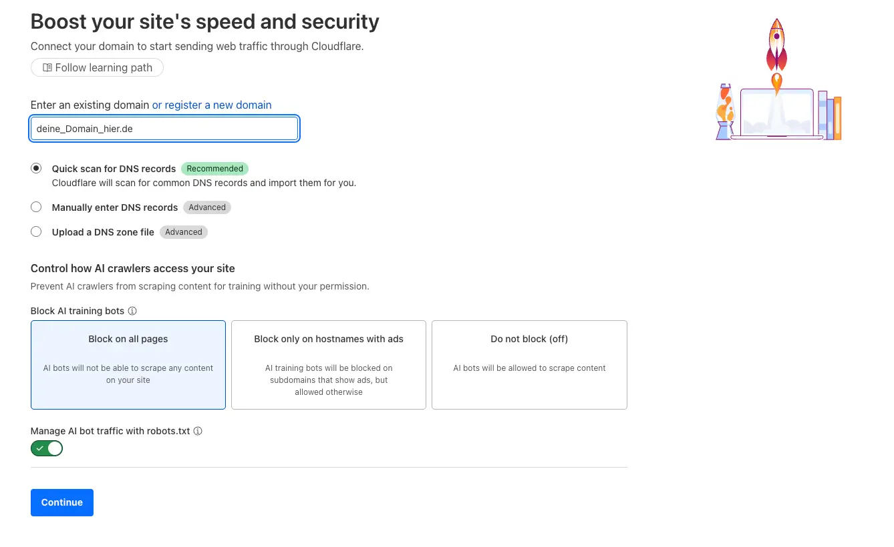
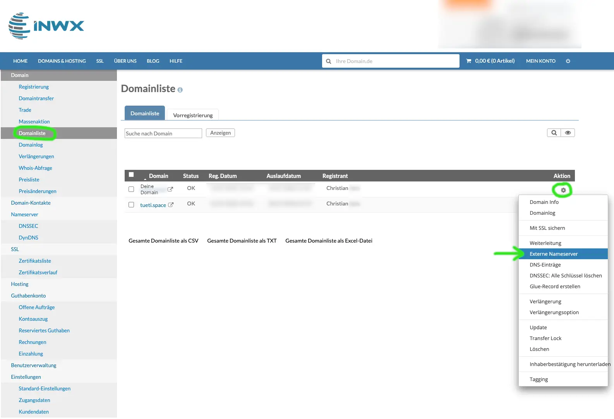
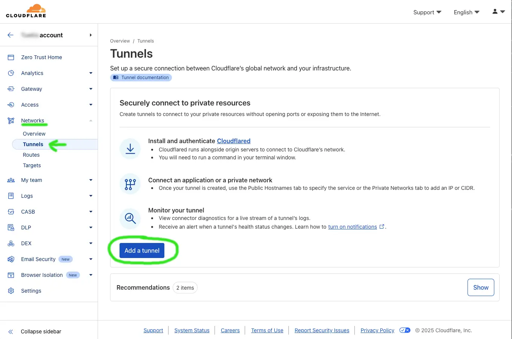
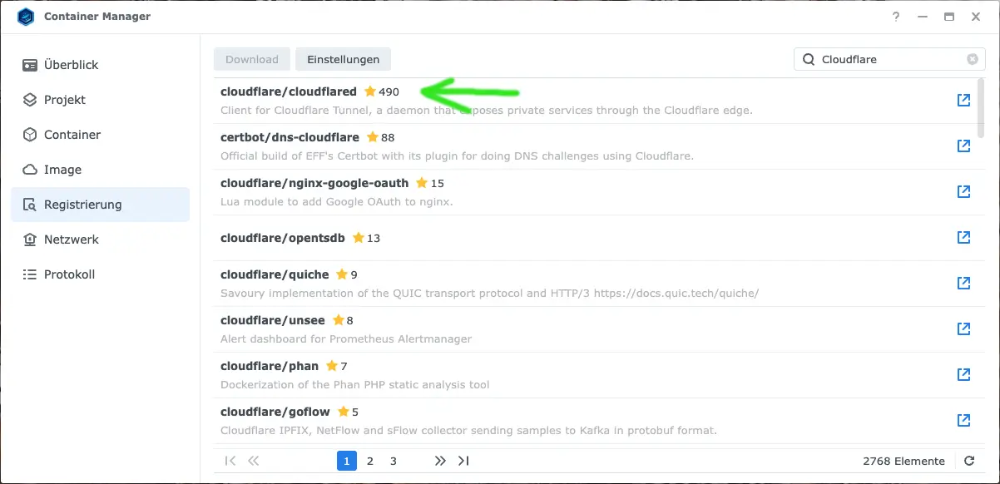

## Eine Private Cloud: Wieso der Cloudflare Tunnel?

Die meisten, die ein NAS haben, wollen dies vermutlich aus dem Internet heraus erreichen können, als Art _Private Cloud_. In diesem Beitrag will ich dir zeigen, wie wir unser NAS mit Cloudflare, ohne Portweiterleitung aus dem Internet erreichbar machen. Der wichtige Teil dabei ist: _ohne Portweiterleitung_. Wir wollen hier über einen _Cloudflare Tunnel_ gehen. Ein solcher Tunnel erlaubt es uns, Services aus dem heimischen Netzwerk publik zu machen. So können wir sie dann aus dem Internet heraus erreichen. Gänzlich, ohne Einfallstore - wie offene Ports - zu erschaffen.

Es gibt verschiedenen Gründe, wieso du den Weg über einen Cloudflare Tunnel gehen solltest - oder manchmal auch musst. Nicht immer spielen unsere Internetanbieter mit und ermöglichen es uns, unser Heimnetzwerk vom Internet aus zu erreichen zu können. Ich habe viele Diskussionen im O2-Forum gelesen, die sich um dieses Thema drehen. Speziell, wenn Leute einen LTE/5G-Anschluss zu Hause haben, weil Internet scheinbar noch immer _Neuland_ ist und viele von einem Glasfaseranschluss nur träumen können. Aber auch andere Provider vergeben nicht immer öffentliche IPv4-Adressen. Und ohne öffentliche IPs funktionieren auch keine dynamischen DNS Services. Wenn das der Fall ist, bist du auf Workarounds, wie beispielsweise _Synology QuickConnect_ oder eben einen _Cloudflare Tunnel_ angewiesen.

Aber selbst wenn dir die Entscheidung nicht vom Provider - aufgrund technischer Vorgaben - abgenommen wird, bietet Cloudflare einige Vorteile. Der Zugriff zu deinem NAS ist deutlich schneller, als das hauseigene QuickConnect. Es bietet ein hohes Maß an Schutz mit dem Zero Trust Ansatz. Du kannst granular pro (Sub-)Domain Zugriffsrechte vergeben und Cloudflare ist sehr gut darin, nur legitime Anfragen durchzulassen. Im Gegensatz zum Ansatz mit der Portweiterleitung wird deine öffentliche IP nie publik gemacht und du musst keine Ports an deinem Router öffnen. Die Verbindung ist verschlüsselt, ohne, dass du dich darum kümmern musst und es macht erstmal nichts, wenn innerhalb deines Netzwerkes dann unverschlüsselte Kommunikation stattfindet.

Und die Absicherung deines Netzwerkes wird dir abgenommen. Du musst dich nicht um Dinge, wie Fail2Ban und gültige Zertifikate für alle Dienste kümmern.

Cloudflare sichert den Zugriff auf deine _Private Cloud_ vermutlich besser ab, als wir es selbst könnten. Dieses Tutorial begleitet dich durch die Einrichtung eines solchen Cloudflare Tunnes auf einem Synology NAS. Da das Setup jedoch stark auf Docker basiert, kann es eigentlich überall umgesetzt werden, wo du den Docker Container laufen lassen kannst. Am Ende solltest du mindestens einen Service auf deinem NAS über das Internet erreichen können. Viel Spaß und Erfolg!

## Ein Wort der Warnung

Bevor es losgeht, ein Wort der Warnung. Cloudflare untersagt im [Abschnitt zum _Content Delivery Network (Free, Pro, or Business)_ in seinen Terms of Service](https://www.cloudflare.com/en-gb/service-specific-terms-application-services/#content-delivery-network-terms) das Verteilen großer Daten, wie Videos oder auch überproportional viele Bilder. Außer, man zahlt für ein höheres Serviceangebot. Da wir die "Free" Tiers nutzen werden, empfehle ich, keinen Medienserver über einen solchen Cloudflare Tunnel einzurichten und dann Filme zu streamen. Ich mache selbst mein Bilder Backup nicht direkt aufs NAS, sondern transferiere diese in Richtung pCloud und synchronisiere diese via rclone. Einen Artikel zu dem Setup gibt es [hier](/rclone-auf-dem-synology-nas-installieren).

Seid euch dessen also bitte bewusst. Für ein Setup, um Medienserver von außen zu erreichen, wird ein Blog Beitrag folgen. Nun kann es aber mit dem Cloudflare Tunnel losgehen.

## Das Setup vorbereiten

Also was brauchst du, um das Setup umzusetzen?

* Einen [Cloudflare](https://www.cloudflare.com/de-de/ "Cloudflare Webseite") Account
* Eine eigene, dedizierte Domain - und hier ist der Haken. Diese kostet etwas. Es kann sein, dass du mit freien Alternativen weiter kommst, aber das habe ich nie probiert. Allerdings ist dein NAS danach auch über eine von dir gewählte, hoffentlich tolle URL erreichbar.
* Ein Synology NAS, das Docker (das Paket heißt "Container Manager") laufen lassen kann

Ich werde hier nicht zeigen, wie Account bei Cloudflare registriert wird und auch nicht, wie du eine Domain registrierst. Der Cloudflare Account ist ziemlich geradlinig zu erstellen. Für die Domain gibt es einfach zu viele Möglichkeiten. Ich habe meine Domains bei [INWX](https://www.inwx.de/de) registriert und bin da sehr zufrieden. Es gibt später eine Konfiguration, die du bei deinem Domain Registrar vornehmen musst. Diese zeige ich für INWX. Solltest du dich für einen anderen Service entscheiden, musst du den Einstellungspunkt halt selber suchen. Aber abgesehen davon, steht dir natürlich frei, wo du deine Domain registrierst.

Zu guter Letzt benötigst du ein Synology NAS, auf dem das Paket _Container Manager_ (ist Docker) installiert ist.


Hast du also einen Account bei Cloudflare, eine Domain, die du bei Cloudflare hinterlegen kannst, sowie den Container Manager auf deinem NAS installiert, kann es weitergehen.

## Die Domain mit Cloudflare verbinden

Jetzt müssen wir dafür sorgen, dass wir unsere Domain über Cloudflare verwalten können. Hierzu müssen wir die Cloudflare Name Server bei unserem Domain Registrar für unsere Domain setzen, etwas warten und können dann unsere Domain über Cloudflare nutzen.

Du wirst es ahnen, hierzu müssen wir uns ins [Cloudflare Dashboard](https://dash.cloudflare.com/) einloggen. Das ist direkt die Seite, die sich öffnet, nachdem du dich eingeloggt hast.

Oben rechts findest du einen "+ Add" Button und kannst im Dropdown dann "Connect a domain" auswählen. In dem sich öffnenden Fenster gibst du deine Domain ein, lässt den Rest im Standard und klickst auf "Continue":



Im nächsten Schritt kannst du einfach den "Free Plan" auswählen und erneut "Continue" klicken.

Nun sollte die Cloudflare deine aktuell hinterlegten DNS Einträge deiner Domain anzeigen. Prüfe einmal, ob alle erkannt wurden. Du kannst fehlende Einträge hinzufügen, aber ich hatte es noch nie, das nicht alle erkannt wurden. Klicke dann auf "activate".

Du erhälst nun deine Name Server von Cloudflare, die du exakt so als Einträge bei deinem Domain Registrar hinterlegen musst. Cloudflare wird dir zeigen, welche Einträge du setzen musst und für einige Services hat es dedizierte Anleitungen.

### Für alle, die ihre Domain bei INWX registriert haben

Anfangs dachte ich, dass ich die Cloudflare Nameserver einfach beim Menüpunkt "Nameserver" eintragen muss. Aber bitte lest die dort stehende Info, wenn ihr bereits auf der Seite seid. Diese Info verweist auf [diesen Hilfe-Artikel](https://kb.inwx.com/de-de/3-nameserver/100-wie-kann-ich-externe-nameserver-eintragen), der beschreibt, wie externe Nameserver genutzt werden können. Dies geschieht nämlich unter dem Menüpunkt "Domainliste". Öffne diesen Punkte, dann siehst du deine Domains und kannst beim Zahnrädchen deiner gewünschten Domain "Externe Nameserver" auswählen:



Es öffnet sich ein kleines Fenster, bei dem du wählen kannst, an "Externe Nameserver" weiterzuleiten. Wähle dies und dann siehst du noch einmal all deine INWX Name Server eingetragen. Entferne überall die Einträge von INWX und hinterlege die Einträge con Cloudflare.

Erst mit diesem zweiten Step hast du alles Notwendige bei INWX getan, damit Cloudflare die Domain übernehmen kann.

Nun heißt es, etwas zu warten. Cloudflare gibt an, es könne bis zu 24 Stunden dauern, bei mir waren es nur rund 15-20 Minuten. Also Abwarten und/oder im Sekundentakt die Seite aktualisieren 😁

Sobald deine Domain in Cloudflare als _active_ angezeigt wird, kannst du weiter machen.

## Den Docker Container für den Cloudflare Tunnel vorbereiten

### Cloudflare vorbereiten und Docker Befehl erhalten

Es geht direkt im Cloudflare Dashboard weiter. Links in der Navigationsliste findest du "Zero Trust", dies musst du öffnen. Solltest du bisher noch nie etwas mit Zero Trust bei Cloudflare getan haben, wirst du aufgefordert, einen Team Namen zu vergeben und eine Preisklasse zu wählen. Der Name ist dir überlassen und das "Free" Tier reich aus. Du wirst trotzdem ein Zahlungsmittel hinterlegen müssen. Ich mag so etwas auch nicht, wenn es doch "Free" ist. Aber nun gut...

Sobald das erledigt ist, wirst du auf das Zero Trust Dashboard weitergeleitet. Herzlich Willkommen!

Alle, die bereits einen Zero Trust Account haben, landen natürlich direkt auf diesem Dashboard.

In diesem Zero Trust Dashboard gibt es in der Navigationsleiste links das Dropdown "Networks" und dann "Tunnels". Über dieses Menü kann "Add a tunnel" ausgewählt werden und genau das wollen wir machen.



Danach habt ihr die Wahl zwischen _Cloudflared_ und _WARP Connector_ - wähle hier _Cloudflared_ und gib dem Tunnel einen Namen.

Nun kannst du deine Umgebung bzw. dein OS wählen, auf dem du _cloudflared_ - den Daemon für deinen Tunnel, der lokal bei uns laufen wird - ausführen möchtest. Für uns ist dies Docker.


Sobald du "Docker" selektiert hast, kannst du deinen Docker Befehl - inklusive deines geheimen Tokens - kopieren. Dafür auf das "Kopieren" Symbol in dem Command Feld klicken und am besten in einem Textdokument zwischenspeichern. Wir brauchen Teile dieses Befehls gleich.

Lass die Seite aber offen.

### Docker Image installieren

Weiter geht es im Web Interface eures Synology NAS. Öffne dort die Applikation "Container Manager", gehe in die _Registrierung_ (oder _Registry_) und suche nach "Cloudflare". Du solltest ein Image namens "cloudflare/cloudflared" finden und dieses installieren:



Dieses Image mit dem Tag "latest" herunterladen und keine Angst, wenn du noch nichts mit Docker gemacht hast. Wir haben es hier mit einem super simplen Container zu tun.

Nachdem das Image heruntergeladen ist, solltest du es im Navigationspunkt _Image_ finden. Nun kannst du es ausführen und beim ersten Start fragt das Image nach einer Konfiguration. Legen wir los!

**Im ersten Screen** werden wir nach einem Namen gefragt. Ich wähle hier gern "cloudflared-{name-meines-cloudflared-tunnels}", aber der Name hat keine Auswirkung. Es ist nur für mich zur Wiedererkennung. Außerdem setze bitte den Haken bei _Automatischen Neustart aktivieren_. Weiter.

**Im zweiten Screen** ignorieren wir die ersten Abschnitte und scrollen bis _Netzwerk_. Hier wählst du bitte _host_ im Dropdown Menü aus. Damit bekommt der Container keine eigene IP.

Direkt darunter ist der Abschnitt _Ausführungsbefehl_. Du siehst, das dort als "Entrypoint" `cloudflared --no-autoupdate` steht. Schau dir nun einmal deinen vorhin kopierten `docker run` Befehl inklusive deines Tokens an. Auch dort findest du ein `--no-autoupdate`:

```
docker run cloudflare/cloudflared:latest tunnel --no-autoupdate run --token MEIN_GANZ_LANGER_SEHR_GEHEIMER_TOKEN
```

Wir können nun den ersten Teil, sowie das `--no-autoupdate` entfernen und in das Textfeld hinter _Befehl_ einfügen. Der Teil `docker run cloudflare/cloudflared:latest` kann entfernt werden, da wir die Konfiguration über das Interface vorgenommen haben. Wir konfigurieren hier gerade genau diesen Container mit dem Tag und `--no-autoupdate` ist bereits gesetzt. Es bleibt also:

```
tunnel run --token MEIN_GANZ_LANGER_SEHR_GEHEIMER_TOKEN
```

Dies kopierst du in die Befehlszeile. Der modifizierte Teil des zweiten Screens sollte dann so aussehen:


Weiter! Im **dritten Screen** dann "Fertig"!

Der Container sollte nun starten und wenn du zurück zu der offen gelassenen Cloudflare Seite gehst, sollte ziemlich schnell bei den _Connectors_ eine Connector ID _connected_ sein. Yay 🥳


## Hostnamen für unsere Zugriffe erstellen

Ab jetzt kommt es ein wenig darauf an, welche Services auf deinem NAS zu öffentlich erreichbar machen möchtest. Im Bereich "Hostname" konfigurierst du nun den öffentlich erreichbaren Endpunkt (Beispiel: nas.deinedomain.de) und unter "Service" konfigurierst du deinen lokalen Servicezugriff, wie er vom NAS aus wäre (Beispiel: https://192.168.1.17:5001 für deine DSM Anmeldeseite, sofern du den Standard Port nutzt).

Hier ein generisches Beispiel:


Wenn du also bereits weißt, welche Ports oder Pfade zu wie freigeben willst, dann **Herzlichen Glückwunsch**, ab hier solltest du allein zurecht kommen. Für alle, die nochmal konkret ein Beispiel wünschen, die können jetzt nochmal mitmachen, um _Synology Photos_ erreichbar zu machen.

### Hostnamen für Synology Photos (Beispiel)

Synology Photos ist eine Anwendung, die im Standard keinen eigenen Port besitzt. Bei Applikationen, die bereits einen Port besitzen, können wir diesen entweder direkt nutzen oder in der App ändern und dann nutzen. Aber in diesem Fall müssen wir einen Port für den Zugriff konfigurieren. Hauseigene Applikationen von Synology können unter _Systemeinstellungen_ -> _Anmeldeportal_ für Zugriffe konfiguriert werden. Dort kannst du "Synology Photos" auswählen und bearbeiten. Dann einen Port deiner Wahl angeben:


Du kannst nun deinen Hostname folgendermaßen konfigurieren:

> **Hostname**  
> Subdomain: photos  
> Domain: { deine Domain }  
> Path: leer  
>   
> **Service**  
> Type: HTTPS  
> URL: { DEINE-NAS-IP:1234 }  

Wir haben auf deinem NAS einen https Port vergeben (siehe Screenshot). Ich weiß nicht, ob du ein selbst signiertes Zertifikat hast, aber wenn du die Synology Photos via `{ DEINE-NAS-IP:1234 }` öffnest, wirst du aktuell einen Zertifikatsfehler bekommen. Bei der Konfiguration der Hostnames kannst du _Additional application settings_ und dort _TLS_ öffnen. Lege den Schalter bei _No TLS Verify_ um. Dies ignoriert den lokalen Zertifikatsfehler. Wichtig: Die Verbindung von deinem Browser über Cloudflare zu deinem NAS ist TLS verschlüsselt! Es handelt sich um das interne Routing von auf deinem NAS von dem Docker Container mit cloudflared zu deiner Photos App, welches den Zertifikatsfehler ignorieren soll. Der ein- und außgehende Traffic durch den cloudflared Tunnel ist verschlüsselt. Du kannst den Schalter also bedenkenlos umlegen.

Dann nur noch speichern und fertig!

### Eine Anmerkung zum Tunnel ohne Subdomain

Cloudflare Tunnel nutzt CNAME Einträge für deine Domain. Möchtest du deine Hauptdomain, `{ meinedomain.de }`, tunneln, dann musst du die A Record Einträge für deine Domain und für www löschen und als neuen public hostnames im Tunnel eintragen. Das klingt erstmal nicht intuitiv und wäre unter regulärer DNS Konformität auch nicht erlaubt, glaube ich, aber Cloudflare nutzt sogenanntes _dns flattening_, um auch deine Hauptdomain per CNAME Eintrag zu routen. Mehr noch, lässt du deine A Records bestehen, kann ein Cloudflare Tunnel zu diesen URLs nicht erstellt werden, da kein CNAME angelegt werden kann.

## Der Test

Du solltest nun einen angelegten Hostname `photos.deinedomain.de` in der Cloudflare Übersicht sehen und wenn du diese URL öffnest, sollte sich dein Synology Photos zeigen.

Glückwunsch, dein Photos sind nun von überall erreichbar! Auf diesem Wege kannst du weitere Hostnames anlegen und aus dem Internet erreichbar machen. Da ich anfangs von _Private Cloud_ sprach und das sicherlich mit Dateien verknüpft wird. SMB wird ebenfalls als Service bei den Hostnames angeboten. Ich würde aber eventuell empfehlen, einen WebDAV Server zu installieren und dann via WebDAV (http / https) Zugriff auf die Dateien freizugeben. Nutzt du Synology Drive, dann kannst du zu 100% analog zu unserem Photos-Weg einrichten. Eigenen Port im Anmeldeportal vergeben und den Hostname konfigurieren.

Ein Bonus-Tipp für Synology Drive: In der Admin Console für Drive kannst du die öffentliche URL, die du vergibst (als Beispiel https://drive.deinedomain.de), in den Einstellungen als Eigenen Sharink Link, sowie das forcieren von HTTPS konfigurieren. Wenn du aus Synology Drive heraus nun "Teilen" klickst, dann wird die Datei mit der öffentlich zugänglichen URL geteilt, nicht mit deiner IP oder QuickConnect oder so. Wirkt schon sehr cool.

Viel Spaß mit deiner Private Cloud!

## One More Thing: Zusätzliche Sicherheit

Uns muss nun bewusst sein. Der in Cloudflare konfigurierte Hostname ist öffentlich erreichbar. Cloudflare bietet aber sehr viele Sicherheitsfeatures an, bereits schon im von uns gewählten Free Tier.

Noch immer in deinem Zero Trust Dashboard, siehst du in der linken Navigationsleiste _Access_. Dort kannst du deine Zugriffsverwaltung regulieren und beispielsweise noch eine zusätzliche Authentifizierung für alle Zugriffe einrichten. Du kannst granular einzelne Email-Adresse freischalten oder auch Email-Endungen, wie `@tueti.space`. Es wird dann eine Cloudflare Auth Seite vorgeschaltet, die auffordert, eine Email Adresse anzugeben. Passt diese Email Adresse in das von dir angebene Muster (endet auf eine bestimmte Domain oder ist in der Liste der angegeben Adressen), dann wird ein Verifizierungscode am diese Adresse verschickt, welcher eingegeben werden muss. Erst bei erfolgreicher Verifizierung öffnet sich dann die Seite auf deinem NAS.

Eine Tutorial dazu folgt dann aber nächste Woche, sonst wird dieser Beitrag deutlich zu lang.

Also nochmal: Viel Spaß mit deinem Synology NAS als Private Cloud via Cloudflare Tunnel!