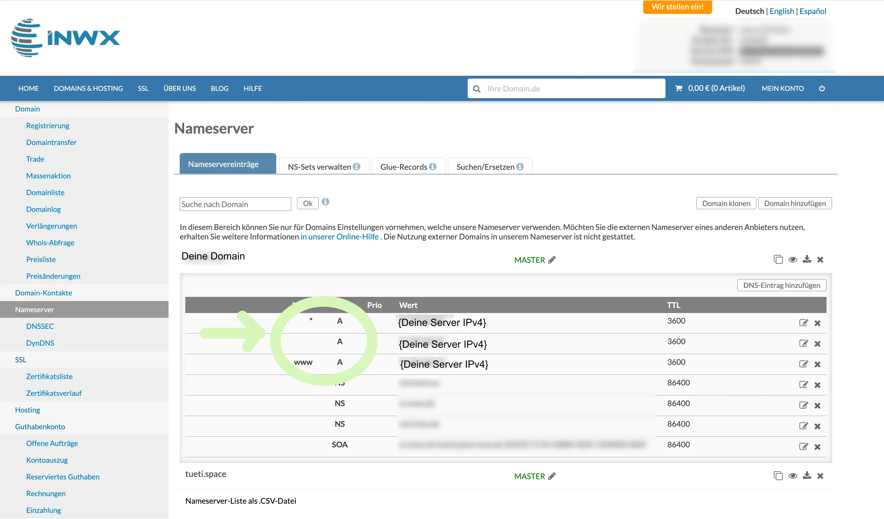
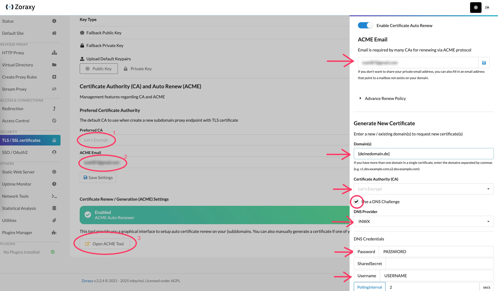
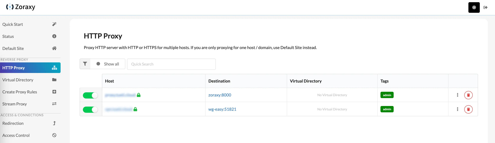

## Wieso nicht einfach Cloudflare?

In den beiden letzten Artikeln habe ich mich des Problems angenommen, das [heimische NAS via Cloudflare Tunnel aus dem Internet heraus erreichbar zu machen](/synology-nas-als-private-cloud-via-cloudflare-tunnel-ohne-portweiterleitung) und dann auch noch [abzusichern](/cloudflare-tunnel-mit-extra-authentifizierung). Das Setup funktioniert soweit, aber es hat zwei Haken:

* Den ersten Haken erwähnte ich bereits im entsprechenden Post: Der Status des Streaming ist in der Community ungewiss
* Und natürlich geht unser Traffic über Cloudflare. Jeder darf selbst entscheiden, ob und in wie weit man Cloudflare vertrauen möchte, aber ich verstehe jeden, der seinen Traffic gern vollständig in der eigenen Hand hat.

Wie im Beitrag zum Setup des Cloudflare Tunnels erwähnt, haben manche von uns einfach nicht die Möglichkeit, Portfreigaben einzurichten und müssen deshalb Kompromisse eingehen. Wenn wir keine Portfreigaben einrichten können oder wollen, dann brauchen wir eine weitere Komponente, mit der wir aus dem Internet heraus auf unsere Services im Heimnetzwerk zugreifen können.

Eine Möglichkeit, die uns sehr viel Kontrolle ermöglicht, wäre ein _eigener Zugriffstunnel mit Hilfe eines virtuellen privaten Servers, eines Reverse Proxies und WireGuard_. Ganz ohne Cloudflare und genau dieses Setup möchte ich hier starten.

## Ein Wort (bzw. Absatz) der Warnung

Ich sage so einfach, wir nutzen einen _privaten virtuellen Server_ (kurz VPS), da dieser viel Kontrolle in die eigene Hand legt. Aber Kontrolle ist Macht und _mit großer Macht kommt auch große Verantwortung (Onkel Ben)_. Ein virtueller privater Server - gerade, wenn dieser als Cloud Service irgendwo gehostet ist - ist ein vollständiger Server, der aus dem Internet heraus erreichbar ist. Ein Server, auf dem ihr vermutlich Admin-Rechte besitzt und der wahrscheinlich auch erstmal keine Firewall aktiviert hat. Kurzum, ein Server, den ihr selbst bestmöglich schützen müsst!

Klingt abschreckend, aber probiere es trotzdem aus! Meine Empfehlung für VPS Hosting Services ist [Hetzner](https://www.hetzner.com/de/cloud). Die bieten für den Anfang gute Tutorials zur [Ersteinrichtung eines Ubuntu Servers](https://community.hetzner.com/tutorials/howto-initial-setup-ubuntu/de) und der [grundlegenden Sicherheit](https://community.hetzner.com/tutorials/howto-initial-setup-ubuntu/de) bei frischen Servern. Außerdem sind die wirklich günstig. 

Mit diesem Disclaimer komme ich aber auch schon zu den Voraussetzungen.

## Voraussetzungen

Um diesem Tutorial folgen zu können, brauchst du...

* ... einen Server, den du aus dem Internet heraus erreichen kannst
* ... eine lauffähige Docker-Installation auf dem Server
* ... eine Domain oder einen DynDNS, wie beispielsweise von [IPv64](https://ipv64.net/) oder [DuckDNS](https://www.duckdns.org/)
* ... ein NAS mit mindestens einem Kernel Version 3.10 - ansonsten wird WireGuard nicht laufen ([hier ist eine Kompatibilitätsliste](https://github.com/runfalk/synology-wireguard?tab=readme-ov-file#compatibility-list))

Ein solcher Server hat natürlich monatliche Kosten. Hetzner rechnet aber sogar stundenweise ab und deckelt monatlich. Du kannst also auch dem Tutorial folgen, alles aufsetzen, entscheiden, dass alles doof war und den Server abreißen. Dann zahlst du nur die Stunden, die der Server tatsächlich existierte. Sollte dies aber eine Dauerlösung werden, musst du monatlich für den Server zahlen. Auch deine Domain kann etwas kosten, sofern du eine eigene erworben hast.

Docker sollte installiert sein, da eine Anleitung für die Installation den Rahmen des Tutorials sprengen würde. Die offiziell empfohlene Routine, an dich auch ich mich gehalten habe, könnte sich geändert haben und dein Server könnte ein ganz anderes Betriebssystem haben, als meins. Deshalb, bitte, installiere Docker selbst auf dem Server. Die offizielle Anleitung für alle Plattformen gibt es [hier bei Docker selbst](https://docs.docker.com/engine/install/).

Ich gehe also davon aus, dass du Zugriff auf einen Server hast, welcher sowohl genügend abgesichert und auf dem Docker installiert ist. Wenn das so ist, lass mich mal beleuchten, was wir überhaupt erreichen wollen.

## Unser Ziel-Setup für Teil 1

Worauf arbeiten wir hier eigentlich hin? Es gibt ein mehrstufiges Ziel. Am Ende möchte ich mein NAS aus dem Internet heraus erreichen können. Für die allermeisten Services auf meinem NAS reicht es mir, wenn diese mit bestehender VPN-Verbindung meiner Clients erreichbar sind. Einige Services möchte ich aber auch über das Internet erreichbar machen.

Dieser Artikel ist Teil 1 der Reihe. Zwischenziel ist ein Setup, welches für die Einrichtung des Netzwerkes bereit ist. Ich wollte erst die Einrichtung des VPN-Netzes mit einbringen, aber habe gemerkt, dass das initiale Setup bereits lang genug ist. In diesem Teil ziehen wir also die benötigten Container (den _Reverse Proxy_ und den _VPN Server_) hoch. Sichern unsere Routen ab, sodass die Ports für die Admin Interfaces nicht mehr öffentlich nutzbar sind und stellen sicher, dass wir unsere Interfaces per Subdomains über HTTPS erreichen können.

Teil 2 kümmert sich dann um die Einrichtung des VPN-Netzes und Teil 3 ist optional für alle, die einige Routen öffentlich erreichbar machen wollen.

Da du nun die Voraussetzungen kennst (und hoffentlich erfüllst) und auch das Ziel vor Augen hast, kann's losgehen 😎

## Los geht's

### Domain / DynDNS auf Server IP richten

Um die Zertifikate zu bestellen und die Kommunikation aus dem Internet heraus mit TLS abzusichern, müssen wir uns als erstes bei unserem Domain Registrar einloggen und die A Records auf die öffentliche IP unseres Server richten.

Hast du deinen Server bei hochgezogen, dann logge dich in der [Hetzner Console](https://console.hetzner.com/) ein und wähle dann deinen Server aus. Die öffentliche IP sollte dir dann direkt ins Auge springen. Bei deinem Domain Registrar setze die A Records für die `Domain`, `www`und `*` auf die IP deines Servers. Bei INWX sollte dies dann so aussehen:


_Anmerkung für diejenigen, die dieselbe Domain nutzen, die ihr für mein Cloudflare-Tutorial genutzt habt. Ihr müsst die Nameserver entweder wieder zurücksetzen, sodass Cloudflare eure Domain nicht mehr administriert oder ihr müsst die A Records bei Cloudflare setzen. Dann ist Cloudflare aber weiterhin involviert._

Bis die Änderung zieht, kann es ein paar Minuten dauern. In der Zeit können wir aber weiter machen.

### Die Docker Container vorbereiten

Wir brauchen zwei Docker Container für unser Setup. Einen _Reverse Proxy_ und unseren _VPN Server_.

Ich habe mich für [_Zoraxy_](https://github.com/tobychui/zoraxy) und [_Wireguard im wg-easy Container_](https://github.com/wg-easy/wg-easy) entschieden. Ich glaube, sucht man nach "Reverse Proxy", stößt man als erstes auf den "Nginx Proxy Manager", "Caddy" oder "Traefik". _Zoraxy_ ist ein recht junges Projekt und trotzdem alt genug, um eine gewisse Stabilität zu haben (2021 erste Commits). Der Entwickler scheint sehr engagiert und auch funktionell bietet es etwas mehr, als der "Nginx Proxy Manager", hat aber ein schönes, modernes Interface, um gut bedienbar zu sein.

Beim VPN habe ich mich für _WireGuard_ entschieden. WireGuard ist Open Source, gilt als sehr sicher und bietet trotzdem einen benutzerfreundlichen Einstieg. Gerade mit dem wg-easy Interface ist ein einfaches Setup schnell möglich. _wireguard-ui_ ist eine bekannte Alternative, die man bei Hetzner sogar als one-click application vorinstallieren kann. Aber das Projekt ist seit längerer Zeit scheinbar nicht mehr weiter entwickelt wurden. Man könnte argumentieren, dass wg-easy fast **zu** leichtgewichtig ist. Aber die Client-Änderungen, die wir vornehmen müssen, können wir in den Config files auch selbst machen, falls notwendig.

Diese beiden Container müssten wir also zum Laufen bringen. Informationen und einen Blueprint für `docker compose` gibt es [hier für Zoraxy](https://hub.docker.com/r/zoraxydocker/zoraxy) und [hier für wg-easy](https://wg-easy.github.io/wg-easy/latest/examples/tutorials/basic-installation/). Schaut man sich das tatsächliche `docker-compose.yml` von wg-easy jedoch an, sieht man, dass dieser Container ein eigenes Netzwerk aufbaut. Eine Routing von Zoraxy ist dann nicht so einfach möglich. Deshalb ist es am einfachsten, ein **gemeinsames** `docker-compose.yml` zu erstellen und so auch Zoraxy in das Netzwerk von wg-easy zu integrieren. So können wir sauber routen.

Ich habe das zusammengefasste `docker-compose.yml` hier eingefügt. In Zeile 38 musst du danach noch für die config Dateien von Zoraxy den lokalen Pfad auf dem Server so anpassen, wie du es wünscht.

Im Linux-Umfeld habe ich immer das Gefühl, es gibt dort so etwas, wie Grundsatzdiskussionen zu gewissen Themen. So auch zum Thema, wo am besten diese Docker Dateien liegen sollen. Mir das das recht egal, ich möchte bei mir einfach, dass es für mich(!) Sinn ergibt. Mein Weg (und du kannst gern einen Anderen gehen, wenn du möchtest) ist, im `home` Verzeichnis einen Ordner `docker` anzulegen. Dort gibt es dann Unterordner pro Container bzw. Containergruppe. In diesen Ordnern sind die gemappten Ordner zum Container und die `docker-compose.yml` Dateien. Meine Datei liegt also unter `~/docker/wg-easy-networksetup/docker-compose.yml`.

Zeile 38 habe ich zu `- ~/docker/zoraxy/config/:/opt/zoraxy/config/` angepasst. So liegt die Konfig zwar nicht unter `~/docker/wg-easy-networksetup`, aber dafür bin ich abgesichert, sollte ich Zoraxy später mal mit eigener `docker-compose.yml` aufbauen - ohne WireGuard. Dann liegt die Konfig schom in korrekten Ordner. Dem kannst du folgen oder auch nicht 😎

Logge dich also per SSH auf deinem Server (entweder per öffentlicher Server IP, aber deine Domain sollte auch als Endpunkt funktionieren, wenn die A Records schon greifen) ein.

```
ssh USERNAME@DEINSERVER
```

Mit dem folgenden Befehl wird das Script in den eben genannten Ordner gespeichert. Du kannst den Pfad natürlich anpassen, musst aber später daran denken, wenn wir die Datei editieren wollen. Lädt man solche Skripte per `curl` herunter, sollte man diese unbedingt prüfen, bevor man sie ausführt. Alternativ kannst du die Datei auch manuell anlegen (zweite Variante).

**Variante a)** Direkt speichern per `curl` (sollte dein System sagen, dass es `curl` nicht besitzt, dann `sudo apt install curl`):
```
curl --create-dirs -o ~/docker/wg-easy-networksetup/docker-compose.yml https://tueti.space/wg-easy-zoraxy-docker-compose.yml
```

**Variante b)** Du kannst die Datei auch manuell anlegen - du musst hinterher per vim oder nano den Inhalt selbst in die Datei einfügen:
```
mkdir ~/docker/wg-easy-networksetup
touch ~/docker/wg-easy-networksetup/docker-compose.yml
```

Wie auch immer du es getan hast, du solltest nun eine `docker-compose.yml` besitzen, mit diesem Inhalt:

```
volumes:
  etc_wireguard:

services:
  wg-easy:
    image: ghcr.io/wg-easy/wg-easy:15
    container_name: wg-easy
    networks:
      wg:
        ipv4_address: 10.42.42.42
        ipv6_address: fdcc:ad94:bacf:61a3::2a
    volumes:
      - etc_wireguard:/etc/wireguard
      - /lib/modules:/lib/modules:ro
    ports:
      - "51820:51820/udp"
      - "51821:51821/tcp" # Zugriff via Reverse Proxy
    restart: unless-stopped
    cap_add:
      - NET_ADMIN
      - SYS_MODULE
    sysctls:
      - net.ipv4.ip_forward=1
      - net.ipv4.conf.all.src_valid_mark=1
      - net.ipv6.conf.all.disable_ipv6=0
      - net.ipv6.conf.all.forwarding=1
      - net.ipv6.conf.default.forwarding=1

  zoraxy:
    image: zoraxydocker/zoraxy:latest
    container_name: zoraxy
    restart: unless-stopped
    ports:
      - 80:80
      - 443:443
      - 8000:8000 # Zugriff via looped Reverse Proxy
    volumes:
      - /path/to/zoraxy/config/:/opt/zoraxy/config/  # ⚠️ PFAD ANPASSEN!
      - /var/run/docker.sock:/var/run/docker.sock
      - /etc/localtime:/etc/localtime
    networks:
      - wg

networks:
  wg:
    driver: bridge
    enable_ipv6: true
    ipam:
      driver: default
      config:
        - subnet: 10.42.42.0/24
        - subnet: fdcc:ad94:bacf:61a3::/64
```

Wenn du dir den Code ansiehst, entdeckst du zwei Kommentare in den Zeilen 17 und 36. Diese Ports werden wir später auskommentieren, um einen Zugriff nur über den Reverse Proxy zu ermöglichen. Noch benötigen wir diese Ports aber für die erste Einrichtung.

Um nun Zeile 38 zu editieren, öffne den Texteditor `nano`:

```
nano ~/docker/wg-easy-networksetup/docker-compose.yml
```

Editiere den Pfad so, wie du es möchtest und speichere die Datei - überschreibe dabei die alte Version:

```
Ctrl+X
Y
Enter
```

Liegt nun ein `docker-compose.yml` auf deinem Server und hat den obigen Inhalt? Top, dann navigiere in den Ordner und erstelle die Container per

```
cd ~/docker/wg-easy-networksetup/
sudo docker compose up -d
```

### Die ersten Routen in Zoraxy

WireGuard können wir noch nicht konfigurieren, da ein Login im Standard nur per HTTPS (verschlüsselt) möglich ist und das wollen wir direkt anständig umsetzen. Deshalb widmen wir uns zuerst Zoraxy.

Öffne im Browser nun `http://{DeineDomain.de}:8000` (kann natürlich auch `{DeineDomain}:8000` oder `{DeinDynDNS}:8000` sein). Das Zoraxy Webinterface sollte sich öffnen. Du musst einen Benutzer für das Interface anlegen. Bedenke hierbei, das Interface ist aus dem Internet heraus erreichbar. Das können wir später ändern, aber aktuell ist es so. Wähle ein entsprechendes Passwort - ein Punkt hinter _qwertz123_ gilt dabei nicht 😜

Sobald du dich dann mit dem neu angelegten Nutzer eingeloggt hast, solltest du das Dashboard sehen. Cool!


#### Zertifikate holen

Jetzt sichern wir erstmal die Admin-Webseiten von Zoraxy und wg-easy ab, indem wir zwei Subdomains für diese anlegen und uns die entsprechenden Zertifikate beschaffen.

Erst die Zertifikate, navigiere hierzu in der linken Menüleiste, im Abschnitt "Security" zu "TLS / SSL certificates". Hier kannst du Zertifikate entweder manuell hinterlegen oder aber Zoraxy das Beschaffen der Zertifikate übernehmen lassen. Wir nehmen hier diesen Weg, da dann auch die automatische Erneuerung aktiviert werden kann. Scrolle nach ganz unten zum Punkt _Certificate Authority (AC) and Auto Renew (ACME)_.

Die _Preferred CA_ lassen wir auf "Let's Encrypt" (1 im Bild) und bei der _ACME Email_ gibst du deine Email Adresse an (2 im Bild). _Save Settings_.

Nun auf den Button ganz unten, "Open ACME Tool" (3 im Bild), klicken, dann öffnet sich ein Wizard.


Diesen Wizard müssen wir 2x ausführen. Einmal für unsere Hauptdomain und einmal als Wildcard für alle Subdomains. Du kannst auch für jede Subdomain einzeln ein Zertifikat erstellen, aber für unsere Bedürfnisse reicht erstmal ein Wildcard-Zertifikat.

Gib deine Email für ACME an, füge deine Domain ein und wähle _Let's Encrypt_ bei der "Certificate Authority". Setze den _Haken_ bei der "DNS Challenge" und wähle deinen "DNS Provider". Bei INWX muss man dann leider Username und Passwort angeben (plus SharedSecret, wenn man 2FA aktiviert hat). Andere Anbieter nutzen Token, was ich tatsächlich angenehmer finde.

Lass den Rest im Standard, scrolle runter und du findest den Button "_Get Certificate_". Anklicken und warten. Wirklich warten. Irgendwann kommt eine Info, dass das Zertifikat erstellt wurde. Dann kannst du den Wizard schließen und siehst weiter oben auf der Seite dein gültiges Zertifikat.

Nun machst du dasselbe Spiel nochmal, nur als Domain setzt du `*.{deineDomain.de}`, ein Sternchen und ein Punkt vor deiner Domain. Damit bekommst du ein Wildcard-Zertifikat für alle Subdomains.

Du siehst deine beiden Zertifikate in der Übersicht? Dann kann's weitergehen und wir können die Proxy Routen erstellen.

Sollest du beim Zertifikate beschaffen übrigens auf Fehler stoßen, hilft oft, die Seite einmal zu aktualisieren oder neu zu öffnen und das nochmal zu machen.

#### Proxy Routen anlegen

Öffne nun _Create Proxy Rules_ in der linken Menüleiste.


Eine simple Konfiguration ist denkbar einfach:

> **Matching Keyword / Domain:** _Deine Wunschdomain für Zoraxy_ (Bsp.: proxy.{deineDomain.de})  
> **Target IP Address or Domain Name with port:** _zoraxy:8000_ (Hier musst du die _interne_ Route angebe und Container sind über ihren Containernamen im eigenen Netzwerk erreichbar)

Der Rest kann so bleiben. Wir können in diesem Interface auch definieren, ob wir _interne_ Routen haben, die via https erreichbar sind, aber kein gültiges Zertifikat haben. Dann könnten wir https nutzen und die Zertifikatswarnung unterdrücken. Zoraxy erreichen wir aber intern über HTTP (was nicht schlimm ist, da dies die Kommunikation auf unserem Server betrifft). Nach außen nutzen wir https. Dafür haben wir das Wildcard-Zertifikat erstellt.

Zu Security-Regeln kommen wir auch später, scrolle nun zum Button "_Create Endpoint_". Sobald du diesen klickst, fragt Zoraxy mit einem kleinen Fenster unten rechts, ob ein neues Zertifikat beantragt werden soll. Nutze das rote X zum Abbrechen. Wir wollen, dass das Wildcard-Zertifikat genutzt wird.

Lege nach diesem Muster nun noch eine zweite Route an, die _wg-easy:51821_ als **Target IP with port** hat und eine Subdomain deiner Wahl.

Wenn du nun links in der Menüleiste auf _HTTP Proxy_ klickst, solltest du deine beiden Routen sehen und die Domains unter **Host** sollten ein grünes Schloss haben, ungefähr so:


Wenn das erreicht ist, musst du ein paar Minuten warten, bis die Subdomains tatsächlich erreichbar sind. Aber nach ein paar Minuten (bis zu 15) solltest du auf beide Subdomains klicken können, um diese - per HTTPS - zu öffnen. Klappt?! Dann weiter 🎉

### Die Ports der Admin Interfaces schließen

Wir können die Admin Interfaces nun via HTTPS und unserer Subdomains erreichen. Also Zeit, die Ports 8000 und 51821 zu schließen, damit ein Zugriff über `{IP}:8000` oder `{Domain}:8000` nicht mehr möglich ist.

Hierfür musst du wieder per SSH auf deinen Server, damit wir die beiden vorhin erwähnten Zeilen des `docker-compose.yml` auskommentieren können.

```
nano ~/docker/wg-easy-networksetup/docker-compose.yml
```

Ändere den Pfad der Datei, wenn du dies vorhin auch getan hast und scrolle in die Zeilen 17 und 36 und setze ein Hash-Symbol (#) an den Anfang, sodass es so aussieht:

```
...
    ports:
      - "51820:51820/udp"
#      - "51821:51821/tcp" # Zugriff via Reverse Proxy
    restart: unless-stopped
...
    ports:
      - 80:80
      - 443:443
#      - 8000:8000 # Zugriff via looped Reverse Proxy
...
```

Dann wieder speichern.

```
Ctrl+X
Y
Enter
```

Danach müssen die Docker Container neu gestartet werden:
```
cd ~/docker/wg-easy-networksetup/
sudo docker compose up -d
```

Die Admin Interfaces sind nun erstmal nicht mehr erreichbar, da die Container neu starten. Zoraxy braucht wieder ein paar Minuten (nicht ungeduldig werden), bis auch die Route auf das eigene Interface steht. Gib deinem System so 10-15 Minuten und dann teste mal deine beiden Subdomains. Beide sollten hoffentlich erreichbar sein, wobei ein direkter Zugriff via `{ServerIP}:8000` oder `{Domain}:8000` (und beides auch mit IP 51821) nicht mehr funktionieren sollte.

Wenn das alles soweit klappt, dann schonmal **meinen Glückwunsch**! Die Container stehen und sind bereit. Weiter geht es im nächsten Teil, in welchem wir uns ein VPN-Netzwerk erstellen, das NAS und einen weiteren Client hinzufügen, um so eine Kommunikation via VPN über das Internet zu erreichen. Bis dahin... ☕️