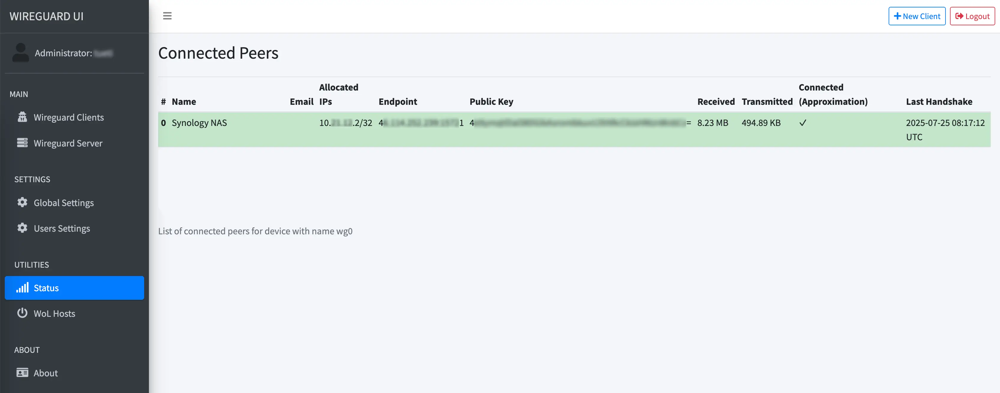

Lasst uns direkt einsteigen, wo wir [letztes Mal](/nas-als-private-cloud-1-eigener-tunnel-mit-virtuellem-privaten-server-reverse-proxy-und-wireguard/) aufgehört haben. Unser VPS steht und WireGuard inklusive aller notwendigen Einstellungen (für Interface und Routing) sind eingerichtet. Außerdem haben wir Caddy und Docker installiert und WireGuard-UI als Container hochgezogen. Caddy läuft auch mit der ersten `reverse_proxy` Regel und wir konnten WireGuard-UI per eigens definierter Subdomain öffnen.

Das klingt alles bekannt? Dann kann es weitergehen.

## Weiter zum Ziel

Ziel dieses Teils der Reihe ist es, unser VPN-Netzwerk aufzubauen und auch unser NAS ins WireGuard-Netz einzubinden. Dies wird nochmal etwas aufwändiger, je nachdem, welches Synology NAS du besitzt. Unser Server läuft bereits und über das Interface von WireGuard-UI können wir nun relativ leicht Client Konfigurationen erstellen.

In diesem Tutorial werde ich die Konfigurationen so erstellen, dass _ausschließlich der interne VPN-Verkehr über den VPN-Server läuft_. Sind die Clients mit VPN verbunden, verbinden sich aber ins Internet (google.de, tueti.space, etc...), dann geht die Verbindung _nicht_ über den VPN Server. Das spart Traffic auf unserem Server. Aber, wie im ersten Teil, ist mein Tutorial hier _opnionated_, geht also _meinen_ Weg. Du kannst das gern anders einrichten. Ich sage dir an der entsprechenden Stelle, was du einrichten müsstest.

Schlussendlich wollen wir am Ende des Tutorials ein VPN-Netz haben, in welchem sich unsere Clients (Smartphone, Tablet, Rechner) aus dem Internet heraus über VPN mit unserem heimischen NAS verbinden können. Obwohl wir hinter [CGNat](https://de.wikipedia.org/wiki/Carrier-grade_NAT) sitzen und keine Portfreigaben eingerichtet haben.

Im dritten Teil werden wir unsere Services dann über ansprechende Domains erreichbar machen und selektieren, welche Routen öffentlich und welche nur aus dem VPN-Netz heraus erreichbar sind.

Da wir alle wieder auf demselben Stand sind, lasst uns loslegen!

## WireGuard-UI vorbereiten

Bei der [Installation von WireGuard-UI im ersten Teil](/nas-als-private-cloud-1-eigener-tunnel-mit-virtuellem-privaten-server-reverse-proxy-und-wireguard/#wireguard-ui-als-container-installieren) erstellten wir eine Proxy Route in Caddy, die auf das WireGuard-UI Interface verweist. Ich nutzte als Beispiel `vpn.meinedomain.de`. Öffne diese Seite nun einmal im Browser und dann lass uns das Interface einmal gemeinsam durchgehen, bevor wir die ersten Clients anlegen.

1. Im Menüpunkt _Administrator:{Username}_ kannst du deinen Username oder Passwort ändern. **Bitte sichere dein Interface ab!**
2. _WireGuard Clients_ nutzen wir gleich, um Clients anzulegen
3. Im _WireGuard Server_ kannst du deine IP Range angeben. Vermutlich wurde die IP Range von vorhin überschrieben und du kannst die vorhandene IP Range durch eine selbst gewählte ersetzen. Ich nutze als Beispiel `10.8.0.1/24`. Der `Listen Port` gibt an, über welchen Port sich deine Clients mit dem VPN verbinden können. In der `nftables` haben wir in der strikten Version `51820/UDP` freigegeben (siehe [letzten Abschnitt](/nas-als-private-cloud-1-eigener-tunnel-mit-virtuellem-privaten-server-reverse-proxy-und-wireguard/#routing-für-das-vpn-erlauben)), deshalb muss dieser Port nun auch verwendet werden - ist aber auch der Standard von WireGuard.
4. In _Global Settings_ kannst du allgemeine Einstellungen für die Client Config treffen:
    - **Endpoint Address** ist die URL (oder öffentliche IP deines Servers), über die dein Server erreichbar ist. Also `deinedomain.de`
    - **DNS Server** werden im dritten Teil der Reihe interessant, wenn wir einen eigenen hinzufügen. Wenn deine Clients doch über das VPN ins Internet sollen, sind dies die DNS Server für die Namensauflösung.
    - Prüfe nochmal, dass in **WireGuard Config File Path** `etc/wireguard/wg0.conf` steht. Dies _muss_ der Pfad sein, den du im `docker-compose.yml` auf dein lokales `/etc/wireguard/` gemappt hast

### Konfig für das NAS

_Wenn du kein NAS hast, kannst du natürlich auch einen anderen Client anlegen. In der Konfig spielt da eigentlich nur der "Name" der Konfig eine Rolle. Für alle mit NAS, folgt weiter dem Tutorial._

In **WireGuard Clients** kannst du nun auf _"New Client"_ klicken, gibst dem Client einen Namen ("Synology NAS"?), prüfst, dass die _IP Allocation_ auch in der Range liegt, die du eben in der Konfig zum _WireGuard Server_ geprüft hast (folgst du meinem Beispiel, ist dies vermutlich `10.8.0.2/32`) und die _Allowed IPs_ änderst du von `0.0.0.0/0` auf `10.8.0.1/24`. Das NAS soll nur mit anderen VPN Clients über den VPN Server reden. Normaler Internetzugriff (wie DSM Updates, etc.) sollen über deinen normalen, hauseigenen Internetanschluss laufen. Entferne den Haken bei `Use DNS Server`. Dies kann auf einigen NAS zu Problemen führen und da wir den heimische Internetzugang nutzen, ist dieses Setting irrelevant. Dann erstelle den Client mit _Submit_.

Der Client sollte nun als Karte in der Übersicht deiner _WireGuard Clients_ auftauchen, das sollte dann ungefähr so aussehen:


Speichere die Konfig via "Download" Button unter dem Namen `wg0.conf` auf deinem Rechner. Außerdem nutze auch den "Apply Config" Button, der in dieser Übersicht oben rechts existiert, wenn du Neues angelegt hast. Dieser aktualisiert deine `wg0.conf` auf dem Server und durch unseren Watcher sollte WireGuard die neue Konfig ziehen. Prüfen kannst du das mit dem folgenden Befehl, welcher dir die letzten Ausführungen des Watchers anzeigt.
```
sudo journalctl -u wg-quick-watcher@wg0.service
```


Es kann sein, dass du das `wg0` Interface einmal manuell neu starten musst.

```
sudo wg-quick down wg0
sudo systemctl restart wg-quick@wg0.service
```
  

## Das NAS verbinden

_Wenn du kein NAS verbinden willst, kannst du dies überspringen und stattdessen einfach deinen Client verbinden. Das geht vermutlich deutlich einfacher, als bei einem Synology NAS._

Um unser NAS zu verbinden, müssen wir nochmal ein paar "Hacks" anwenden. Leider gibt es seit DSM Version 7 kein fertig kompiliertes Communitypaket mehr für WireGuard. Zumindest kein "halb-offizielles". Lass mich kurz erklären:

Es gibt ein [GitHub Repository von Andreas Runfalk, namens _synology-wireguard_](https://github.com/runfalk/synology-wireguard), welches genutzt wird, um eine WireGuard App für Synology zu beziehen. Für DSM Version 6.X hat der Autor diese Pakete selbst kompiliert und in seinen Releases zur Verfügung gestellt. Für DSM Version 7 macht er dies jedoch nicht mehr und sagt, die App müsse selbst für das eigene System kompiliert werden. Er stellt dafür auch eine Anleitung zur Verfügung. Allerdings ist das nicht ganz trivial und ich habe zwei Quellen gefunden, in denen du auch fertig kompilierte Pakete herunterladen kannst. Um die WireGuard App zu bekommen, gibt es also zwei Varianten und du kannst dir eine aussuchen.

### Die WireGuard App bekommen

Bevor wir aber weitermachen können, brauchen wir die Info, welche CPU Architektur dein NAS hat. Dafür stellt Synology selbst eine [nette Übersicht](https://kb.synology.com/en-global/DSM/tutorial/What_kind_of_CPU_does_my_NAS_have) zur Verfügung. Öffne diese Seite einmal und prüfe den "Package Arch" deines NAS.

#### Variante a: Fertiges Paket herunterladen

Wie bereits geschrieben, habe ich zwei Quellen gefunden, von denen man bereits fertig kompilierte Pakete der WireGuard App herunterladen kann. Hier muss man sich entscheiden, ob man den Leuten vertraut, die diese Pakete kompiliert haben oder ob man das Paket lieber selber bauen möchte. Hierauf gehe ich in Variante B ein.

Trotzdem möchte ich dir die Quellen nicht vorenthalten, möchte aber betonen, _diese Quellen sind nicht von mir und ich habe die Pakete nicht selbst kompiliert_.

Die **erste Quelle** habe ich über ein YouTube-Video von _[ITechPG](https://www.youtube.com/watch?v=TOTXwM2_gc8)_ gefunden. Dieser bedankt sich jedoch beim Kanal _Digital Aloha_, welcher wiederum [dieses Video](https://www.youtube.com/watch?v=v0Z1m658Xe8) veröffentlichte, in welchem er die Quelle als "sein Google Drive" bezeichnet. ITechPG hat aktuell ca. 15.500 Abonnenten und dahinter verbirgt sich der ["IT Service Heilbronn"](https://it-service-heilbronn.de/), welcher auf seiner Seite zumindest ein Impressum angibt. _Digital Aloha_ scheint ein reiner Tech YouTube Kanal mit aktuell ca. 8.300 Abonnenten zu sein. Auf dessen Webseite findet man wenig Persönliches.

Die Quelle selbst ist [dieses Google Drive](https://drive.google.com/drive/folders/1Ci-8oWZ_gW8tH3mv5wKL19nKE1pR8ZfH). Darin sind die App-Pakete nach DSM-Version sortiert und jedes *.spk hat eine Architektur (euren Package Arch) im Namen.

Die **zweite Quelle** findet man in einem [Issue des offiziellen GitHub Repos](https://github.com/runfalk/synology-wireguard/issues/143#issuecomment-1272390938) und dieses Issue verweist auf [Blackvoid.club](https://www.blackvoid.club/wireguard-spk-for-your-synology-nas/).

Solltest du ein Paket für dich herunterladen wollen, achte auf deine korrekte DSM Version und vor allem auch auf den Package Arch, den du eben geprüft hast. Ich habe beispielweise die Architektur apollolake, müsste also für DSM 7.2 (dieses habe ich installiert) das *.spk herunterladen, welches `apollolake` im Namen hat.

#### Variante b: Paket selbst kompilieren

Wenn du das *.spk selbst kompilieren möchtest, kann ich dich leider nicht Schritt für Schritt an die Hand nehmen. Du brauchst auf jeden Fall Docker und Git installiert, um sowohl das Repo selbst zu klonen, aber auch den Container bauen zu können, mit welchem dann das Paket kompiliert werden soll.

Die Anleitung findest du [hier auf der README des Repos](https://github.com/runfalk/synology-wireguard?tab=readme-ov-file#compiling). Für einige Architekturen funktioniert der Build recht einfach, für Apollolake stieß ich direkt auf einen Fehler und musste die `build.sh` des Repos editieren. Das führte zu einem anderen Fehler, der dann Debugging bedurfte. Am Ende scheint es so, dass ein Kompilieren nicht in jedem Fall "einfach so" geht.

Ich kann dir hier leider nur sagen, teste die Anleitung, arbeite dich durch die Issues und es gibt auch [Reddit Beiträge](https://www.reddit.com/r/synology/comments/xkxjfh/fya_how_to_connect_synology_to_a_wireguard_vpn/), die sich mit dem Thema befassen.

Ich drücke die Daumen, dass es klappt. Ansonsten, wenn du den Anbietern der Quellen unter Variante A genug vertraust, kannst du sonst auch so weiter machen.

### Paket installieren

Egal, ob du nun Variante A oder B gewählt hast, du solltest nun WireGuard als *.spk Datei auf deinem Rechner haben und diese Datei soll nun auf dem NAS installiert und vor allem zum Laufen gebracht werden. Dabei ist die Installation recht simpel. Öffne dein DSM und gehe ins Paketzentrum. Unter "manuelle Installation" wählst du dein *.spk aus installierst dies. **Wichtig ist**, am Ende den Haken bei "nach der Installation automatisch starten" zu entfernen!

Die Installation sollte dann hoffentlich erfolgen (wenn das *.spk für deine DSM Version und CPU Architektur korrekt war) und auch erfolgreich abschließen. Die App sollte im Paketzentrum, wie jede andere App einsehbar sein.


Aufgrund einer Berechtigungsthematik kann die App nicht über das Paketzentrum gestartet werden, dies muss laut [offizieller Doku](https://github.com/runfalk/synology-wireguard?tab=readme-ov-file#installation) über SSH erfolgen.

Also ab ins Terminal:
```
ssh USER@NAS-IP
```

Mit dem folgenden Befehl kannst du die App dann starten
```
sudo /var/packages/WireGuard/scripts/start
```

Auch dies kannst du im Paketzentrum prüfen - schaust du dir die App im Paketzentrum an (drauf klicken), sollte dort in grün _Wird ausgeführt_ stehen:


Jetzt müssen wir noch die Konfigdatei hinzufügen, um die Verbindung zu unserem Server aufzubauen.

### Konfig hinzufügen und Interface starten

Die `wg0.conf` Konfigurationsdatei vom Anfang des Beitrags kannst du auf verschiedene Arten auf dein NAS bringen. Wenn du weißt, was du tun musst, um schneller zu sein, mach das gern. Mit meinem folgenden Weg solltest du recht unabhängig vom Betriebssystem sein.

Öffne die _File Station_ in der DSM Weboberfläche und gehe in dein eigenes `home` Verzeichnis. Lade die Datei `wg0.conf` in dieses Verzeichnis, sodass diese auf deinem NAS in deinem eigenen `home` Ordner liegt.

Per SSH führe auf deinem NAS die folgenden Befehle aus, um `wg0.conf` ins Zielverzeichnis zu bringen und diese VPN-Schnittstelle zu starten:

Zielordner erstellen:
```
sudo mkdir /etc/wireguard
```

Datei verschieben:
```
sudo mv ~/wg0.conf /etc/wireguard/
```

Und die Verbindung starten:
```
sudo wg-quick up wg0
```

Solltest du **keinen** DNS Server in deiner Config haben, müsste die Verbindung aufgebaut und mit _connection established_ bestätigt sein.



```{hl_lines=[7]}
[#] ip link add wg0 type wireguard
[#] wg setconf wg0 /dev/fd/63
[#] ip -4 address add {MEINE-ZIEL-VPN-IPv4}/24 dev wg0
[#] ip -6 address add {MEINE-ZIEL-VPN-IPv6}/112 dev wg0
[#] ip link set mtu 1420 up dev wg0
[#] resolvconf -a wg0 -m 0 -x
/usr/local/bin/wg-quick: line 32: resolvconf: command not found
[#] ip link delete dev wg0
```
Solltest du auf diesen Fehler gestoßen sein, kann dein NAS die DNS Einträge nicht nutzen, da das Tool `resolveconf` nicht verfügbar ist. Dieses Tool ist für die Verwaltung von DNS-Einstellungen verantwortlich. Es gibt die App [Entware](https://github.com/Entware/Entware), welches [mit dieser Anleitung auf dem NAS installiert werden kann](https://github.com/Entware/Entware/wiki/Install-on-Synology-NAS). Dies würde `resolveconf` wohl bereitstellen.

Für mein genanntes Wunschsetup gibt es jedoch einen einfacheren Weg. Denn wie eingangs beschrieben, benötigen wir die DNS Einträge auf dem NAS nicht, da nur interner VPN Traffic über den VPN Server gehen soll. Die _AllowedIPs_ unterstützen dies. Wir können also unsere DNS Config einfach aus der Datei `wg0.conf` auskommentieren (oder löschen). Das machen wir jetzt (leider mit `vim`, statt mit `nano`).

```
sudo vim /etc/wireguard/wg0.conf
```

Der Inhalt sieht in etwa so aus und die Zeile 4 setzt deine DNS Konfiguration:
```{hl_lines=[4]}
[Interface]
PrivateKey = {DEIN PRIVATE KEY}
Address = {DEIN VPN IPv4}, {DEINE VPN IPv6}
DNS = 5.9.164.112, 2a01:4f8:251:554::2, 1.1.1.1
MTU = 1420

[Peer]
PublicKey = {DEIN PUBLIC KEY}
PresharedKey = {DEIN PRESHARED KEY}
AllowedIPs = 10.8.0.0/24
PersistentKeepalive = 25
Endpoint = {DEIN VPN ENDPUNKT}:51820
```

Da wir `vim` nutzen, kannst du nicht direkt editieren. Deshalb erstmal ...

```
i
```

... für den _insert mode_. Nun kannst du Text schreiben. Setze ein `#` vor die vierte Zeile. Dann drücke die `esc` Taste, um den _insert mode_ wieder zu verlassen und speichere. Die komplette Befehlskette ist also:

```
<esc>
:wq
```
Der Doppelpunkt leitet Dateibefehle ein und `wq` steht für `write` und `quit`, also speichern und schließen.

Der DNS Eintrag ist nun nicht mehr gültig und du kannst erneut testen, ob du eine Verbindung aufbauen kannst:
```
sudo wg-quick up wg0
```

Diesmal sollte am Ende etwas stehen, wie _connection established_ oder so.
  
Du kannst auch in WireGuard-UI, im Menüpunkt "Status" sehen, dass die Verbindung steht:


Dein Interface zeigt auch ein verbundenes NAS? Dann **Glückwunsch** 🥳! Jetzt erleichtern wir uns noch den Start der WireGuard App und die Verbindung anderer Clients ist dann ein Kinderspiel.

### Ein Startskript für den Aufgabenplaner

Per `ssh` bietet `wg-autostart` einen angenehmem Weg, wie das Interface nach Neustarts des NAS immer wieder automatisch aktiviert werden sollte;

Wenn du noch per SSH verbunden bist, nutze:
```
sudo wg-autostart enable wg0
```

Mit `disable` könntest du den Autostart wieder beenden:
```
sudo wg-autostart enable wg0
```

Zur Sicherheit können wir aber auch im Aufgabenplaner eine Aufgabe erstellen, die wir manuell ausführen können, um das Interface zu starten. Öffne dazu dein DSM, gehe in die _Systemsteuerung_ zu _Aufgabenplaner_.

Erstelle eine _Ausgelöste Aufgabe_ => _Benutzerdefiniertes Skript_.

> **Allgemein**  
> _Aufgabe_: Start WireGuard  
> _Benutzer_: root  
> _Ereignis_: Hochfahren  
> _Vor-Aufgabe_: {leer}  
> _Aktiviert_: Haken entfernen!
>
> **Aufgabeneinstellungen**  
> _Ausführungsdetails per Email_: Deine Entscheidung  
> _Benutzerdefiniertes Skript_: `bash /volume1/homes/{DEIN-NUTZERNAME}/start_wireguard.sh`

Dann speichern und dein Adminkennwort eingeben. Jetzt müssen wir dieses `start_wireguard.sh` natürlich noch anlegen.

Dazu wieder per `ssh` auf dein NAS, dort landest du dann direkt in deinem `home` Verzeichnis:
```
ssh USER@NAS-IP
```

Nun legst du die Datei an, machst sie ausführbar und öffnest sie:
```
touch start_wireguard.sh
chmod +x start_wireguard.sh
vim start_wireguard.sh
```

Erst mit `i` in den _insert_ Modus wechsel, dann kannst du tippen. Folgender Inhalt kann nun in die Datei:
```
#!/usr/bin/env bash

/var/packages/WireGuard/scripts/start
wg-quick up wg0
```

Das sind die beiden Befehle, die wir vorhin manuell ausgeführt haben. Ein `sudo` brauchen wir nicht, da die Aufgabe im Userkontext `root` angelegt wurde. Also speichern und schließen:
```
<esc>
:wq
<enter>
```

Ab jetzt kannst du WireGuard über das Paketzentrum _beenden_ und über den Aufgabenplaner _starten_, indem du die angelegte Aufgabe ausführst. Nach einem Neustart sollte das Interface automatisch starten, du kannst den Autostart aber auch deaktivieren und diese Aufgabe aktivieren. Vermutlich ist der Autostart im System aber robuster, da das Interface dann hoffentlich schon vorhanden ist.

## Unser Smartphone verbinden

Okay, das NAS ist verbunden, aber das bringt nichts, wenn kein Client damit per VPN kommunizieren kann. Nutze den "+ New Client" Button, um einen weitern Client hinzuzufügen. Nimm gern dein Smartphone und gib dem Client einen sprechenden Namen. Wenn du deinen Internet Traffic nicht über deinen Server umleiten willst, passe wieder die _Allowed IPs_ auf dein Subnet an (10.8.0.1/24), dann speichere den Client mit "Submit".

Nun lade dir die WireGuard App auf dein Smartphone herunter. Diese ist im App Store und im Play Store (und vermutlich auch in alternativen Android Stores) verfügbar. Klicke dann in der App auf "Tunnel hinzufügen" und wähle "Aus QR-Code erstellen". In WireGuard-UI kannst du über den Button "QR Code" einen QR Code für deinen Client anzeigen lassen und diesen kannst du dann mit deinem Smartphone scannen. Gib dem Tunnel einen Namen, speichere und erlaube eventuell, dass die App ein VPN-Profil auf deinem Gerät hinterlegen darf (dies muss mit Code bestätigt werden).

Fertig! Sobald du die Verbindung aufbaust, kannst du mit deinem Smartphone dein WLAN verlassen und trotzdem im Browser die VPN-IP deines NAS mit Port 5001 für dein DSM Interface (Beispiel https://10.8.0.2:5001) öffnen und dein NAS sollte erreichbar sein!

## Fazit

Damit ist das Ziel des zweiten Teils erreicht, unser VPN-Netz steht und du kannst nun weitere Clients hinzufügen. Für WireGuard Apps, die beispielsweise auf Rechnern laufen, kannst du die config herunterladen und per "Tunnel hinzufügen" importieren. Geräte mit Kamera funktionieren am einfachsten mit dem QR Code.

Da wir in den _Global Settings_ einen Persistent Keepalive von 25 Sekunden behalten haben (dies war der Standard), werden die Clients sich alle 25 Sekunden beim VPN Server melden, um die Verbindung nicht zu verlieren. Das sorgt auch dafür, dass dein NAS die Verbindung aufrecht erhalten wird. Aktuell geht dann der interne VPN Traffic über den VPN Server, Verbindungen "nach außen", also ins Internet nutzen die eigene Internetverbindung des Gerätes. Das spart Bandbreite auf unserem Server.

Aktuell sind unsere Clients nur über die IP erreichbar, das ändern wir im nächsten Teil. Dort selektieren wir, welche Routen öffentlich werden und welche intern bleiben sollen. Außerdem wollen wir die internen Routen ebenfalls zu einer schönen Subdomain ändern, damit wir uns nicht IP und Port für alles merken müssen.

Jetzt haben wir uns aber natürlich erstmal wieder einen Kaffee verdient und ich hoffe, das Tutorial ar hilfreich! ☕️