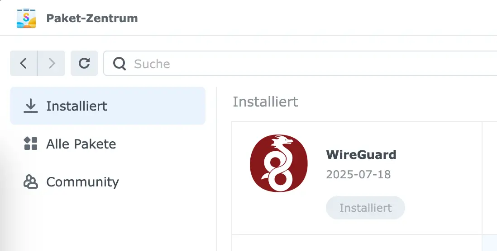
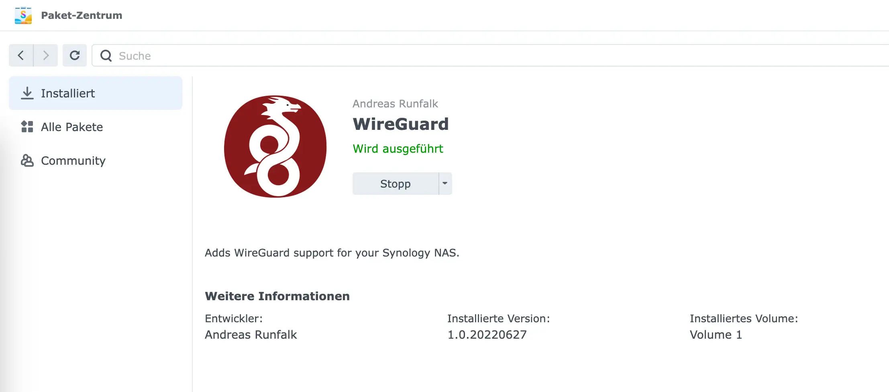
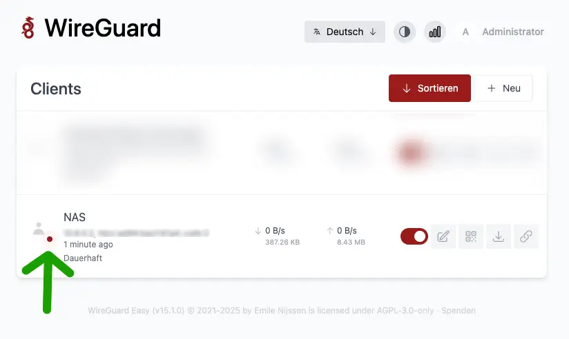

Lasst uns direkt einsteigen, wo wir [letztes Mal](/nas-als-cloud-eigener-tunnel-mit-virtuellem-privaten-server-reverse-proxy-und-wireguard-teil-1/) aufgehört haben. Unser VPS steht und WireGuard inklusive aller notwendigen Einstellungen (für Interface und Routing) ist eingerichtet. Außerdem haben wir Caddy und Docker installiert und WireGuard-UI als Container hochgezogen. Caddy läuft auch mit der ersten reverse proxy Regel und wir konnten WireGuard-UI per eigens definierter Subdomain öffnen.

Das klingt alles bekannt? Dann kann es weitergehen.

## Weiter zum Ziel

Ziel dieses Teils der Reihe ist es, unser VPN-Netzwerk aufzubauen. Unser Server läuft und über das Interface von WireGuard-UI können wir relativ leicht Client Konfigurationen erstellen. Wir werden also das NAS als Client im Interface anlegen, um eine solche Konfiguration zu bekommen. Wir müssen außerdem auch WireGuard auf unserem NAS installieren, damit es sich mit unserem Server verbinden kann. Dabei sind ein paar Dinge zu beachten, da wir ja nicht den gesamten Traffic des NAS über unseren Server leiten wollen. DSM-Updates und anderer regulärer Internetzugriff soll weiterhin über unseren normalen Internetzugang zu Hause laufen. Nur Zugriff auf andere VPN-Clients und den Server sollen auch über VPN abgewickelt werden. Zu guter Letzt werden wir noch ein weiteres Gerät, beispielsweise ein Smartphone als Client hinzufügen, um zu testen, ob wir aus dem Mobilfunknetz, mit verbundenem VPN, auf das NAS zugreifen können.

Wenn dieses Setup steht, dann könntet ihr einfach alle gewünschten Clients in WireGuard-UI anlegen, den entsprechenden WireGuard Client auf den Geräten installieren und die Konfiguration dort hinterlegen. Danach habt ihr ein voll funktionsfähiges VPN-Netz, mit welchem ihr aus dem Internet heraus per VPN aufs heimische NAS zugreifen könnt.

Im dritten Teil werden wir unsere Services dann über ansprechende Domains erreichbar machen und selektieren, welche Routen öffentlich und welche nur aus dem VPN-Netz heraus erreichbar sind.

Da wir alle wieder auf demselben Stand sind, lasst uns loslegen!

## WireGuard-UI vorbereiten


>>>>>>AB HIER NEU<<<<<<<<

Gehen wir kurz das Interface durch:
* Im Menüpunkt _Administrator:{Username}_ kannst du deinen Username oder Passwort ändern. Bitte sichere dein Interface ab!
* _WireGuard Clients_ nutzen wir gleich, um Clients anzulegen
* Im _WireGuard Server_ kannst du deine IP Range angeben. Vermutlich wurde die IP Range von vorhin überschrieben und du kannst die vorhandene IP Range ersetzen durch `10.X.Y.1/24` (`X` und `Y` wieder ersetzen). Ich nutze als Beispiel `10.8.0.1/24`
* In _Global Settings_ kannst du deinen Endpunkt setzen, also deine Domain oder deine öffentliche Server IP.


### Konfig für das NAS

Sobald ihr den entsprechenden Button drückt, öffnet sich ein kleines Fenster. Gebt einen sprechenden Namen ein ("NAS"?), lasst das Datum leer - bzw. mit dem Platzhalter versehen und sagt "Client erstellen". Fertig.

Also fast. Wir wären im einfachsten Fall fertig, wenn _alles an Traffic_ über unseren Server geroutet werden sollte. Aber wir möchten ein wenig einschränken, also klickt bitte auf den "Editieren" Button neben dem roten Schalter bei eurem Client. Dieser Button führt euch in die Konfiguration _pro Client_. Eben waren wir in der _globalen Konfiguration_, die _Client Konfiguration_ überschreibt die globale Konfiguration _für diesen Client_.

Zwei Werte möchte ich anpassen.

1. **Erlaubte IP-Adressen**: 10.8.0.0/24  
2. Unter **Erweitert** => **Dauerhaftes Keepalive**: 25  

Wieso diese Änderungen? Die erste Einschränkung sagt, nur Verbindungen, die eine IP im Bereich 10.8.0.X haben (die Standard Range von WireGuard, die auch wir nutzen) sollen über den VPN Server geroutet werden. Also unser NAS leitet nur Anfragen an solche IPs über unseren Server. Anfragen an andere IP (internets Netzwerk oder öffentliche IPs im Internet) gehen nicht über den VPN Server.

Der zweite Wert sorgt dafür, dass unser NAS dauerhaft verbunden bleibt, auch, wenn kein aktiver Traffic läuft. Alle 25 Sekunden hält er die Verbindung aufrecht. Das ist der empfohlene Wert von WireGuard. Macht unser Client das nicht, könnte die Verbindung irgendwann einschlafen und dann wäre das NAS gegebenenfalls nicht mehr erreichbar, wenn wir es erreichen wollen. Einfach, weil lange keine Verbindung mehr stand.

Dann ganz unten auf der Seite _speichern_, du landest wieder auf der Hauptseite und kannst die Konfig-Datei über den _Herunterladen_ Button als `wg0.conf` auf deinem Rechner speichern. Diese Datei brauchen wir gleich für unser NAS.

## Das NAS verbinden

Nun wird es heikel und in diesem Abschnitt kommt es ziemlich auf dein NAS und auf deine Lust des Debuggings an, denn ich möchte das NAS als WireGuard Client hinterlegen. WireGuard wird leider für DSM 7.X nicht als Paket (weder offiziell, noch aus der Community heraus) angeboten und dazu kommt noch, einige NAS unterstützen WireGuard nicht "einfach so".

### Die WireGuard App bekommen

Es gibt allerdings ein [GitHub Repository von Andreas Runfalk, namens _synology-wireguard_](https://github.com/runfalk/synology-wireguard), welches ich gern nutzen möchte. Synology unterstützt IPSec und OpenVPN in der Netzwerkkonfiguration, aber WireGuard bietet ein paar Vorteile, was beispielweise das einfache Setup und die Geschwindigkeit im Betrieb angeht. Die Installation des Clients ist dafür leider nicht trivial und ich kann zwei Möglichkeiten anbieten.

Bevor wir aber weitermachen können, brauchen wir die Info, welche CPU Architektur dein NAS hat. Dafür stellt Synology selbst eine [nette Übersicht](https://kb.synology.com/en-global/DSM/tutorial/What_kind_of_CPU_does_my_NAS_have) zur Verfügung. Öffne diese Seite einmal und prüfe den "Package Arch" deines NAS.

#### Variante a: Fertiges Paket herunterladen

Ich habe zwei Quellen gefunden, von denen man bereits fertig kompilierte Pakete der WireGuard App herunterladen kann. Hier muss man sich entscheiden, ob man den Leuten vertraut, die diese Pakete kompiliert haben oder ob man das Paket lieber selber bauen möchte. Hierauf gehe ich in Variante B ein.

Trotzdem möchte ich euch die Quellen nicht vorenthalten, möchte aber betonen, diese Quellen sind nicht von mir und ich habe die Pakete nicht selbst kompiliert.

Die **erste Quelle** habe ich über ein YouTube-Video von [_ITechPG_](https://www.youtube.com/watch?v=TOTXwM2_gc8) gefunden. Dieser bedankt sich jedoch beim Kanal _Digital Aloha_ und dieser Kanal hat [dieses Video](https://www.youtube.com/watch?v=v0Z1m658Xe8), in welchem er die Quelle als "sein Google Drive" bezeichnet. ITechPG hat aktuell ca. 15.500 Abonnenten und dahinter verbirgt sich der ["IT Service Heilbronn"](https://it-service-heilbronn.de/), welcher auf seiner Seite zumindest ein Impressum angibt. _Digital Aloha_ scheint ein reiner Tech YouTube Kanal, mit ca. 8.300 Abonnenten aktuell. Auf dessen Webseite findet man wenig persönliches.

Die Quelle selbst ist nun aber [dieses Google Drive](https://drive.google.com/drive/folders/1Ci-8oWZ_gW8tH3mv5wKL19nKE1pR8ZfH). Diese ist nach DSM-Version sortiert und jedes *.spk hat eine Architektur im Namen.

Die **zweite Quelle** findet man in einem [Issue des offiziellen GitHub Repos](https://github.com/runfalk/synology-wireguard/issues/143#issuecomment-1272390938) und dieses Issue verweist auf [Blackvoid.club](https://www.blackvoid.club/wireguard-spk-for-your-synology-nas/).

Solltest du das Paket herunterladen wollen, achte auf deine korrekte DSM Version und vor allem auch auf die Package Arch, die du eben geprüft hast. Ich habe beispielweise die Architektur apollolake, müsste also für DSM 7.2 (dieses habe ich installiert) das *.spk herunterladen, welches `apollolake` im Namen hat.

#### Variante b: Paket selbst kompilieren

Wenn du das *.spk selbst kompilieren möchtest, kann ich dich leider nicht Schritt für Schritt an die Hand nehmen. Du brauchst auf jeden Fall Docker und Git installiert, um sowohl das Repo selbst zu klonen, aber auch den Container bauen zu können, mit welchem dann das Paket kompiliert werden soll.

Die Anleitung findest du [hier auf der README des Repos](https://github.com/runfalk/synology-wireguard?tab=readme-ov-file#compiling). Für einige Architekturen funktioniert der Build recht einfach, für Apollolake stieß ich direkt auf einen Fehler und musste die `build.sh` des Repos editieren. Das führte zu einem anderen Fehler, der dann Debugging bedurfte. Am Ende scheint es so, dass ein Kompilieren nicht in jedem Fall "einfach so" geht. Der Ersteller des Repos hat für alte DMS Versionen (6.2) fertige Pakete in den Releases veröffentlicht, sagt aber, für DSM 7 Pakete muss man diese selbst erstellen.

Ich kann dir hier leider nur sagen, teste die Anleitung, arbeite dich durch die Issues und es gibt auch [Reddit Beiträge](https://www.reddit.com/r/synology/comments/xkxjfh/fya_how_to_connect_synology_to_a_wireguard_vpn/), die sich mit dem Thema befassen.

Ich drücke die Daumen, dass es klappt. Ansonsten, wenn du den Anbietern der Quellen unter Variante A genug vertraust, kannst du sonst auch so weiter machen.

### Paket installieren

Egal, ob du nun Variante A oder B gewählt hast, du solltest nun WireGuard als *.spk Datei auf deinem Rechner haben und diese soll nun auf dem NAS installiert und vor allem zum Laufen gebracht werden. Dabei ist die Installation recht simpel. Öffne dein DSM und gehe ins Paketzentrum. Unter "manuelle Installation" wählst du dein *spk aus installierst dies. **Wichtig ist**, am Ende den Haken bei "nach der Installation automatisch starten" zu entfernen!

Die Installation sollte dann hoffentlich erfolgen (wenn das *.spk für deine DSM Version und CPU Architektur korrekt war) und auch erfolgreich abschließen. Die App sollte im Paketzentrum, wie jede andere App einsehbar sein.



Aufgrund einer Berechtigungsthematik kann die App nicht über das Paketzentrum gestartet werden, dies muss laut [offizieller Doku](https://github.com/runfalk/synology-wireguard?tab=readme-ov-file#installation) über SSH erfolgen.

Also ab ins Terminal (oder PuTTY bei Windows) und aufs NAS aufschalten:
```
ssh USER@NAS-IP
```

Mit dem folgenden Befehl kannst du die App dann starten
```
sudo /var/packages/WireGuard/scripts/start
```

Auch dies kannst du im Paketzentrum prüfen - schaust du dir die App im Paketzentrum an (drauf klicken), sollte nun in grün _Wird ausgeführt_ dort stehen:


Nun müssen wir noch die Konfigdatei hinzufügen, um die Verbindung zu unserem Server aufzubauen.

### Konfig hinzufügen und Interface starten

Die `wg0.conf` Konfigurationsdatei vom Anfang des Beitrags kannst du nun auf verschiedene Arten auf dein NAS bringen. Wenn du weißt, was du tun musst, um schneller zu sein, mach das gern. Mit meinem folgenden Weg solltest du recht unabhängig vom Betriebssystem sein.

Öffne die _File Station_ in der DSM Weboberfläche und gehe in dein eigenes `home` Verzeichnis. Lade nun dort die Datei `wg0.conf` hoch, sodass diese auf deinem NAS in deinem eigenen `home` Ordner liegt.

Per SSH führe auf deinem NAS die folgenden Befehle aus, um `wg0.conf` ins Zielverzeichnis zu bringen und diese VPN-Schnittstelle zu starten:

Zielordner erstellen:
```
sudo mkdir /etc/wireguard
```

Datei verschieben:
```
sudo mv ~/wg0.conf /etc/wireguard/
```

Und die Verbindung starten:
```
sudo wg-quick up wg0
```

... und dies lief beir mir schief. Bei dir auch? Mein Output war:
```{hl_lines=[7]}
[#] ip link add wg0 type wireguard
[#] wg setconf wg0 /dev/fd/63
[#] ip -4 address add {MEINE-ZIEL-VPN-IPv4}/24 dev wg0
[#] ip -6 address add {MEINE-ZIEL-VPN-IPv6}/112 dev wg0
[#] ip link set mtu 1420 up dev wg0
[#] resolvconf -a wg0 -m 0 -x
/usr/local/bin/wg-quick: line 32: resolvconf: command not found
[#] ip link delete dev wg0
```

Das Tool `resolveconf` ist nicht auf dem NAS verfügbar und dieses Tool ist für die Verwaltung von DNS-Einstellungen verantwortlich. Es gibt das Tool [Entware](https://github.com/Entware/Entware), welches [mit dieser Anleitung auf dem NAS installiert werden kann](https://github.com/Entware/Entware/wiki/Install-on-Synology-NAS). Dies würde `resolveconf` wohl bereitstellen.

Für mein genanntes Wunschsetup gibt es jedoch einen einfacheren Weg. Unser NAS soll gar nicht über das VPN ins Internet gehen. Wir haben die AllowedIPs sowieso nur auf die internen VPN Adressen begrenzt und diese werden vom WireGuard Server direkt verwaltet. Wir können also unsere DNS Config einfach aus der Datei `wg0.conf` auskommentieren (oder löschen). Das machen wir jetzt (leider mit `vim`, statt mit `nano`).

```
sudo vim /etc/wireguard/wg0.conf
```

Der Inhalt sieht in etwa so aus und die Zeile 4 setzt deine DNS Konfiguration:
```{hl_lines=[4]}
[Interface]
PrivateKey = {DEIN PRIVATE KEY}
Address = {DEIN VPN IPv4}, {DEINE VPN IPv6}
DNS = 5.9.164.112, 2a01:4f8:251:554::2, 1.1.1.1
MTU = 1420

[Peer]
PublicKey = {DEIN PUBLIC KEY}
PresharedKey = {DEIN PRESHARED KEY}
AllowedIPs = 10.8.0.0/24
PersistentKeepalive = 25
Endpoint = {DEIN VPN ENDPUNKT}:51820
```

Da wir `vim` nutzen, kannst du nicht direkt editieren. Deshalb erstmal ...

```
i
```

... für den _insert mode_. Nun kannst du Text schreiben. Setze ein `#` vor die vierte Zeile. Dann drücke die `esc` Taste, um den _insert mode_ wieder zu verlassen und speichere. Die komplette Befehlskette ist also:

```
<esc>
:wq
```
Der Doppelpunkt leitet Dateibefehle ein und `wq` steht für `write` und `quit`, also speichern und schließen.

Der DNS Eintrag ist nun nicht mehr gültig und du kannst erneut testen, ob du eine Verbindung aufbauen kannst:
```
sudo wg-quick up wg0
```

Diesmal sollte am Ende etwas stehen, wie _connection established_ oder so. Du kannst auch dein WireGuard Admin Interface (wireguard-ui) im Browser aufrufen und solltest sehen, dass die Verbindung steht.



Bis hierhin kamst du mit und du hast ein verbundenes NAS? Dann **Glückwunsch** 🥳! Die Verbindung anderer Clients ist ein Kinderspiel.

## Unser Smartphone verbinden

Okay, das NAS ist verbunden, aber das bringt nichts, wenn kein Client damit per VPN kommunizieren kann. Nutze den "+ Neu" Button, um einen weitern Client hinzuzufügen. Nimm gern dein Smartphone und gib dem Client einen sprechenden Namen in wireguard-ui. Dann speichere den Client mit "Client erstellen".

Klicke auch hier auf den "Edit" Button und editiere die Liste der **Erlaubten IP-Adressen**, füge die IP Range `10.8.0.0/24` hinzu und speichere am Ende der Seite. Da wir Zoraxy und wireguard-ui auf demselben Server laufen lassen, kann es auf dem Server zu Routingproblemen kommen, wenn du die IP Range nicht begrenzt. Im Regelfall wird alles "normale" funktionieren, aber ein Zugriff auf die Admin Interfaces ist dann erstmal nicht mehr möglich. Der Traffic kommt über VPN, aber dem "öffentlichen Eingangstor von Zoraxy" herein. Zoraxy bzw. unser Server wollen dann nach dem Routing den Traffic über die normale Netzwerkschnittstelle zurückgeben - nicht über die Docker Bridge. Deshalb, begrenze bitte vorerst die Liste der _erlaubten IP-Adressen_.

Nun lade dir die WireGuard App auf dein Smartphone herunter. Diese ist im App Store und im Play Store (und vermutlich auch in alternativen Android Stores) verfügbar. Klicke dann in der App auf "Tunnel hinzufügen" und wähle "Aus QR-Code erstellen". Im wireguard-ui Interface kannst du über den zweiten Button einen QR Code für deinen Client anzeigen lassen und diesen kannst du dann mit deinem Smartphone scannen. Gib dem Tunnel einen Namen, speichere diesen und erlaube eventuell, dass die App ein VPN-Profil auf deinem Gerät hinterlegen darf (dies muss mit Code bestätigt werden).

Fertig! Sobald du die Verbindung aufbaust, kannst du mit deinem Smartphone dein Heimnetz verlassen und trotzdem im Browser die VPN-IP deines NAS mit Port 5001 für dein DSM Interface (Beispiel 10.8.0.2:5001) öffnen und dein NAS sollte erreichbar sein!

## Fazit

Damit ist das Ziel des zweiten Teils erreicht, unser VPN-Netz steht und du kannst nun weitere Clients hinzufügen. Für WireGuard Apps, die beispielsweise auf Rechnern laufen, kannst du die config herunterladen und per "Tunnel hinzufügen" importieren. Geräte mit Kamera funktionieren am einfachsten mit dem QR Code.

Mit dem Netz, das wir aufgebaut und den Konfigurationen, die wir genutzt haben, hat unser NAS eine dauerhafte Verbindung zum VPN-Server (dank keepalive von 25 Sek.), routet aber nur den internen VPN-Traffic über den Server. Machen wir DSM-Updates oder aktualisieren Pakete, dann routen wir den Internetverkehr weiterhin über unseren Router und dann über unsere heimische Internetvernindung. Das spart Bandbreite auf unserem Server.

Im nächsten Teil geben wir all unseren Routen schönere Namen, sodass wir sie nicht über die IP ansprechen müssen und öffnen selektierte Routen zum Internet, sodass diese auch ohne VPN erreichbar sind. Unsere Routen zu den Admin Interfaces (wireguard-ui und Zoraxy) sichern wir hingegen ab, sodass diese nur noch mit verbundenem VPN erreichbar sind.

Jetzt haben wir uns einen Kaffee verdient und ich hoffe, das Tutorial ar hilfreich!