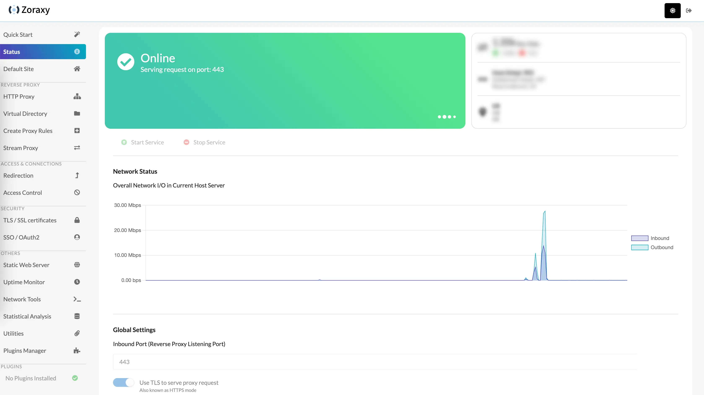

## Wieso nicht einfach Cloudflare?

In den beiden letzten Artikeln habe ich mich des Problems angenommen, das [heimische NAS via Cloudflare Tunnel aus dem Internet heraus erreichbar zu machen](/synology-nas-als-private-cloud-via-cloudflare-tunnel-ohne-portweiterleitung) und dann auch noch [abzusichern](/cloudflare-tunnel-mit-extra-authentifizierung). Das Setup funktioniert soweit, aber es hat zwei Haken:

* Den ersten Haken erwähnte ich bereits im entsprechenden Post: Der Status des Streaming ist in der Community ungewiss
* Und natürlich geht unser Traffic über Cloudflare. Jeder darf selbst entscheiden, ob und in wie weit man Cloudflare vertrauen möchte, aber ich verstehe jeden, der seinen Traffic gern vollständig in der eigenen Hand hat.

Wie im Beitrag zum Setup des Cloudflare Tunnels erwähnt, haben manche von uns einfach nicht die Möglichkeit, Portfreigaben einzurichten und müssen deshalb Kompromisse eingehen. Wenn wir keine Portfreigaben einrichten können oder wollen, dann brauchen wir eine weitere Komponente, mit der wir aus dem Internet heraus auf unsere Services im Heimnetzwerk zugreifen können.

Eine Möglichkeit, die uns sehr viel Kontrolle ermöglicht, wäre ein _eigener Zugriffstunnel mit Hilfe eines virtuellen privaten Servers und WireGuard_ - optional auch ganz ohne Cloudflare. Genau dieses Setup möchte ich hier starten.

## Ein Wort (bzw. Absatz) der Warnung

Ich sage so einfach, wir nutzen einen _privaten virtuellen Server_ (kurz VPS), da dieser viel Kontrolle in die eigene Hand legt. Aber Kontrolle ist Macht und _mit großer Macht kommt auch große Verantwortung (Onkel Ben)_. Ein virtueller privater Server - gerade, wenn dieser als Cloud Service irgendwo gehostet ist - ist ein vollständiger Server, der aus dem Internet heraus erreichbar ist. Ein Server, auf dem ihr vermutlich Admin-Rechte besitzt und der wahrscheinlich auch erstmal keine Firewall aktiviert hat. Kurzum, ein Server, den ihr selbst bestmöglich schützen müsst!

Aber lass dich davon nicht abschrecken! Meine Empfehlung für VPS Hosting Services ist [Hetzner](https://www.hetzner.com/de/cloud). Die sind wirklich günstig und bieten für den Anfang auch Tutorials zur [Ersteinrichtung eines Ubuntu Servers](https://community.hetzner.com/tutorials/howto-initial-setup-ubuntu/de) und der [grundlegenden Sicherheit](https://community.hetzner.com/tutorials/howto-initial-setup-ubuntu/de) bei frischen Servern. Damit komme ich aber auch zu den Voraussetzungen.

## Voraussetzungen

Um diesem Tutorial folgen zu können, brauchst du...

* ... einen Server, den du aus dem Internet heraus erreichen kannst
* ... eine lauffähige Docker-Installation auf dem Server
* ... optional eine Domain oder einen DynDNS, wie beispielsweise von [IPv64](https://ipv64.net/) oder [DuckDNS](https://www.duckdns.org/)

Ein solcher Server hat natürlich monatliche Kosten. Hetzner rechnet tatsächlich stundenweise ab. Du kannst also auch dem Tutorial folgen, alles aufsetzen, entscheiden, dass alles doof war und den Server abreißen. Dann zahlst du nur die Stunden, die der Server tatsächlich existierte. Sollte dies aber eine Dauerlösung werden, musst du monatlich für den Server zahlen. Auch deine Domain kann etwas kosten, sofern du eine eigene erworben hast.

Docker sollte installiert sein, da eine Anleitung für die Installation den Rahmen dieses Tutorials sprengen würde. Die offiziell empfohlene Routine, an dich auch ich mich gehalten habe, könnte sich geändert haben und dein Server könnte ein ganz anderes Betriebssystem haben, als meins. Deshalb, bitte, installiere Docker selbst auf dem Server. Die offizielle Anleitung für alle Plattformen gibt es [hier bei Docker selbst](https://docs.docker.com/engine/install/).

Mein letzter, wichtiger Hinweis: Ich werde in diesem Tutorial nicht beschreiben, wie du deinen Server bekommst oder eine sinnvolle Ersteinrichtung zur Absicherung aussieht. Dies ist ein Tutorial mit Fokus auf das Setup eines eigenen Zugriffstunnels vom Internet auf heimische Services und diesen Fokus will ich auch halten.

## Unser Ziel-Setup

Worauf arbeiten wir hier eigentlich hin? Es gibt ein mehrstufiges Ziel. Der erste Schritt ist, auf unserem VPS einen VPN-Server (wir nutzen WireGuard) zu installieren. Unser NAS, sowie unsere gewünschten Clients berechtigen wir für dieses VPN. Damit sollten wir unseren Clients (Smartphone, Tabelet, Notebook) ermöglichen, von überall aus auf unser NAS zugreifen zu können - allerdings nur mit aktiver VPN-Verbindung. Wer damit zufrieden ist, ist dann auch fertig.

Im zweiten Teil möchte ich dann aber noch bestimmte Services aus unserem VPN-Netz nach außen öffnen. Wenn ihr eurer Familie Zugriff auf ein Familien-Fotoalbum oder einen Medienserver geben wollt, dann ist es schwierig, diesen zu erklären, dass sich sich die WireGuard App installieren und eure Client Config hinzufügen sollen. Das schreit förmlich nach dem nächsten Support-Anruf. Einfacher ist es, diese Services über einen Reverse Proxy (dazu kommen wir später) ins Internet zu öffnen. Und dies ist das Ziel des zweiten Teils.

Wenn wir dazu kommen, muss ich natürlich den Disclaimer bringen, dass diese Services natürlich angreifbar werden und geschützt werden sollten. Aber dazu später mehr.

Dieser Beitrag ist Teil 1, Ziel ist also erstmal ein VPN-Netz. Ich werde trotzdem schon jetzt zu Beginn einen Reverse Proxy installieren. Wenn du den zweiten Schritt nicht planst und auch weißt, dass du einen Reverse Proxy nicht brauchen wirst, kannst du diesen Schritt überspringen. Ich sage dir trotzdem, wie du weiter kommst. Aber ein Reverse Proxy kann trotzdem als sinnvoll angesehen werden, selbst, wenn wir nur die UI für unser WireGuard Admin Interface ohne Portangabe aufrufen wollen. Ich empfehle also, diesen trotzdem zu installieren.

Da du nun die Voraussetzungen kennst (und hoffentlich erfüllst) und auch das Ziel vor Augen hast, kann's losgehen 😎

## Los geht's

### Domain / DynDNS auf Server IP richten

Um die Zertifikate zu bestellen und die Kommunikation aus dem Internet heraus mit TLS abzusichern, müssen wir uns als erstes bei unserem Domain Registrar einloggen und die A Records auf die öffentliche IP unseres Server richten.

Hast du deinen Server bei hochgezogen, dann logge dich in der [Hetzner Console](https://console.hetzner.com/) ein und wähle dann deinen Server aus. Die öffentliche IP sollte dir dann direkt ins Auge springen. Bei deinem Domain Registrar setze die A Records für die `Domain`, `www`und `*` auf die IP deines Servers. Bei INWX sollte dies dann so aussehen:


_Anmerkung für diejenigen, die dieselbe Domain nutzen, die ihr für mein Cloudflare-Tutorial genutzt habt. Ihr müsst die Nameserver entweder wieder zurücksetzen, sodass Cloudflare eure Domain nicht mehr administriert oder ihr müsst die A Records bei Cloudflare setzen. Dann ist Cloudflare aber weiterhin involviert._

Bis die Änderung zieht, kann es ein paar Minuten dauern. In der Zeit können wir aber weiter machen.

### Die Docker Container vorbereiten

Wir brauchen zwei Docker Container für unser Setup. Einen _Reverse Proxy_ und unseren _VPN Server_.

Ich habe mich für [_Zoraxy_](https://github.com/tobychui/zoraxy) und [_Wireguard im wg-easy Container_](https://github.com/wg-easy/wg-easy) entschieden. Ich glaube, sucht man nach "Reverse Proxy", stößt man als erstes auf den "Nginx Proxy Manager", "Caddy" oder "Traefik". _Zoraxy_ ist ein recht junges Projekt und trotzdem alt genug, um eine gewisse Stabilität zu haben (2021 erste Commits). Der Entwickler scheint sehr engagiert und auch funktionell bietet es etwas mehr, als der "Nginx Proxy Manager", hat aber ein schönes, modernes Interface, um so gut bedienbar zu sein.

Beim VPN habe ich mich für _WireGuard_ entschieden. WireGuard ist Open Source, gilt als sehr sicher und bietet trotzdem einen benutzerfreundlichen Einstieg. Gerade mit dem wg-easy Interface ist ein einfaches Setup schnell möglich. _wireguard-ui_ ist eine bekannte Alternative, die man bei Hetzner sogar als one-click application vorinstallieren kann. Aber das Projekt ist seit längerer Zeit scheinbar nicht mehr weiter entwickelt wurden. Man könnte argumentieren, dass wg-easy fast **zu** leichtgewichtig ist. Aber die Client-Änderungen, die wir vornehmen müssen, können wir in den Config files auch selbst machen, falls notwendig.

Diese beiden Container müssten wir also zum Laufen bringen. Informationen und einen Blueprint für `docker compose` gibt es [hier für Zoraxy](https://hub.docker.com/r/zoraxydocker/zoraxy) und [hier für wg-easy](https://wg-easy.github.io/wg-easy/latest/examples/tutorials/basic-installation/). Schaut man sich das tatsächliche `docker-compose.yml` von wg-easy jedoch an, sieht man, dass dieser Container ein eigenes Netzwerk aufbaut. Eine Routing von Zoraxy ist dann nicht so einfach möglich. Deshalb ist es am einfachsten, ein **gemeinsames** `docker-compose.yml` zu erstellen und so auch Zoraxy in das Netzwerk von wg-easy zu integrieren. So können wir sauber routen.

Ich habe das zusammengefasste `docker-compose.yml` hier eingefügt. Es gibt eine Zeile, in der ihr euren gewünschten Pfad angeben müsst, in den Zoraxy seine Config auf euem Server ablegen soll.

Im Linux-Umfeld habe ich immer das Gefühl, es gibt dort so etwas, wie Glaubenskriege, wo etwas abgelegt werden sollte. Mir das das recht egal, ich möchte bei mir einfach, dass es für mich(!) Sinn ergibt. Mein Weg (und du kannst gern einen Anderen gehen, wenn du möchtest) ist, im `home` Verzeichnis einen Ordner `docker` anzulegen. Dort gibt es dann Unterordner pro Container und Containergruppe. In diesen Ordnern sind die gemappten Ordner zum Container und die `docker-compose.yml` Dateien. Meine Datei liegt also unter `~/docker/wg-easy-networksetup/docker-compose.yml`. Dem kannst du folgen oder auch nicht 😎

```
volumes:
  etc_wireguard:

services:
  wg-easy:
    image: ghcr.io/wg-easy/wg-easy:15
    container_name: wg-easy
    networks:
      wg:
        ipv4_address: 10.42.42.42
        ipv6_address: fdcc:ad94:bacf:61a3::2a
    volumes:
      - etc_wireguard:/etc/wireguard
      - /lib/modules:/lib/modules:ro
    ports:
      - "51820:51820/udp"
      - "51821:51821/tcp" # Zugriff via Reverse Proxy
    restart: unless-stopped
    cap_add:
      - NET_ADMIN
      - SYS_MODULE
    sysctls:
      - net.ipv4.ip_forward=1
      - net.ipv4.conf.all.src_valid_mark=1
      - net.ipv6.conf.all.disable_ipv6=0
      - net.ipv6.conf.all.forwarding=1
      - net.ipv6.conf.default.forwarding=1

  zoraxy:
    image: zoraxydocker/zoraxy:latest
    container_name: zoraxy
    restart: unless-stopped
    ports:
      - 80:80
      - 443:443
      - 8000:8000 # Zugriff via looped Reverse Proxy
    volumes:
      - /path/to/zoraxy/config/:/opt/zoraxy/config/  # ⚠️ PFAD ANPASSEN!
      - /var/run/docker.sock:/var/run/docker.sock
      - /etc/localtime:/etc/localtime
    networks:
      - wg

networks:
  wg:
    driver: bridge
    enable_ipv6: true
    ipam:
      driver: default
      config:
        - subnet: 10.42.42.0/24
        - subnet: fdcc:ad94:bacf:61a3::/64
```

Wenn du dir den Code ansiehst, entdeckst du zwei Kommentare in den Zeilen 17 und 36. Diese Ports werden wir später auskommentieren, um einen Zugriff nur über den Reverse Proxy zu ermöglichen. Noch benötigen wir diese Ports aber für die erste Einrichtung.

Liegt nun ein `docker-compose.yml` auf deinem Server und hat den obigen Inhalt? Top, dann navigiere in den Ordner und erstelle die Container per

```
sudo docker compose up -d
```

### Die ersten Routen in Zoraxy

WireGuard können wir noch nicht konfigurieren, da ein Login im Standard nur per HTTPS (verschlüsselt) möglich ist und das wollen wir direkt anständig umsetzen. Deshalb widmen wir uns zuerst Zoraxy.

Öffne im Browser nun `{DeineDomain.de}:8000` (kann natürlich auch `{DeinDynDNS}:8000` sein). Das Zoraxy Webinterface sollte sich öffnen. Du musst einen Benutzer für das Interface anlegen. Bedenke hierbei, das Interface ist aus dem Internet heraus erreichbar. Das können wir später ändern, aber aktuell ist es so. Wähle ein entsprechendes Passwort - ein Punkt hinter _qwertz123_ gilt dabei nicht 😜

Sobald du dich dann mit dem neu angelegten Nutzer eingeloggt hast, solltest du das Dashboard sehen. Cool!



---

Meine Schritte:
3. In Zoraxy Routen erstellen und Zertifikate holen (proxy.domain.de & vpn.domain.de) => prüfen
4. docker-compose.yml anpassen und Admin-Ports auskommentieren
5. docker compose up -d
.... warten
Ab jetzt Zugriff auf Reverse Proxy und WireGuard per HTTPS Subdomains

WireGuard einrichten...