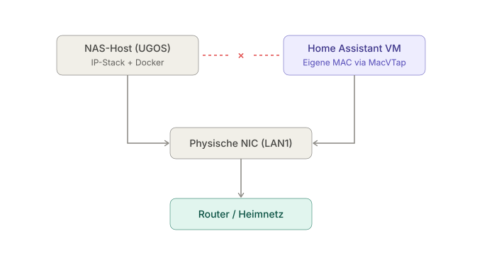
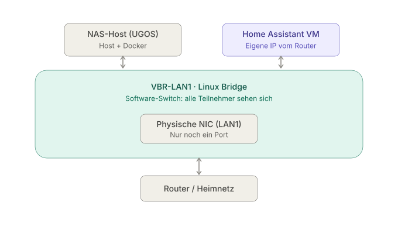

## Wie eine UGOS-Default-Konfig fast meine Proxmox-Migration ausgelöst hätte

Mein UGREEN DXP4800 Plus läuft seit Monaten brav. Docker-Stacks für Jellyfin, n8n, UniFi-Controller, das Übliche. Dann sollte Home Assistant dazukommen – als VM, nicht als Container, weil ich AddOn-Support wollte. HAOS-Image runtergeladen, qcow2 in den UGOS VM Manager importiert, statische IP konfiguriert, Boot.

Die Installation war relativ geradlinig (ein Tutorial hierzu wird vermutlich folgen) und das Webinterface war erreichbar. Allerdings nicht via `homeassistant.local`, wie es sein sollte, sondern lediglich über die direkte IP der VM. Merkwürdig, aber okay... Ich richtete alles weiter ein, bis ich das UniFi-AddOn installieren und konfigurieren wollte: Der UniFi-Controller, der in einem Docker-Container auf demselben NAS lebt, wurde einfach nicht gefunden!

Also begann das Debugging.

## Die Symptome

Zuerst dachte ich an ein internes Routing-Problem zwischen Docker und der VM auf dem NAS. Docker-Bridge- und Host-Netzwerke, die Netzwerkkonfiguration einer VM, irgendwo hier vermutete ich die Ursache. Aber jedes gute Debugging beginnt mit einer sauberen Analyse. Was ist der Ausgangszustand?

- VM erreichbar von jedem anderen Gerät im LAN
- Host-NAS erreicht VM _nicht_
- Container auf dem Host erreichen VM _nicht_
- VM erreicht die Docker-Container auf dem Host _nicht_
- mDNS-Auflösung von `homeassistant.local` funktioniert nicht

Aha! Bereits das NAS selbst konnte die VM nicht erreichen. Das Problem lag also nicht zuerst bei Docker, sondern bei der Netzwerkanbindung zwischen Host und VM.

## Warum der UGOS-Host die VM nicht erreicht

Die Liste machte ziemlich schnell deutlich: Das Problem lag nicht zuerst bei Docker. Bereits das NAS selbst konnte die VM nicht erreichen, obwohl sie für andere Geräte im LAN ganz normal erreichbar war.

Der Grund dafür war der Netzwerkmodus der VM. UGOS hatte sie über **macvtap** mit dem physischen Netzwerkanschluss des NAS verbunden. Dabei erhält die VM eine eigene virtuelle Netzwerkkarte samt eigener MAC-Adresse. Für meinen Mac, mein Smartphone und andere Geräte im LAN sieht sie deshalb wie ein eigenständiges Gerät aus.

Der Haken: Der Host kann eine über macvtap angebundene VM standardmäßig nicht über dasselbe physische Interface erreichen. Der Netzwerkverkehr des Hosts wird nicht zurück in das macvtap-Interface der VM geleitet.

Genau deshalb war Home Assistant aus dem restlichen LAN erreichbar, vom NAS selbst aber nicht. In meinem Setup betraf das auch die Docker-Container, deren Dienste über das Netzwerk des NAS angebunden waren.

Macvtap war also nicht kaputt oder falsch konfiguriert. Der Netzwerkmodus passte nur nicht zu meinem Anwendungsfall: Home Assistant sollte schließlich auch mit Diensten kommunizieren, die auf demselben NAS liefen.

## Was eine Linux Bridge anders macht

Eine Linux Bridge funktioniert vereinfacht wie ein virtueller Switch im NAS. Die physische Netzwerkkarte, der Host und die virtuellen Maschinen hängen dabei an derselben Bridge.

Die VM wird nicht mehr direkt per macvtap an die physische Netzwerkkarte gekoppelt. Stattdessen verbindet ein virtuelles TAP-Interface die VM mit der Bridge. Auch die IP-Adresse des NAS liegt anschließend üblicherweise auf diesem Bridge-Interface.

Damit können Pakete zwischen NAS und VM direkt innerhalb des Linux-Kernels weitergeleitet werden. Sie müssen das NAS nicht erst über die physische Netzwerkkarte verlassen.

Für mein Setup war das der entscheidende Unterschied: Das NAS konnte anschließend die Home-Assistant-VM erreichen und umgekehrt. Auch meine Docker-Dienste waren über die NAS-IP wieder erreichbar, sofern ihre Netzwerk- und Firewallregeln den Zugriff erlaubten.

Es geht also nicht darum, dass macvtap grundsätzlich schlecht und eine Linux Bridge grundsätzlich besser ist. Macvtap reicht aus, wenn eine VM hauptsächlich mit anderen Geräten im LAN kommunizieren soll. Sobald Host, VM und lokale Dienste miteinander sprechen müssen, ist eine Linux Bridge meist die passendere Wahl.

## Die passenden Einstellungen in UGOS

In meiner UGOS-Pro-Version taucht der Begriff „Brücke“ an zwei verschiedenen Stellen auf. Das ist etwas verwirrend, weil nur eine der Einstellungen für virtuelle Maschinen relevant ist.

Im Control Panel unter **Netzwerk** gibt es eine "Normale Netzwerkbrücke" und eine "Virtuelle Netzwerkbrücke". Für dieses Problem wird die **Virtuelle Netzwerkbrücke** benötigt. Sie stellt auf dem NAS die Linux Bridge bereit, mit der anschließend auch die VM verbunden werden kann.

Die Umstellung erfolgt in zwei Schritten:

1. Öffne im Control Panel den Bereich **Netzwerk** und aktiviere die **Virtuelle Netzwerkbrücke**. Dabei wird die Netzwerkanbindung des NAS kurz unterbrochen. Ich würde die Änderung deshalb nicht gerade während eines Streams oder einer größeren Datenübertragung durchführen.

2. Fahre die VM vollständig herunter. Öffne anschließend im VM Manager ihre Netzwerkeinstellungen und ändere den Modus von **Bridged Mode – macvtap** auf **Bridged Mode – Linux Bridge**. Danach kannst du die VM wieder starten.

Die Bezeichnungen können sich mit späteren UGOS-Versionen ändern. In meinem Fall lief das NAS mit 1.17.0.0095.

## Prüfen, ob die Umstellung funktioniert hat

Nach dem Start der VM habe ich die vier Verbindungen erneut getestet:

- Das NAS konnte die IP-Adresse der Home-Assistant-VM erreichen.
- Home Assistant konnte die über die NAS-IP veröffentlichten Dienste meiner Docker-Container erreichen.
- Der UniFi-Controller wurde in Home Assistant gefunden und ließ sich einrichten.
- Home Assistant konnte über `homeassistant.local` sauber erreicht werden.

Die Linux Bridge beseitigt zunächst die entscheidende Trennung zwischen NAS und VM.

## Lesson Learned

Die eigentliche Lektion ist nicht "macvtap ist böse" – es ist ein legitimes Kernel-Feature für seinen Anwendungsfall. Die Lektion ist:

**Bevor du strukturelle Änderungen anstößt – Hypervisor wechseln, Architektur umbauen, Migration planen – prüf die Default-Konfig deines aktuellen Stacks.**

Ich war ernsthaft dabei, Proxmox zu installieren, weil ich UGOS-Networking für strukturell kaputt hielt. Die Häufung der Symptome – der Host erreichte die VM nicht, lokale Container-Dienste waren aus der VM nicht erreichbar und die automatische Erkennung funktionierte nicht zuverlässig – sah nach einem grundsätzlichen Problem aus. Tatsächlich waren es zwei Netzwerkeinstellungen, kombiniert mit einem Verhalten des Kernels, das in der UGOS-Dokumentation nicht deutlich erklärt wird.

Die Frage, die ich mir früher hätte stellen sollen: Welcher Bridge-Mode ist eigentlich aktiv? Statt direkt nach Workarounds und Migration zu denken.

Beim nächsten "Host erreicht VM nicht"-Symptom auf einer NAS-Plattform ist die erste Frage: macvtap oder Linux Bridge? Spart vermutlich ein paar Wochenenden Hypervisor-Migration.
