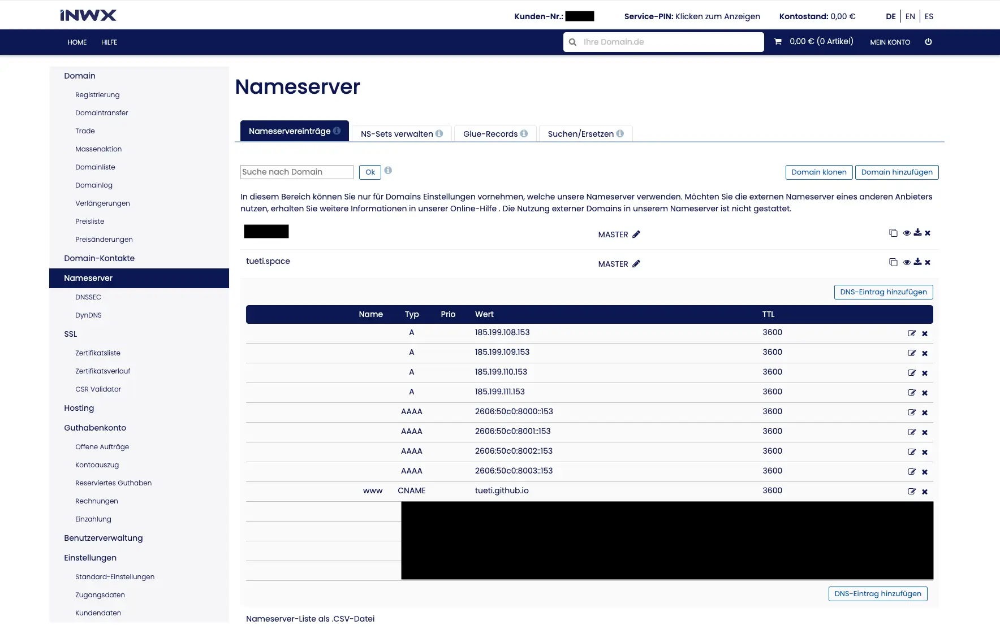

TL;DR - Das Tutorial beginnt [hier](#unser-ziel-und-die-vorbereitungen), wenn du mein Geschwafel vorher nicht lesen willst 😉

## Zurück zu den Anfängen

Ich habe gerade vor wenigen Wochen meinen Facebook Account gelöscht und ich überlege, Instagram als nächstes abzulegen. Dabei weiß ich gar nicht, wieso einem das so schwer fällt. Man hat das Gefühl, man verpasse etwas, wenn man nicht auf diesen Plattformen vertreten ist. Dabei ist es Wochen her, dass ich das letzte Mal Instagram geöffnet habe. Ich mochte die Plattform anfangs sehr, da ich auch gern fotografiere. Ich mochte es als Bilder-Tagebuch, aber irgendwann ging es darum, zu konkurrieren. Mittlerweile ist es keine Bilder-Plattform mehr und damit meine ich gar nicht, dass es nun Reels und Stories und all den Kram gibt. Es ist eine Art "News-Plattform" (wobei die Nachrichten dank Algorithmus teils Tage bis Wochen zu spät in den Feed gespült werden und nicht alles seriös ist), "Stetiger Selbstoptimierungscoach" (und ich meine ich _Optimierung_ nicht positiv, vielmehr fördert es den ewigen Drang, einem unerreichbaren Bild hinterherzujagen) und "Litfaßsäule" (früher haben wir bei Werbung im TV weg gezappt, heute wird Werbeinhalt absichtlich konsumiert. Genialer Schachzug der Werbeindustrie). Den "Freundeskreis", das _soziale_ an diesem Social Network, muss man lange suchen. Wenn ich die App mal öffne, sehe ich eigentlich nie, was ich erwarte oder was ich sehen möchte.

Wenn ich Nachrichten lesen will, öffne ich die entsprechenden Apps oder meinen RSS Reader und wenn ich sehen möchte, was meine Bekannten und Freunde machen, haben diese sicher WhatsApp Stories. Bei Instagram würde ich gern Themen sehen, für die ich mich aktiv entschieden haben: Fotografien, Menschen, die es als Bilder-Tagebuch nutzen und mit denen ich verbunden sein will, so etwas. Aber keinen generischen, für den Algorithmus optimierten Inhalt, der nichts mehr aussagt und vor allem nicht diesen KI-generierten Mist.

Ich will jetzt nicht sagen "früher war alles besser". Ich hoffe, so alt bin ich noch nicht. Aber das Web 1.0 hatte seinen Charme. Ich erinnere mich, dass ich damals meine erste Formel 1 Fanseite ins Internet stellte und so HTML, CSS und später PHP und MySQL erlernte. formel1-fan.de.vu oder so, mit den schönen gratis Top-Level-Domains auf einem gratis Hoster, der dann Werbung einblendete. Herrlich! Das waren die Anfänge, die schlussendlich zu meinem Job in der IT führten. Dann kamen Blogging-Plattformen, wie Tumblr oder Blogspot und heute gibt es [Medium](https://medium.com/). Auch ich habe überlegt, meine Inhalte auf Medium zu veröffentlichen, aber man würde sich wieder in die Abhängigkeit eines Services geben. Aber viel mehr noch, man würde wieder gegen andere Inhalte _konkurrieren_ und für einen Algorithmus optimieren, um Herzen (also Likes) zu jagen. Ich bin anfällig für so etwas, doch genau so etwas wollte ich nicht. So zog mich die Idee eines eigenen Blogs wieder in seinen Bann. Ein eigenes, digitales Wohnzimmer, in dem ich über alles reden kann, was mir gefällt. Ein Platz, den ich gemütlich [vom iPad aus](/ipad-blog-workflow-vom-schreiben-bis-zur-veroeffentlichung/) mit Inhalt füllen kann. Ein Blog, bei dem ich bewusst auf alle Analysen verzichte, einfach um mir selbst keinen Druck zu machen.

Und trotzdem wird der Blog scheinbar gelesen, was mich natürlich irre freut! Ich weiß nicht, von wie vielen, aber ich bekomme Feedback. An dieser Stelle vielen Dank für die Emails, die mich erreicht haben, als der Blog kurz offline war und an all diejenigen, die mich nach bestimmten Artikeln, wie [der rclone-Installation auf dem NAS](/rclone-auf-dem-synology-nas-installieren/) fragten. Einen riesigen Dank auch an alle, die pCloud-Speicher über meinen Link erwroeben haben. Diese Art der Kontaktaufnahme bedeutet mir unmessbar viel mehr, als ein Herz auf Instagram, das man achtlos setzt, weil man gerade durch seinen Feed scrollt. 💙

Und mit diesem Hintergrund will ich euch auch ermutigen, Blogs oder Webseiten zu starten. Euren eigenen Space zu erstellen und das muss nichtmal Geld kosten, wenn man auf eine eigene Domain verzichten kann. Das will ich hier einmal aufzeigen.

## Unser Ziel und die Vorbereitungen

Das Ziel ist eine eigene Webseite, die gratis oder mindestens mal sehr günstig zu betreiben ist. Für das einfachste Setup brauchen wir [einen gratis GitHub Account](https://github.com/) und optional eine [Domain, ich nutze dafür INWX](https://www.inwx.de/de). Für meine *.space-Domain zahle ich ab dem zweiten Jahr 33€ jährlich. Toplevel-Domains mit _.de_ sind aber sehr viel günstiger und schon für ca. 10-15 Euro jährlich zu haben. Für das erste Jahr gibt es meist riesige Rabatte, schaut einfach mal nach.

## 1. GitHub vorbereiten

Auf GitHub wollen wir die Webseite bereitstellen. Das ist ein gratis Service von GitHub und kann von jedem genutzt werden. Obwohl GitHub ein US-Unternehmen ist (mittlerweile gehören sie zu Microsoft), hat GitHub alle Compliance-Maßnahmen für internationale Datenübermittlungen umgesetzt. Also perfekt für eine datenschutzkonforme Webseite, auch in der EU.

### 1.1 Account anlegen

Auf zu [GitHub](https://github.com/) und einen Account anlegen. Euren Benutzernamen braucht ihr gleich, also merkt euch diesen. Meiner ist - Überraschung! - _Tueti_.

### 1.2 Das Repository anlegen

Ihr braucht nun ein spezielles, öffentlichen Repository, welches den Namen _$username.github.io_ besitzt. Also in meinem Fall _tueti.github.io_. Die Auswahlfelder zu _.gitignore_ oder der _Lizenz_ könnt ihr erstmal ignorieren.

### 1.3 Die Webseite hochladen

Als letzten Schritt könnt ihr ein einfaches `index.html` in das Repository laden (oder direkt im Browser anlegen). Wie das geht zeigt euch GitHub auf der Übersichtsseite des Repos, sofern dies noch leer ist.

Und das wars 🥳 Öffnet im Browser einmal die URL (den Namen eures Repositorys) _$username.github.io_ (mit eurem Nutzernamen) und ihr solltet eure Webseite sehen. Wenn ihr keine eigene Domain braucht und eure Webseite aus HTML oder dem Static Site Generator Jeckyll besteht, seid ihr nun fertig. GitHub sollte nun bei jeder Änderung des `main` Branches die Seite neu generieren und über die Standard-URL bereitstellen.

## 2. GitHub mit Hugo

Wenn ihr einen Hugo Blog bereitstellen wollt, dann müssen wir die Art des Deployments noch ändern. Navigiert dazu in GitHub einmal in eurem Repo zu _Settings_ und dort zu _Pages_ und stellt von _Deploy from branch_ auf _GitHub Actions_ um:

Ihr habt nun eine Auswahl, welche Action ihr nutzen wollt. Hier könnt ihr einfach nach "Hugo" suchen und diese Action wählen. Dann baut GitHub euren Quellcode auch korrekt für Hugo Seiten - inklusive möglicher Submodulen, wie Themes.

Wenn ihr also einen gratis Hugo Blog haben möchtet, seid ihr nun auch fertig! 🎉

## 3. Eine eigene Domain nutzen

Wenn ihr eure Webseite nicht nur über _$username.github.io_, sondern auch über eine eigene Domain erreichen wollt, dann braucht ihr natürlich eine eigene Domain. Da ich [INWX](https://www.inwx.de/de) nutze, schreibe ich die Anleitung ebenfalls anhand dieses Domain Providers. Ihr könnt aber nutzen, was ihr wollt.

### 3.1 Account einrichten

Als erstes braucht ihr natürlich einen Account bei einem Domain Registrar, also legt euch gern einen Account bei [INWX](https://www.inwx.de/de) an.

### 3.2 Domain registrieren

Entscheidet euch für eine Domain, ich habe - wer hätte es erwartet - _tueti.space_ registriert. _*.de_-Domains sind mittlerweile wirklich günstig zu registrieren.

### 3.3 Domain konfigurieren

GitHub hat eine eigene [Dokumentation](https://docs.github.com/de/pages/configuring-a-custom-domain-for-your-github-pages-site/about-custom-domains-and-github-pages) zur Konfiguration von eigenen Domains, aber die Schritte sind recht simpel. Man muss die A Records und die AAAA Records auf GitHubs IPs zeigen lassen und einen CNAME für den www redirect anlegen, der dann auf die von GitHub bereitgestellte Domain zeigt. Achtet dabei darauf, mögliche Standardeinträge für A und AAAA Records zu entfernen. Ein Bild sagt mehr, als tausend Worte, deshalb hier einmal die Übersicht, wie es bei euch aussehen sollte:

| **Name** | **Type** |    **Value**    | **TTL** |
|----------|----------|-----------------|---------|
|          |    A     | 185.199.108.153 |  3600   |
|          |    A     | 185.199.109.153 |  3600   |
|          |    A     | 185.199.110.153 |  3600   |
|          |    A     | 185.199.111.153 |  3600   |
|          |   AAAA   | 2606:50c0:8000::153 |  3600   |
|          |   AAAA   | 2606:50c0:8001::153 |  3600   |
|          |   AAAA   | 2606:50c0:8002::153 |  3600   |
|          |   AAAA   | 2606:50c0:8003::153 |  3600   |
|   www    |   CNAME  | _$username_.github.io |  3600   |

**Bitte ersetzt _$username_ mit eurem tatsächlichen username. Also bei mir steht dort _tueti.github.io_.**

### 3.4 Die Domain bei GitHub hinterlegen

Navigiert erneut in eurem Repository zu _Setting_ und _Pages_ und tragt nun eure registrierte Domain bei _Custom Domain_ ein. GitHub wird nun beim Registrar prüfen, ob die Settings alle korrekt sind und sofern diese es sind, wird ein TLS-Zertifikat ausgestellt, damit ihr eine schöne HTTPS-Verbindungen nutzen könnt. Sobald dies geschehen ist, empfehle ich den Haken bei _Enforce HTTPS_ zu setzen und oben auf der Seite sollte stehen **Your site is live at https://_deine-gewählte-domain.tld/_**.

Der ganze Prozess kann mehrere Stunden dauern, also nicht ungeduldig werden, wenn es nicht sofort alles live ist.

Ein (bzw. zwei) wichtiger Hinweis noch: Die URL, die du einträgst wird die Haupt-URL für deine Webseite. In meinem Fall verweist _www.tueti.space_ also auf _tueti.space_. Ich finde dies schöner. Wenn du _www_ aber explizit setzen und in der URL sehen willst, muss die Custom Domain das _www_ mit beinhalten. Und für alle, die einen Hugo-Blog nutzen. Eure _baseURL_ in der `hugo.yaml` sollte der Custom Domain entsprechen. Ich würde auch empfehlen, in dieser Datei `canonifyURLs: true` zu setzen, damit es keinen `mixed-content`-Block gibt, wenn mal Ressourcen über _www.deine-domain.de_ geladen werden, du aber deine Seite unter _deine-domain.de_ eingerichtet hast.

## Fertig!

Sehr cool und herzlichen Glückwunsch. Deine Webseite sollte nun auf GitHub gehostet und eventuell mit einer eigenen Domain erreichbar sein. Ich wünsche mir, dass das Web wieder mehr solcher kleinen Themen-Blogs bekommt. Es ist doch irgendwie schön, Beiträge und Erfahrungen von Leuten zu lesen und nicht nur aufpolierten Inhalt für soziale Medien oder falsch zusammengefasste Artikel von GPTs. In diesem Sinne, viel Spaß mit deinem Blog!